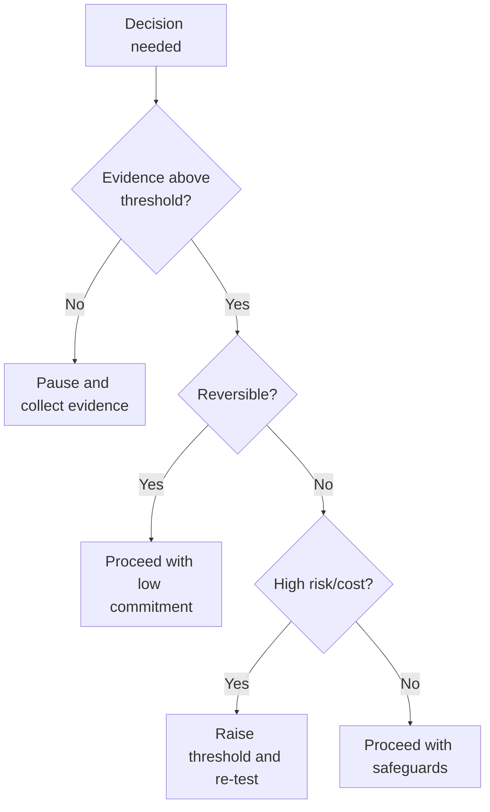

This page explains decision thresholds and reversibility in the Canon without
prescribing workflows.

:::note Purpose
Explain how decisions advance, pause, or reverse based on evidence quality and
thresholds.
:::

:::info What this explains
- What decision thresholds are and how they are used.
- Why reversibility matters before committing resources.
- How to interpret evidence sufficiency in context.
- How decision integrity prevents premature scaling.
:::

:::note Derived from Canon
- [Canon -> Decision theory](../canon/decision-theory)
- [Canon -> Evidence logic](../canon/evidence-logic)
- [Canon -> Definitions](../canon/definitions)
:::

:::tip How to use this page
- Use it to interpret decision language in Book chapters.
- Use Canon pages when you need formal definitions or constraints.
- Treat thresholds as evidence gates, not timelines.
:::

:::info FIGURE 5 — DECISION THRESHOLDS, REVERSIBILITY, AND OPTIONALITY (EXPLANATORY)

:::

## Decision thresholds (explanatory)
A decision threshold is the minimum evidence required to defend a specific
decision. The threshold is not universal; it depends on risk, cost, and
reversibility (Kahneman, 2011). The Canon defines the logic; this Book layer
explains how to interpret it in practice (Steele, 2015).

## Reversibility and optionality
MCF 2.2 treats reversibility as a safeguard. If a decision is reversible, the
threshold can be lower because the cost of being wrong is limited. If a decision
is irreversible, the threshold must be higher because the cost of error is
systemic (Taleb, 2012). Preserving **optionality** keeps future paths open until
evidence justifies commitment.

