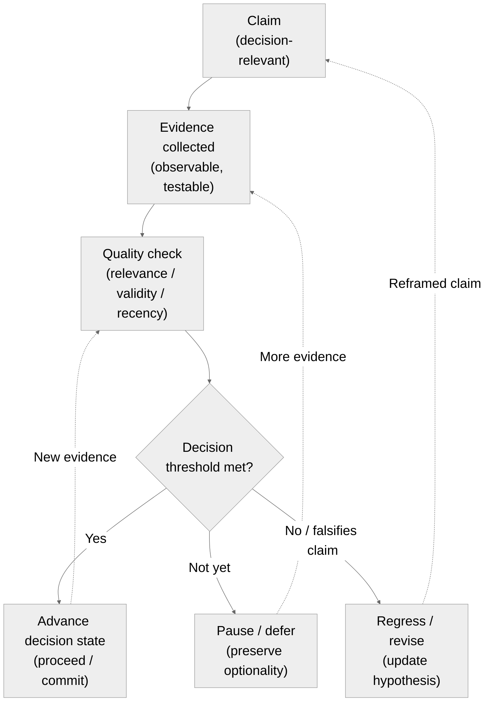

This page explains the evidence-first framing used by the Canon and how it
guides interpretation in the Book layer.

:::note Purpose
Clarify how evidence quality—not activity, seniority, or narrative—drives
progression and decisions in MCF 2.2.
:::

:::info What this explains
- Why evidence is required to justify epistemic state changes.
- How evidence quality affects decision thresholds.
- How to distinguish signal from activity or narrative.
- How to interpret evidence without turning it into a checklist.
:::

:::note Derived from Canon
- [Canon -> Evidence logic](../canon/evidence-logic)
- [Canon -> Definitions](../canon/definitions)
- [Canon -> Decision theory](../canon/decision-theory)
:::

:::tip How to use this page
- Use it to interpret evidence requirements in Book chapters.
- Use Canon pages when you need formal definitions or constraints.
- Treat examples as illustrative, not prescriptive.
:::

:::tip Figure 3 - Evidence-first loop (claim -> evidence -> decision state)

:::

## Evidence-First Thinking (Explanatory)
Evidence-first thinking means you treat decisions as claims that must be
supported by observable, testable information. Activity, effort, or consensus
does not change the decision state unless it produces evidence that reduces
uncertainty. This framing protects teams from premature conclusions and helps
avoid "progress theater"—activity that accumulates without increasing epistemic
resolution (Steup, 2005; Kelly, 2006).

Evidence in MCF 2.2 is not binary. It has quality, relevance, and limits. Good
evidence clarifies which assumptions have been strengthened, which remain weak,
and which have been falsified. Evidence-first thinking therefore asks: what
would change our decision, and do we have that?

## How Evidence Affects Decisions
Decisions advance when evidence crosses a threshold that makes the next step
defensible. Decisions pause when evidence is ambiguous or conflicting. Decisions
reverse when evidence weakens the original claim. Over time, evidence may also
decay in validity as context changes; claims require revalidation when prior
evidence no longer supports the threshold (Steele, 2015).

The Book layer explains how to apply these ideas in context; the Canon defines
the constraints and invariants.

## Common Failure Modes (Explanatory)
- **Activity bias:** Treating output or effort as proof.
- **Confirmation drift:** Selecting only evidence that supports a preferred
  conclusion.
- **Proxy substitution:** Using a weak metric as a stand-in for a stronger one.
- **Narrative overreach:** Telling a story that exceeds the evidence.
- **Unstated thresholds:** Moving forward without declaring what “enough evidence”
  means for the decision at hand.

## Minimal Checks Before Proceeding
- Can you state which assumption or claim is being tested?
- Can you explain what observation would falsify it?
- Can you show why the evidence is relevant (not merely available)?
- Can you justify why the decision threshold is met?

