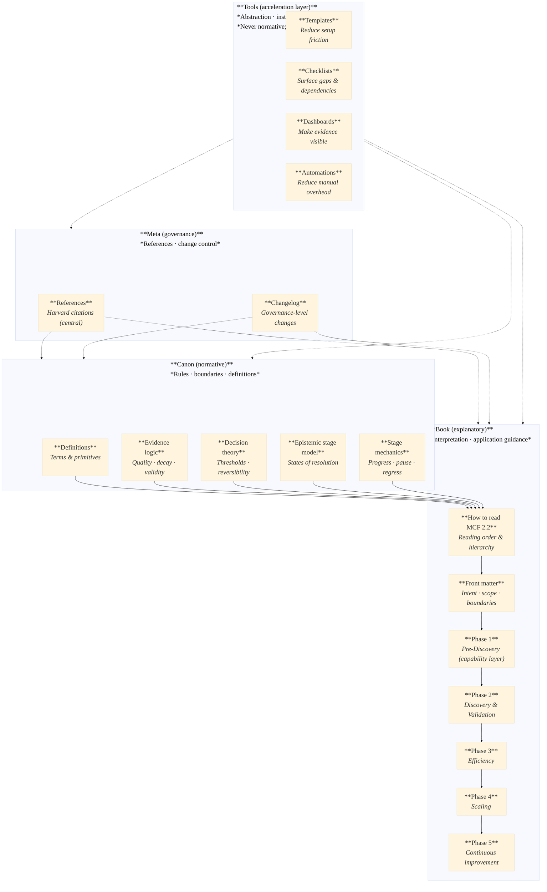

:::info What this chapter does
- Explains how to navigate the Book layer across phases.
- Clarifies how to apply chapters without assuming linear progression.
- Defines how readers should use examples, tools, and templates.
- Reinforces how evidence gates and decision thresholds guide movement.
:::

:::warning What this chapter does not do
- Does not redefine Canon rules, terms, or constraints.
- Does not prescribe a mandatory reading order.
- Does not guarantee outcomes from following the phases.
- Does not replace governance or decision authority.
:::

:::tip When you should read this
- After the Foreword and Preface.
- Before engaging with any phase-based chapters.
- When onboarding new teams or stakeholders to MCF 2.2.
:::

:::note Derived from Canon
This chapter is constrained by the following Canon sources:

- [Canon → Introduction](/docs/canon/_intro)
- [Canon → Definitions](/docs/canon/definitions)
- [Canon → Epistemic model](/docs/canon/epistemic-model)
:::

:::info Key terms (canonical)
- Phase
- Evidence
- Decision threshold
- Governance
- Optionality
:::

:::warning Minimal evidence expectations (non-prescriptive)
This chapter introduces no new evidence requirements. It explains how evidence
is interpreted and applied throughout the Book.
:::

:::tip[Figure 1 — MCF 2.2 System Map (Canonical + Explanatory Layers)]

Welcome to The MicroCanvas Framework. This chapter shows you how to use the
Book layer effectively while staying aligned with **MCF 2.2 Canon**. Whether
you are new to innovation or experienced in transformation, the goal is the
same: move with **clarity**, **evidence**, and **intent**.

## A Modular Approach

We have divided this book into distinct phases that mirror the innovation cycle:

- **Phase 1 - Evaluating and Enhancing Innovation Maturity (Pre-Discovery)**:  
  *Start here to assess your current state and lay a solid foundation for change.*

- **Phase 2 - Structured Discovery and Validation**:  
  *Use this section to explore new opportunities, test ideas, and validate your business model.*

- **Phase 3 - Efficiency - Process Optimization and Operations**:  
  *Learn how to streamline your operations to support your innovative ideas.*

- **Phase 4 - Scaling - Accelerating Growth and Expansion**:  
  *Discover strategies to build the infrastructure needed for rapid growth.*

- **Phase 5 - Continuous Improvement - Adaptation and Future Readiness**:  
  *Adopt a learning culture and prepare for future challenges.*

You can follow the phases sequentially or jump directly to the sections that
address your immediate needs. If you jump, review the prior phase summary so
you do not skip required assumptions or **evidence gates**.

## Navigating the Content

- **Use the table of contents:**  
  Start with the phase intros and the chapter headers. They are designed to
  surface scope, limits, and evidence expectations quickly.

- **Templates and tools:**  
  Use tools as aids, not substitutes for evidence. If a tool conflicts with
  Canon guidance, the **Canon wins**.

- **Examples:**  
  Treat examples as illustrative. They show how decisions were made, not
  guarantees of outcomes.

- **Reflect and apply:**  
  Use the "Minimal evidence expectations" section to decide whether to
  **proceed**, **pause**, or **rework**.

## Making the Most of This Guide

- **Engage actively:**  
  Capture assumptions, evidence gaps, and decision thresholds as you read.

- **Adapt the framework:**  
  Adapt the tools, not the Canon. The Canon defines boundaries and terms.

- **Collaborate and review:**  
  Use peer review or governance checkpoints to validate evidence before moving
  forward.

- **Take action with evidence:**  
  Move forward when evidence meets the **decision threshold**, not when a
  timeline demands it.

By following these guidelines, you set yourself up for a rewarding journey through the world of structured innovation. Let's start building a better future - one innovative step at a time.
