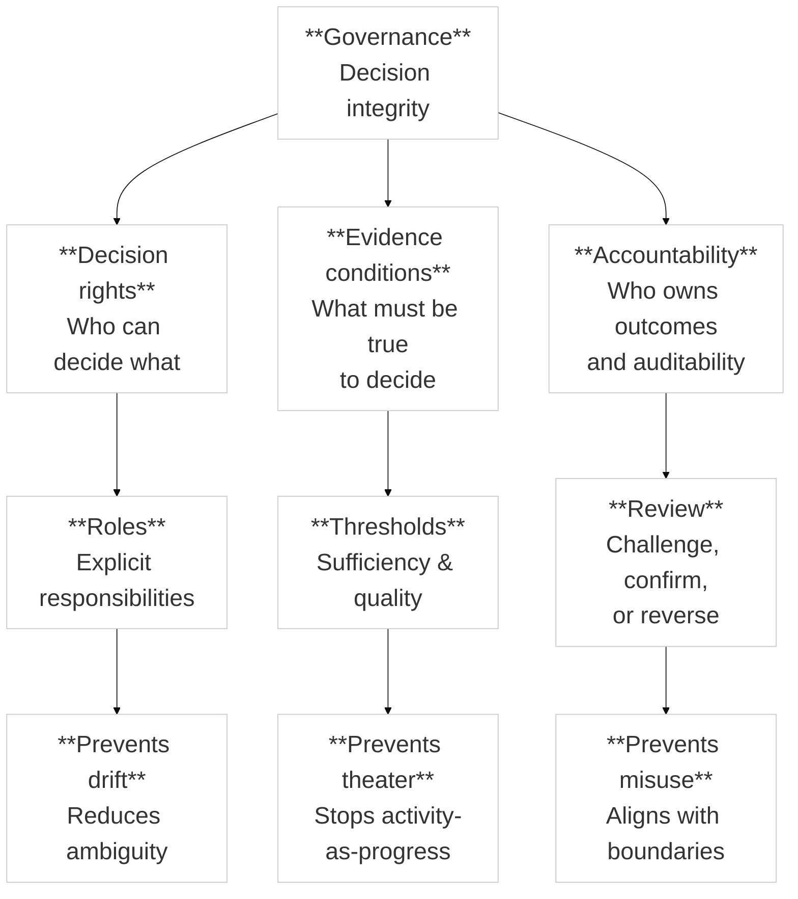

This page explains governance and decision-rights concepts as derived from the
Canon, without prescribing organizational structure.

:::note Purpose
Clarify how governance protects decision integrity and defines accountability
in MCF 2.2.
:::

:::info What this explains
- Why governance exists in an evidence-first framework.
- How decision rights are assigned and reviewed.
- How roles protect against drift and misuse.
- How governance boundaries shape acceptable use.
:::

:::note Derived from Canon
- [Canon -> Governance boundaries](../canon/governance-boundaries)
- [Canon -> Definitions](../canon/definitions)
- [Canon -> Framework boundaries](../canon/framework-boundaries)
:::

:::tip How to use this page

Use it to interpret governance language in Book chapters.

Use Canon pages when you need formal boundaries and constraints.

Treat governance as decision integrity, not bureaucracy.
:::

:::note Figure 4 - Governance as Decision Integrity (explanatory)

Governance is a constraint system: it protects evidence quality, clarifies decision rights, and creates accountability.
:::

## Governance in MCF 2.2
Governance in MCF 2.2 is a constraint system that protects decision integrity. It exists to ensure that progress is justified by evidence rather than preference, momentum, or authority. It does not prescribe an org chart; it specifies **decision rights**, **evidence conditions**, and **accountability** that must be true for a decision to be defensible.

## Decision Rights
Decision rights define *who can decide what* and *under which conditions*. In an evidence-first framework, authority is scoped:
- by the decision’s **risk**, **cost**, and **reversibility**
- by the **epistemic stage** of the claim being advanced
- by the required **review** before commitment

A practical governance rule is: the more irreversible the decision, the more explicit the decision right and the stronger the review requirement should be.

## Evidence Conditions
Evidence conditions define *what must be true to decide*. They prevent “activity-as-progress” by requiring that:
- the assumption being tested is explicit
- the evidence is relevant to that assumption (not merely available)
- the evidence quality meets the threshold implied by risk/cost

This is where governance connects directly to the Canon’s evidence logic and decision thresholds.

## Accountability and Review
Accountability defines who owns outcomes and auditability. Review defines how decisions are challenged, confirmed, deferred, or reversed.
- **Accountability** prevents diffusion of responsibility (“everyone agreed, so no one owns it”).
- **Review** prevents silent drift and makes reversals legitimate when evidence changes.

## Roles (Non-Prescriptive)
MCF 2.2 does not prescribe job titles, but most implementations need explicit ownership for:
- **Evidence stewardship** (quality, traceability, interpretation boundaries)
- **Decision facilitation** (ensuring the decision is properly framed and thresholded)
- **Risk/constraint review** (regulatory, security, operational constraints)
- **Delivery ownership** (ensuring decisions translate into execution without semantic drift)

These can be mapped to existing structures (product, strategy, compliance, ops) without renaming teams.

## Governance Checkpoints (Practical Pattern)
Use checkpoints as decision moments, not status meetings. A checkpoint should answer:
1) What decision is being requested?
2) What evidence supports it (and what would falsify it)?
3) What is the reversibility and cost of being wrong?
4) Does the evidence meet the implied threshold?
5) If not, is the correct action **pause**, **deferral**, or **reframing**?

## Boundaries and Misuse Prevention
Governance is also where boundaries are enforced:
- If an action violates framework boundaries, it is **out of scope** regardless of urgency.
- If evidence is insufficient, “moving forward” becomes a governance failure mode, not execution speed.

Concretely: governance prevents misuse by refusing decisions that exceed evidence or violate boundaries.

## Minimal Evidence Expectations (Non-Prescriptive)
Evidence used to justify governance decisions should allow you to:
- show which decision right applies and why
- show which evidence condition is being satisfied
- show what review occurred (or why it was deferred)
- explain why the decision remains reversible (or why safeguards exist)
