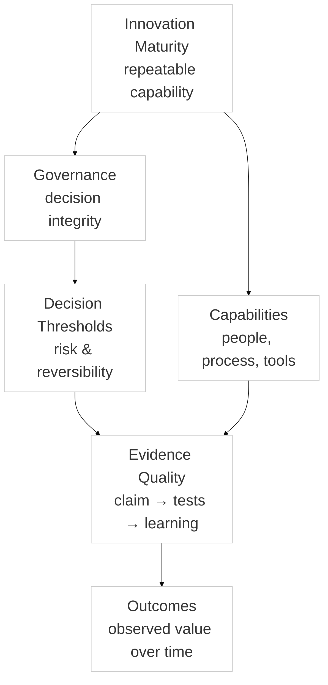

:::info What this chapter does
- Defines innovation maturity as a repeatable capability rather than a one-off outcome.
- Establishes the baseline concepts that anchor the Phase 1 foundation.
- Connects maturity to evidence, governance, and strategic alignment.
- Frames the chapter as a starting point for the program sequence.
:::

:::warning What this chapter does not do
- Does not provide a scoring model or maturity assessment tool.
- Does not replace organization-specific strategy or leadership decisions.
- Does not prescribe a single transformation methodology.
- Does not guarantee innovation outcomes without execution.
:::

:::tip When you should read this
- When starting the framework or onboarding new stakeholders.
- When you need a shared definition of innovation maturity.
- When aligning leadership on why maturity matters.
- Before applying assessment or governance practices.
:::

:::note Derived from Canon
This chapter is interpretive and explanatory. Its constraints and limits derive from the Canon pages below.

- [Canon - Definitions](/docs/canon/definitions)
- [Canon - Evidence logic](/docs/canon/evidence-logic)
- [Canon - Decision theory](/docs/canon/decision-theory)
- [Canon - Epistemic stage model](/docs/canon/epistemic-model)
:::

:::info Key terms (canonical)
- Evidence
- Evidence quality
- Decision threshold
- Optionality preservation
- Strategic deferral
- Reversibility
:::

:::warning Minimal evidence expectations (non-prescriptive)
Evidence used in this chapter should allow you to:
- articulate a baseline maturity definition for the organization
- connect maturity goals to observable practices and outcomes
- state what evidence would show progress or regression
- justify why the organization should invest in maturity work
:::

:::note Figure 6 — Innovation Maturity as Evidence-First Capability (explanatory)

Innovation maturity describes how reliably an organization can make innovation decisions under evidence constraints. It is not a maturity ladder or a promise of outcomes.
:::

## What This Chapter Establishes
Innovation maturity describes the capability to make innovation decisions
reliably under evidence constraints. It is not a journey narrative or a
guarantee of progress. In MCF 2.2, maturity refers to how consistently an
organization can generate, test, and scale ideas while preserving decision
integrity.

This chapter sets the baseline language for Phase 1. It frames maturity as a
repeatable capability that can be examined through evidence quality, governance
clarity, and strategic alignment.

## Why This Matters (Evidence-First Framing)
Maturity matters because decisions depend on evidence sufficiency, not
activity volume. When evidence is weak, optionality should remain high and
thresholds should be conservative. When evidence strengthens, thresholds may
shift, but reversibility and governance still bound what can be claimed.

This framing keeps innovation maturity tied to decision quality under
constraints rather than to linear progress or static milestones.

## Key Elements of Innovation Maturity (Explanatory)
Innovation maturity is supported by properties that preserve decision integrity
over time:

- **Structured Processes:**  
  Organizations commonly use repeatable methods for idea generation, testing,
  and scaling so outcomes are comparable.

- **Cultural Readiness:**  
  A mature system typically includes conditions that enable learning:

  - **Innovation Mindset:**  
    A learning-oriented stance that treats uncertainty as evidence to be
    refined, not ignored.

  - **Data-Driven Decision-Making:**  
    Evidence signals are used to reduce uncertainty and clarify thresholds.

  - **Iterative Delivery Practices:**  
    Short learning cycles help test claims without overcommitting resources.

  - **Leadership and Governance of Innovation:**  
    Decision rights and accountability are explicit so evidence can be acted on
    without ambiguity.

- **Strategic Alignment:**  
  Initiatives are connected to strategy so evidence supports meaningful
  decisions rather than isolated activity.

These elements describe typical characteristics, not mandated steps or a single
implementation model.

## Common Misinterpretations and Misuse Signals
Misinterpretations often appear as signals that maturity is being framed as a
status label rather than an evidence discipline:

- Treating maturity as a scorecard, certification, or compliance marker.
- Treating maturity as a fixed linear ladder.
- Confusing activity volume with learning or evidence quality.
- Claiming maturity guarantees outcomes or market success.
- Skipping governance and thresholds while still labeling work “mature.”

## How This Connects to Phase 1 and Later Phases
Phase 1 establishes shared language, governance intent, and a baseline evidence
orientation. Phase 2 tests assumptions and validates problems and solutions.
Phases 3–5 operationalize learning, scale responsibly, and preserve optionality
as conditions change.

## Setting the Stage for Transformation (Explanatory Checklist)
The prompts below are examples that can help clarify the current state and
desired direction. They are not required steps.

- [ ] 1. **Assess Your Current State**  
  Example prompts:
  - *How are ideas currently generated and evaluated?*
  - *Where are evidence gaps most visible?*
  - *Which decisions lack clear thresholds?*

- [ ] 2. **Define a Vision and Strategic Objectives**  
  Example prompts:
  - *What outcomes should evidence support over the next cycle?*
  - *Which decisions need stronger governance or clearer ownership?*

- [ ] 3. **Cultivate a Culture Ready for Change**  
  Example prompts:
  - *Where does learning stall because incentives conflict with evidence?*
  - *How is data used to reduce uncertainty in decisions?*

- [ ] 4. **Create a Transformation Roadmap**  
  Example prompts:
  - *Which assumptions should be tested first?*
  - *Where should optionality remain high until evidence improves?*

- [ ] 5. **Engage Stakeholders**  
  Example prompts:
  - *Who needs to interpret evidence to make decisions defensible?*
  - *Which boundaries should be explicit before scale begins?*

:::warning
Leadership alignment influences whether maturity signals can be acted on. If
decision ownership or governance intent is unclear, evidence may be gathered
but not translated into defensible thresholds.
:::

## Final Thoughts
Innovation maturity is a way to keep decisions evidence-aligned under
constraints. It supports decision integrity, not guarantees of success. The
framework is most useful when it clarifies what can be justified, deferred, or
reversed as evidence changes.

## Optional Tools and Next Actions (Non-Canonical)
These are optional, non-canonical support materials.

- [ ] Create current innovation maturity reflection questionnaire, attach template to Google Drive and link to this page
- [ ] Create Chapter Assesment questionnaire to Google Drive and attach to this page
- [ ] Translate all content to Spanish and integrate to i18n
- [ ] Record and embed video for this chapter
