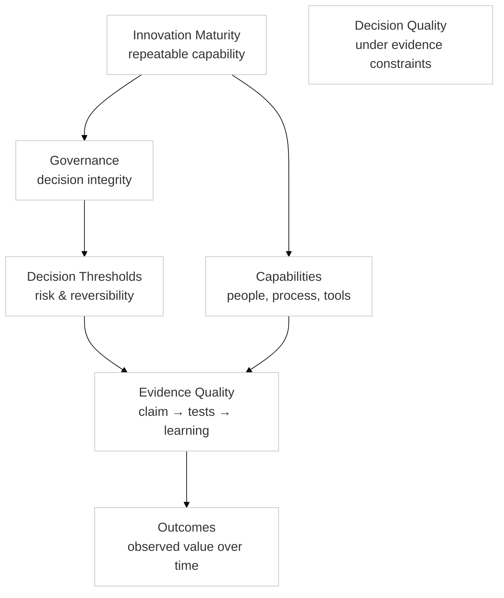

:::info What this chapter does
- Defines innovation maturity as a repeatable capability rather than a one-off outcome.
- Establishes the baseline concepts that anchor the Phase 1 foundation.
- Connects maturity to evidence, governance, and strategic alignment.
- Frames the chapter as a starting point for the program sequence.
:::

:::warning What this chapter does not do
- Does not provide a scoring model or maturity assessment tool.
- Does not replace organization-specific strategy or leadership decisions.
- Does not prescribe a single transformation methodology.
- Does not guarantee innovation outcomes without execution.
:::

:::tip When you should read this
- When starting the framework or onboarding new stakeholders.
- When you need a shared definition of innovation maturity.
- When aligning leadership on why maturity matters.
- Before applying assessment or governance practices.
:::

:::note Derived from Canon
This chapter is interpretive and explanatory. Its constraints and limits derive from the Canon pages below.

- [Canon - Definitions](/docs/canon/definitions)
- [Canon - Evidence logic](/docs/canon/evidence-logic)
- [Canon - Decision theory](/docs/canon/decision-theory)
- [Canon - Epistemic stage model](/docs/canon/epistemic-model)
:::

:::info Key terms (canonical)
- Evidence
- Evidence quality
- Decision threshold
- Optionality preservation
- Strategic deferral
- Reversibility
:::

:::warning Minimal evidence expectations (non-prescriptive)
Evidence used in this chapter should allow you to:
- articulate a baseline maturity definition for the organization
- connect maturity goals to observable practices and outcomes
- state what evidence would show progress or regression
- justify why the organization should invest in maturity work
:::

:::note Figure 6 — Innovation Maturity as Evidence-First Capability (explanatory)

```mermaid
%%{init: {"theme":"base","flowchart":{"nodeSpacing":60,"rankSpacing":80},"themeVariables":{"fontSize":"18px"}} }%%
flowchart TB
  IMM["Innovation Maturity<br/>repeatable capability"]
  CAP["Capabilities<br/>people, process, tools"]
  GOV["Governance<br/>decision integrity"]
  EVI["Evidence Quality<br/>claim → tests → learning"]
  THR["Decision Thresholds<br/>risk & reversibility"]
  OUT["Outcomes<br/>observed value over time"]
  NOTE["Decision Quality<br/>under evidence constraints"]

  IMM --> CAP
  IMM --> GOV
  GOV --> THR
  THR --> EVI
  CAP --> EVI
  EVI --> OUT

  classDef layer fill:#ffffff,stroke:#c7c7c7,stroke-width:1px;
  class IMM,CAP,GOV,EVI,THR,OUT,NOTE layer;
```
This diagram is explanatory, not normative. Innovation maturity is non-linear,
regression is expected, and reversibility remains relevant. It illustrates
decision quality under evidence constraints rather than a maturity ladder.
:::

## What Innovation Maturity Means in MCF 2.2

Innovation maturity, in MCF 2.2, is the capability to make innovation decisions that remain defensible under uncertainty. It does not describe a journey, a ladder, or a level to be achieved. Instead, it reflects how consistently an organization can generate, test, and scale ideas while keeping decision thresholds explicit and reversibility available.

A mature organization does not equate progress with activity. It distinguishes between exploration and commitment, preserves optionality when evidence is weak, and tightens thresholds only as evidence improves. Regression is expected and acceptable when reversibility is still the responsible choice.

Innovation maturity therefore describes decision behavior under constraints, not output volume or success narratives.

## Why Innovation Maturity Matters (Decision-Centric Framing)

Innovation maturity matters because innovation decisions are made under uncertainty. Without evidence discipline, organizations drift toward over-commitment, premature scaling, and governance breakdowns.

Maturity improves the integrity of decisions about what to test, what to defer, and what to scale. It reduces exposure to irreversible errors by aligning commitments with evidence sufficiency rather than optimism or pressure.

This framing preserves the motivational force of innovation work without promising outcomes. The value lies in clearer, more reversible decisions — not in guarantees of success.

## Core Elements of Innovation Maturity (A Non-Linear System)

Innovation maturity emerges from the interaction of multiple elements. These elements do not progress linearly, and strength in one area does not compensate for weakness in another.

### Cultural Readiness

Cultural readiness reflects how an organization treats uncertainty, learning, and challenge. A mature culture allows evidence to question assumptions and status without penalty. Invalidated hypotheses are treated as learning, not failure.

This includes tolerance for experimentation, clarity about what counts as evidence, and protection for teams when reversibility is exercised responsibly.

Common misuse signals include celebrating experimentation rhetorically while penalizing reversal in practice, or collecting data without allowing it to influence decisions.

### Talent and Structural Enablement

Innovation maturity depends not only on skills, but on decision rights. Clear roles, accountability for thresholds, and cross-functional structures enable evidence to be interpreted and acted upon.

Talent without structural authority produces analysis without impact. Structure without evidence discipline produces compliance without learning. Maturity requires alignment between people, roles, and decision ownership.

### Structured Processes

Processes support maturity when they make learning repeatable without enforcing rigidity. Mature processes clarify how claims are tested, when evidence is sufficient, and how decisions remain reversible when uncertainty persists.

Process misuse appears when frameworks optimize throughput, ceremony, or reporting rather than evidence quality and decision integrity.

### Customer and Technology Readiness

Customer insight and technology capability amplify maturity only when they are used to test claims, not to justify premature scaling. Technology enables speed, but speed without thresholds increases risk.

Mature organizations treat customer data and technical capability as evidence generators, bounded by governance and reversibility constraints.

## Common Misinterpretations and Misuse Signals

Innovation maturity is often misframed. Typical misuse patterns include:

- Treating maturity as a score, certification, or compliance label
- Equating activity volume with learning or evidence quality
- Performing agile rituals without updating thresholds
- Claiming leadership sponsorship without decision accountability
- Scaling initiatives before reversibility can be preserved

These signals indicate erosion of decision integrity rather than progress.

## How This Chapter Anchors Phase 1

Phase 1 establishes shared language, evidence discipline, and decision boundaries. It does not execute transformation, implement tools, or promise results.

The purpose of Phase 1 is orientation: clarifying what claims can be made, what evidence is missing, and which decisions should be deferred. This prevents premature commitment and protects optionality before investments become difficult to reverse.

## Setting Direction Without Locking Trajectories

The prompts below guide orientation without implying a fixed path or maturity ladder. They emphasize hypothesis ordering, deferral, and reversibility.

- [ ] **Assess Current Decision Integrity**
  - Which innovation decisions are currently made without explicit evidence thresholds?
  - Where is reversibility least protected?
  - What evidence is missing for the next defensible decision?

- [ ] **Define Constraints and Decision Boundaries**
  - Which claims should be deferred until stronger evidence exists?
  - What governance limits scaling at this stage?

- [ ] **Align Culture to Evidence Tolerance**
  - Where does the organization penalize learning or reversal?
  - How is evidence allowed to challenge assumptions safely?

- [ ] **Order Hypotheses, Not Milestones**
  - Which assumptions must be tested first to preserve optionality?
  - Where can uncertainty be reduced without over-commitment?

- [ ] **Engage Stakeholders Around Decision Integrity**
  - Who owns threshold decisions?
  - Where is decision accountability unclear or misaligned?

## Closing: Maturity as Constraint-Aware Progress

Innovation maturity improves the defensibility of decisions under uncertainty. It does not guarantee outcomes or linear progress. In MCF 2.2, maturity is reflected in how well an organization preserves optionality, updates thresholds as evidence evolves, and accepts regression when reversibility remains the responsible choice.

This chapter establishes the foundation for disciplined innovation — one that advances through constraint-aware learning rather than optimism or inertia.
