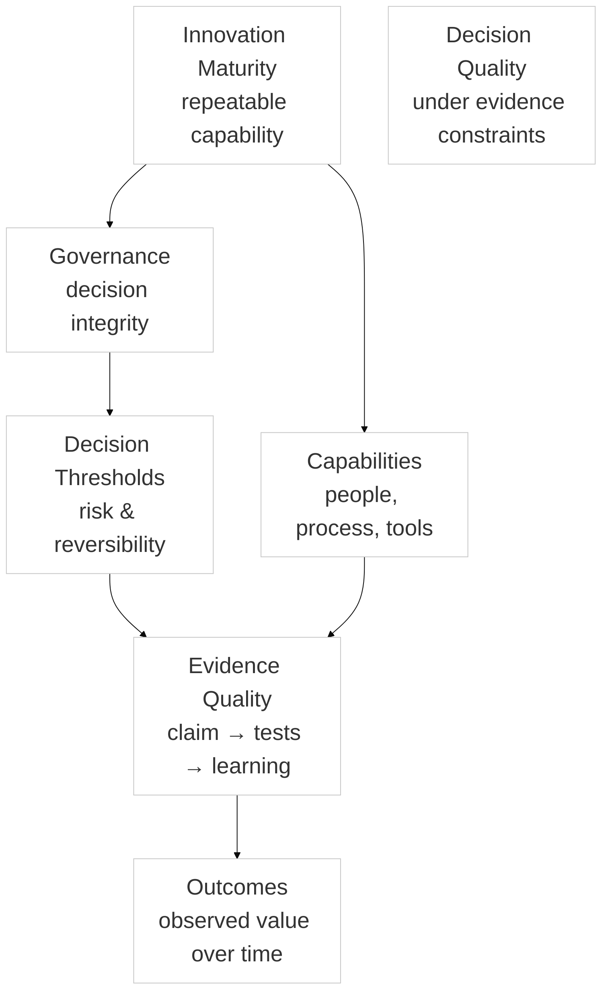

:::info What this chapter does
- Defines innovation maturity as a repeatable capability rather than a one-off outcome.
- Establishes the baseline concepts that anchor the Phase 1 foundation.
- Connects maturity to evidence, governance, and strategic alignment.
- Frames the chapter as a starting point for the program sequence.
:::

:::warning What this chapter does not do
- Does not provide a scoring model or maturity assessment tool.
- Does not replace organization-specific strategy or leadership decisions.
- Does not prescribe a single transformation methodology.
- Does not guarantee innovation outcomes without execution.
:::

:::tip When you should read this
- When starting the framework or onboarding new stakeholders.
- When you need a shared definition of innovation maturity.
- When aligning leadership on why maturity matters.
- Before applying assessment or governance practices.
:::

:::note Derived from Canon
This chapter is interpretive and explanatory. Its constraints and limits derive from the Canon pages below.

- [Canon - Definitions](/docs/canon/definitions)
- [Canon - Evidence logic](/docs/canon/evidence-logic)
- [Canon - Decision theory](/docs/canon/decision-theory)
- [Canon - Epistemic stage model](/docs/canon/epistemic-model)
:::

:::info Key terms (canonical)
- Evidence
- Evidence quality
- Decision threshold
- Optionality preservation
- Strategic deferral
- Reversibility
:::

:::warning Minimal evidence expectations (non-prescriptive)
Evidence used in this chapter should allow you to:
- articulate a baseline maturity definition for the organization
- connect maturity goals to observable practices and outcomes
- state what evidence would show progress or regression
- justify why the organization should invest in maturity work
:::

:::note Figure 6 — Innovation Maturity as Evidence-First Capability (explanatory)

```mermaid
%%{init: {"theme":"base","flowchart":{"nodeSpacing":60,"rankSpacing":80},"themeVariables":{"fontSize":"28px"}} }%%
flowchart TB
  IMM["Innovation Maturity<br/>repeatable capability"]
  CAP["Capabilities<br/>people, process, tools"]
  GOV["Governance<br/>decision integrity"]
  EVI["Evidence Quality<br/>claim → tests → learning"]
  THR["Decision Thresholds<br/>risk & reversibility"]
  OUT["Outcomes<br/>observed value over time"]
  NOTE["Decision Quality<br/>under evidence constraints"]

  IMM --> CAP
  IMM --> GOV
  GOV --> THR
  THR --> EVI
  CAP --> EVI
  EVI --> OUT

  classDef layer fill:#ffffff,stroke:#c7c7c7,stroke-width:1px;
  class IMM,CAP,GOV,EVI,THR,OUT,NOTE layer;
```
This diagram is explanatory, not normative. Innovation maturity is non-linear,
regression is expected, and reversibility remains relevant. It illustrates
decision quality under evidence constraints rather than a maturity ladder.
:::

## What Innovation Maturity Means in MCF 2.2

Innovation maturity is a capability to make innovation decisions that remain defensible under evidence constraints. It is not a journey narrative or a maturity ladder. In MCF 2.2, maturity is defined by how consistently an organization can generate, test, and scale ideas while keeping decision thresholds explicit and reversibility available.

Maturity signals include the ability to preserve optionality when evidence is weak, tighten thresholds as evidence improves, and accept regression without treating it as failure. A mature organization treats reversibility as a boundary condition, not a temporary inconvenience.

## Why Innovation Maturity Matters (Decision-Centric Framing)

Innovation maturity matters because decision quality, not output volume, determines whether investments are defensible. High activity without evidence discipline increases risk exposure and undermines governance. Strong maturity improves the integrity of decisions about what to test, what to defer, and what to scale.

This framing preserves the motivational force of innovation work without promising outcomes. The value is in clearer, more reversible decisions under uncertainty, not in guarantees of success.

## Core Elements of Innovation Maturity (Non-Linear System)

These elements form a system. Strength in one area does not compensate for weakness in another, and progress is not linear.

- **Cultural Readiness**  
  Culture is mature when evidence can challenge status and assumptions without penalty. This includes tolerance for invalidated hypotheses, clarity about what counts as evidence, and a norm of learning before commitment.

- **Talent and Structure**  
  Skills matter, but decision rights matter more. Maturity requires defined roles, clear accountability for thresholds, and structures that allow cross-functional decisions to be made and revisited as evidence changes.

- **Structured Processes**  
  Processes should make experimentation repeatable without forcing rigidity. Mature processes define how claims are tested, when evidence is sufficient, and how reversibility is preserved when uncertainty remains.

- **Customer and Technology Readiness**  
  Customer insight and technical capability amplify evidence quality when they are used to test claims, not to justify premature scaling. Technology enables speed only when governance and thresholds are explicit.

## Common Misinterpretations and Misuse Signals

- Treating maturity as a score, certification, or compliance label.
- Equating activity volume with learning or evidence quality.
- Agile theater that produces rituals without updated thresholds.
- Leadership sponsorship without decision accountability or governance follow-through.
- Scaling claims before evidence allows reversibility to be preserved.

## How This Chapter Anchors Phase 1

Phase 1 establishes shared definitions and evidence discipline. It does not execute transformation, implement tools, or promise outcomes. The work is about orientation: what claims can be made, what evidence is missing, and what decisions should be deferred.

## Setting Direction Without Locking Trajectories

These prompts guide orientation without implying a fixed sequence. They emphasize hypothesis ordering, deferral, and reversibility.

- [ ] 1. **Assess Current Decision Integrity**  
  Example prompts:
  - *Which innovation decisions are currently made without explicit evidence thresholds?*
  - *Where are optionality and reversibility least protected?*
  - *What evidence is missing for the next meaningful decision?*

- [ ] 2. **Define Constraints and Decision Boundaries**  
  Example prompts:
  - *Which claims should be deferred until stronger evidence exists?*
  - *What governance boundaries limit what can be scaled right now?*

- [ ] 3. **Align Culture to Evidence Tolerance**  
  Example prompts:
  - *Where does the organization penalize learning or reversal?*
  - *How is evidence used to challenge assumptions without escalation risk?*

- [ ] 4. **Order Hypotheses, Not Milestones**  
  Example prompts:
  - *Which hypotheses must be tested first to preserve reversibility?*
  - *Where can uncertainty be reduced without overcommitting resources?*

- [ ] 5. **Engage Stakeholders Around Decision Integrity**  
  Example prompts:
  - *Who owns threshold decisions and evidence interpretation?*
  - *Where is decision accountability unclear or misaligned?*

## Closing: Maturity as Constraint-Aware Progress

Innovation maturity improves the defensibility of decisions under uncertainty. It does not guarantee outcomes or linear progress. In MCF 2.2, maturity is measured by how well an organization preserves optionality, updates thresholds as evidence changes, and accepts regression when reversibility is still the responsible choice.
