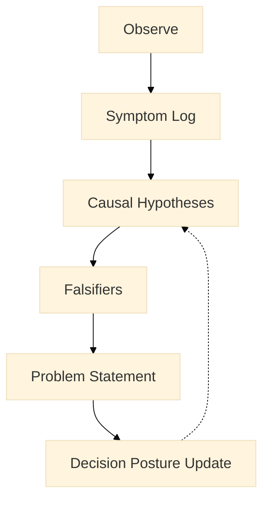

:::info What this chapter does
- Defines “problem” as a decision-relevant constraint framed by evidence, not a slogan.
- Shows how to separate symptoms from causal hypotheses without premature solutions.
- Uses a problem tree as an explanatory model that can be falsified.
- Translates problem framing into strategic objectives and key results as governance artifacts.
:::

:::warning What this chapter does not do
- Does not guarantee your problem statement is correct or complete.
- Does not prescribe a single root-cause method or workshop format.
- Does not provide a full OKR execution playbook for delivery teams.
- Does not justify irreversible commitments when evidence remains thin.
:::

:::tip When you should read this
- When insights exist but causal clarity is still weak.
- When solutions are debated without a shared, evidence-linked problem statement.
- When objectives are stated but not traceable to the underlying problem.
- Before selecting solutions or committing to roadmaps.
:::

:::note Derived from Canon
This chapter is interpretive and explanatory. Its constraints and limits derive from the Canon pages below.

- [Canon - Definitions](/docs/canon/definitions)
- [Canon - Evidence logic](/docs/canon/evidence-logic)
- [Canon - Decision theory](/docs/canon/decision-theory)
- [Canon - Epistemic stage model](/docs/canon/epistemic-model)
:::

:::info Key terms (canonical)
- Evidence
- Evidence quality
- Decision threshold
- Optionality preservation
- Strategic deferral
- Reversibility
- Termination logic
:::

:::warning Minimal evidence expectations (non-prescriptive)
Evidence used in this chapter should allow you to:
- distinguish symptoms (observations) from causes (hypotheses)
- justify why the stated problem is decision-relevant
- specify what observations would falsify the causal explanation
- trace each objective and key result to the problem statement
- state which commitments are reversible vs. potentially irreversible
:::

This chapter turns customer observations into a **decision-ready problem statement** and then into strategic objectives that can be governed. It stays practical while making evidence, thresholds, and reversibility explicit.

## 1) Problem analysis: from symptoms to decision-ready constraints

In MCF 2.2, a “problem” is not a complaint. It is a **decision-relevant constraint** backed by evidence: something that, if true, changes what decisions are defensible.

### Symptoms vs. causes (make the distinction visible)

- **Symptoms** are observed signals (what is happening).
- **Causes** are hypotheses (why it might be happening).

Use a small field list to avoid conflation:

- **Symptom log:** what is observed, where, and how often.
- **Causal hypotheses:** plausible drivers (falsifiable).
- **Falsifiers:** what evidence would contradict each hypothesis.

:::tip Example — Startup Context
A startup sees a 35% drop-off at checkout. The symptom is “drop-off at Step 3.” A causal hypothesis is “payment options are missing for mobile users.” A falsifier is “drop-off persists even after the missing options are added.”
:::

:::tip Example — Institutional Context
A public service team sees repeated verification failures. The symptom is “verification step causes rework.” A causal hypothesis is “document mismatch rules are unclear.” A falsifier is “failure persists after rule clarity improves.”
:::

:::tip Example — Hybrid Context
An innovation lab sees pilots stalling at a handoff. The symptom is “handoff delay > 10 days.” A causal hypothesis is “governance review is triggered by missing evidence artifacts.” A falsifier is “delays persist when artifacts are complete.”
:::

### Causal model guidance (problem tree as explanatory artifact)

A problem tree is not truth; it is a **working model** that can be revised. It helps teams distinguish what is observed from what is inferred.

:::note Figure 9 — Problem Analysis Workflow (explanatory)

This figure is explanatory, not normative. Evidence can revise hypotheses and update decision posture without implying linear progress.
:::

### Decision posture notes (reversibility, optionality, deferral)

Problem statements should include decision posture:
- **Reversibility:** how costly is it to change course?
- **Optionality:** what is kept open if evidence is weak?
- **Deferral:** what must be postponed until stronger evidence appears?

## 2) Strategic objectives (OKRs) as governance artifacts

Objectives and KRs are **commitments with evidence linkage**, not “goals theater.” They clarify what evidence is required before decisions can advance.

### OKR hygiene checklist (practical)

Each objective and KR should be:
- **Measurable:** observable signals exist.
- **Time-bound:** review cadence is defined.
- **Owned:** decision owner is explicit.
- **Baseline-aware:** starting point is recorded.
- **Failure-mode aware:** how the metric could mislead is stated.

### KPI vs KR vs metric (when to use each)

- **Metric:** any signal; may be noisy or incomplete.
- **KR:** a decision-relevant outcome tied to an objective.
- **KPI:** an operational signal used to monitor stability or risk.

KPIs are used when operational stability constrains decision posture. KRs are used to justify advancement. Metrics are used to explore or falsify.

### Traceability fields (make it auditable)

Use a simple traceability list:
- **Problem → Objective → KR → Metric/KPI → Evidence source → Review cadence**

This keeps objectives anchored to the problem statement and makes governance decisions auditable.

## 3) What you should have before Chapter 13

Before moving on, you should have:
- a decision-ready problem statement
- symptom log + causal hypotheses + falsifiers
- draft objectives and KRs traceable to the problem
- reversibility notes and deferral criteria

This is enough to explore alternative solutions without turning uncertainty into theater.

## ToDo for this Chapter

- [ ] Create Problem Analysis and OKR questionaire/template, attach template to Google Drive and link to this page
- [ ] Create Chapter Assesment questionnaire to Google Drive and attach to this page
- [ ] Translate all content to Spanish and integrate to i18n
- [ ] Record and embed video for this chapter
