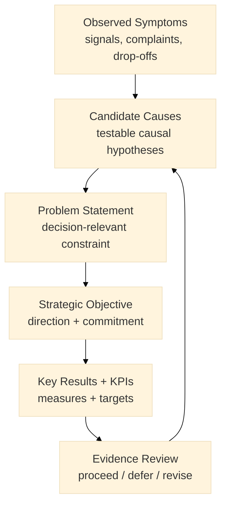

:::note What this chapter does
- Defines what “problem” means in MCF terms: a decision-relevant constraint framed by evidence, not a slogan.
- Shows how to move from observed symptoms to testable causal hypotheses (root causes) without premature solution selection.
- Uses a problem tree as an explanatory causal model that can be falsified and revised.
- Translates a decision-ready problem statement into strategic objectives and measurable key results (OKRs) as governance commitments.
- Clarifies how objectives, KRs, and KPIs constrain scope, preserve optionality, and reduce “goal theater.”
:::

:::warning What this chapter does not do
- Does not guarantee your stated problem is correct; it requires evidence quality, revalidation, and revision when falsified.
- Does not prescribe a single root-cause method (5 Whys is an example, not a requirement).
- Does not provide a complete OKR scaling playbook; it establishes decision-ready strategic direction for Phase 2.
- Does not replace experimentation and validation required for solution selection in later chapters.
- Does not justify irreversible commitments when evidence remains below the decision threshold.
:::

:::tip When you should read this
- When customer insights exist, but the causal story behind outcomes is still ambiguous.
- When teams are debating solutions without a shared, evidence-linked problem statement.
- When strategic goals are stated but not measurable or not traceable to the problem.
- Before selecting solutions, allocating major resources, or committing to delivery roadmaps.
:::

:::info Derived from Canon
This chapter is interpretive and explanatory. Its constraints and limits derive from the Canon pages below.
- [Canon → Definitions](../../canon/definitions)
- [Canon → Evidence logic](../../canon/evidence-logic)
- [Canon → Decision theory](../../canon/decision-theory)
- [Canon → Epistemic stage model](../../canon/epistemic-model)
:::

:::info Key terms (canonical)
- Evidence
- Evidence quality
- Decision threshold
- Optionality preservation
- Strategic deferral
- Reversibility
- Termination logic
:::

:::note Minimal evidence expectations (non-prescriptive)
Evidence used in this chapter should allow you to:
- distinguish symptoms (observations) from causes (hypotheses)
- justify why the stated problem is decision-relevant (not merely descriptive)
- specify what observations would falsify the causal explanation
- trace each strategic objective and key result to the problem statement
- state which commitments are reversible vs. potentially irreversible at this point
:::

From Questions to Clarity. This visual shows how Phase 2 turns observed symptoms into a falsifiable causal model, then translates a decision-ready problem statement into objectives and measurable key results.

:::note Figure 9 — Problem Analysis Loop (explanatory)

This figure is explanatory. It is a loop: evidence review can revise the causal model, update the problem statement, or change which objectives remain defensible.
:::

A strong Phase 2 problem statement is not a slogan. In the Book layer, a **problem** is a **decision-relevant constraint** that you can link to evidence and use to justify commitment (or deferral) without pretending you have certainty.

This chapter shows how to:
1) turn observations into a falsifiable causal story (problem analysis), and
2) convert that story into governance commitments (strategic objectives + KRs).

---

## 1) What “problem” means in MCF 2.2

Most teams confuse:
- **symptoms** (what you observe),
- **causes** (why it might be happening),
- **solutions** (what you want to build).

In MCF terms:
- **Symptoms** are observations (they can be measured or documented).
- **Causes** are hypotheses (they must be testable and falsifiable).
- **A problem statement** is decision-ready when it links symptoms to a causal hypothesis with enough evidence to justify a next commitment.

At this stage, your goal is not “perfect truth.” Your goal is **decision integrity**.

---

## 2) Problem analysis: from symptoms to causal hypotheses

### 2.1 Start with a symptom log (observable)
Collect a small set of observable symptoms. Keep them concrete and bounded:
- what is happening,
- where it happens in the journey/process,
- how often,
- what it costs (time, revenue, risk, trust, rework).

**Practical fields (minimum):**
- Symptom (what is observed)
- Where it occurs (step / touchpoint)
- Evidence source (tickets, analytics, logs, audits)
- Baseline metric (current)
- Severity (why it matters)

:::tip Example — Startup context
A product team sees a sharp drop-off at checkout Step 3. Analytics shows a 52% abandonment rate at that step, and session recordings show users pausing on the same form field.
:::

:::tip Example — Institutional transformation context
A public service shows repeated escalations at identity verification. Case logs show rework because documents don’t match records; the service completion rate drops and processing time expands.
:::

:::tip Example — Hybrid context
An innovation lab pilot shows improved completion, but manual review escalations spike. The symptom is “mixed movement”: one metric improves while a governance-risk metric worsens.
:::

### 2.2 Separate causes from narratives (hypotheses, not conclusions)
For each symptom, propose 2–4 plausible **causal hypotheses**. Treat each as a claim that could be wrong.

**Practical fields (minimum):**
- Hypothesis (cause candidate)
- What would support it (observable evidence)
- What would falsify it (observable evidence)
- Risk if wrong (why it matters)

:::tip Example — Startup context
Hypothesis: “Users abandon because the checkout form asks for information they don’t have.”  
Falsifier: “If abandonment is high even when the field is prefilled or removed, the cause is elsewhere.”
:::

:::tip Example — Institutional transformation context
Hypothesis: “Verification friction is driven by mismatch between citizen registry data and submitted documents.”  
Falsifier: “If mismatch rates are low but escalations remain high, process design or staffing may be causal.”
:::

:::tip Example — Hybrid context
Hypothesis: “The pilot increased completion because it loosened controls; escalations rose because fraud signals were not handled earlier.”  
Falsifier: “If fraud-signal rates are stable while escalations rise, workload design (not risk control) may be causal.”
:::

### 2.3 Use a causal model (problem tree) as an explanatory artifact
A problem tree is not “the truth.” It is a **model you can revise**. It helps teams stop arguing in circles by making the causal story explicit.

- **Trunk**: main problem (decision-relevant constraint)
- **Roots**: causal hypotheses (drivers)
- **Branches**: effects (what the organization experiences)

## 2.4 Write a decision-ready problem statement
A problem statement is decision-ready when it includes:

- the constraint (what limits progress),
- the observable symptom(s) (evidence),
- the stakeholder impact (why it matters),
- the causal hypothesis (why it might be happening),
- the reversibility note (risk of committing too early).

Template (Book layer, non-prescriptive):

We observe [symptom + baseline] at [where] affecting [stakeholders] with impact [cost/risk/trust].
We believe this is driven by [causal hypothesis] and would be falsified by [falsifier].
Until evidence improves, we treat commitments as [reversible / potentially irreversible] and set decision posture to [proceed/defer/revise].

:::tip Example — Startup context
We observe 52% abandonment at checkout Step 3, reducing conversions and raising CAC. We believe the abandonment is driven by a high-friction form field requiring unavailable information, and this would be falsified if abandonment remains high after simplifying/removing the field. Commitments remain reversible; decision posture is proceed with bounded tests.
:::

:::tip Example — Institutional transformation context
We observe repeated escalations and rework during identity verification, expanding processing time and lowering completion rates while increasing trust and compliance risk. We believe mismatches between registry data and submitted documents drive manual reviews, falsified if mismatch rates are low while escalations remain high. Commitments touching verification controls may be potentially irreversible; decision posture is proceed with constrained pilots and explicit risk metrics.
:::

:::tip Example — Hybrid context
We observe improved completion in a bounded pilot while manual review escalations increase. We believe controls shifted downstream rather than being resolved earlier, falsified if escalation causes are primarily staffing/workload rather than risk signals. Commitments are mixed (some reversible, some not); decision posture is revise the hypothesis and retest before scaling.
:::

## 3) Strategic objectives and OKRs as governance commitments
Once you have a decision-ready problem statement, OKRs become a governance artifact:

- they constrain solution space,
- they clarify what "progress" means,
- they prevent teams from shipping activity without evidence.

## 3.1 Objective: the commitment you are making
An objective is a directional commitment that responds to the problem constraint.

Objective hygiene (minimum):
- outcome-oriented (not a feature list)
- bounded in time
- has a named owner
- grounded in baseline evidence
- consistent with reversibility (avoid premature irreversible commitments)

## 3.2 Key Results: the measurable changes you will accept as progress
Key Results are not tasks. They are measurable outcomes that reduce uncertainty.

KR hygiene (minimum):
- measurable and time-bound
- tied to a baseline
- tied to an evidence source
- has a failure mode (how it could be "wrong")

## 3.3 KPIs: health signals, not substitutes for KRs
KPIs can be useful, but they often become a distraction. In Phase 2:

- use KPIs as system health and risk signals,
- keep KRs as commitment outcomes tied to the problem.

Rule of thumb (Book layer):

- If it proves the objective is being achieved: it’s likely a KR.
- If it monitors system health or risk across time: it’s likely a KPI.

:::tip Example — Startup context
Objective: Reduce checkout friction to improve conversion.
KRs: Decrease drop-off at Step 3 from 52% to 30% within 8 weeks; Increase conversion rate from 2.1% to 2.8%.
KPIs: Support ticket rate; Payment failure rate.
:::

:::tip Example — Institutional transformation context
Objective: Improve service completion without increasing fraud risk.
KRs: Increase completion rate from baseline to target; Reduce average processing time; Reduce rework rate.
KPIs: Fraud alerts; audit exceptions; manual review workload.
:::

:::tip Example — Hybrid context
Objective: Improve completion while maintaining governance constraints.
KRs: Reduce drop-off at the breakpoint; Reduce escalations to manual review; Maintain risk thresholds.
KPIs: Review queue time; exception rates; policy compliance signals.
:::

## 4) Traceability: link OKRs back to the problem
If OKRs are not traceable to the problem statement, they are not governance; they are decoration.

Practical fields (minimum):
- Problem statement reference (short ID)
- Objective (text)
- KR (metric + target + deadline)
- Evidence source (analytics/logs/audits)
- Review cadence (weekly/biweekly/monthly)
- Reversibility note (what becomes harder to undo)

## 5) What you should have before Chapter 13
Before moving into exploring alternatives, you should be able to say:

- We observed these symptoms (with baselines and sources).
- We have 1-3 causal hypotheses (with falsifiers).
- We have a decision-ready problem statement (bounded, evidence-linked).
- We have draft OKRs traceable to that problem statement.
- We know what is reversible vs potentially irreversible at this point.

We have 1–3 causal hypotheses (with falsifiers).

That is enough to proceed.

The next chapter, Exploring Alternative Solutions, uses these constraints to explore options without turning uncertainty into “solution theater.”

## ToDo for this Chapter
- [ ] Create Problem Analysis and OKR questionnaire/template, attach template to Google Drive and link to this page
- [ ] Create Chapter Assesment questionnaire to Google Drive and attach to this page
- [ ] Translate all content to Spanish and integrate to i18n
- [ ] Record and embed video for this chapter
