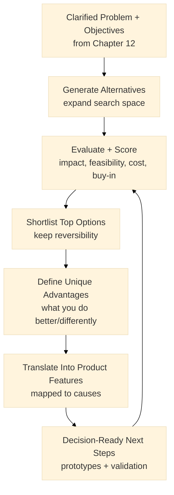
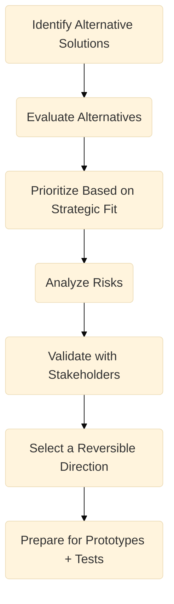
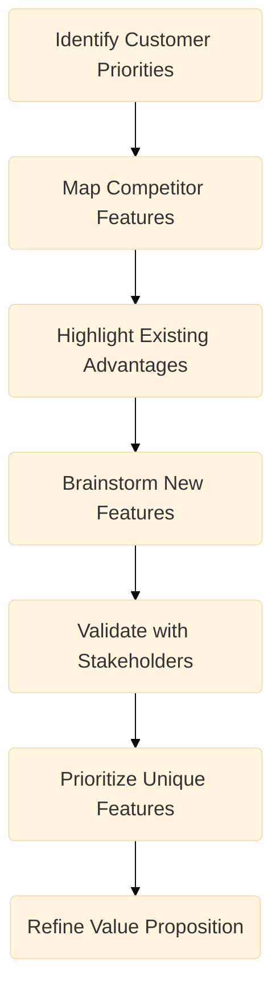
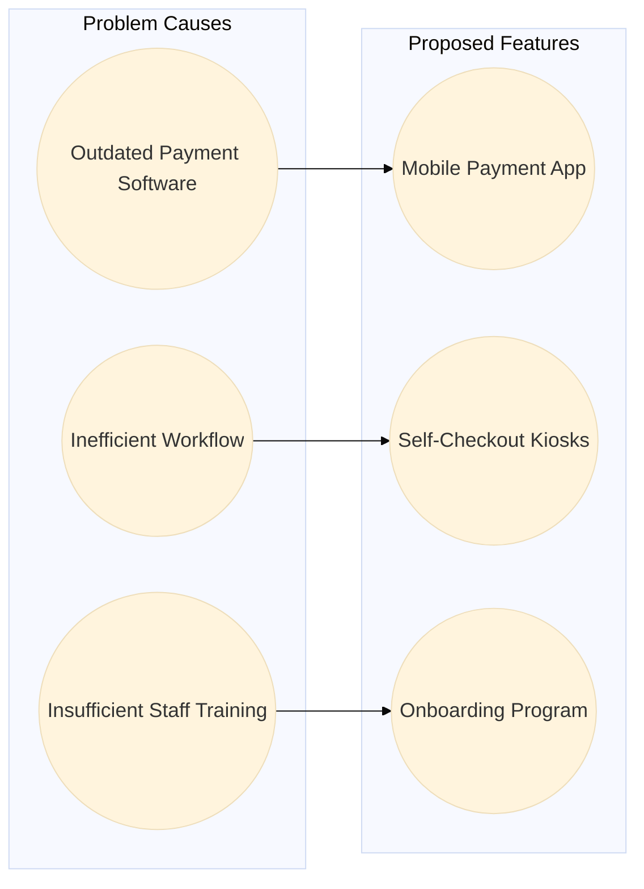

:::info What this chapter does
- Explains how to expand the solution search space without prematurely committing to a single approach.
- Introduces alternatives analysis as an epistemic step: compare options using explicit criteria and evidence.
- Shows how to separate *solution hypotheses* from *validated constraints*, so teams can test without locking in.
- Connects alternatives selection to decision thresholds and reversibility, ahead of prototyping and experiments.
:::

:::warning What this chapter does not do
- Does not claim that generating more ideas increases innovation success.
- Does not prescribe a single ideation method, workshop format, or template.
- Does not guarantee feasibility, desirability, or viability of any option without evidence.
- Does not replace prototyping, experiments, or user validation required later in Discovery and Validation.
:::

:::tip When you should read this
- After you have a clarified problem and strategic intent, but before committing to a solution direction.
- When multiple approaches seem plausible and the team needs defensible selection logic.
- When the organization is defaulting to the “first solution” without comparing alternatives.
- When constraints (cost, time, compliance, integration) must be made explicit early.
:::

:::note Derived from Canon
This chapter is interpretive and explanatory. Its constraints and limits derive from the Canon pages below.

- [Canon → Definitions](../../canon/definitions)
- [Canon → Evidence logic](../../canon/evidence-logic)
- [Canon → Decision theory](../../canon/decision-theory)
- [Canon → Epistemic stage model](../../canon/epistemic-model)
:::

:::info Key terms (canonical)
- Evidence
- Evidence quality
- Decision threshold
- Optionality preservation
- Reversibility
- Termination logic
:::

:::warning Minimal evidence expectations (non-prescriptive)
Evidence used in this chapter should allow you to:
- state *why* each alternative is considered plausible (and under what assumptions)
- compare alternatives against explicit criteria (constraints, risks, expected outcomes)
- specify what observations or tests would eliminate an option
- justify why a chosen direction remains reversible until stronger evidence is obtained
:::

:::note Figure 10 — Alternatives → Scoring → Differentiation (explanatory)

This figure is explanatory. It shows an iterative loop: scoring and feature definition can update the shortlist as evidence improves.
:::

Navigating the Path to Differentiation. This figure reflects the exploration of alternative solutions and the selection of differentiating advantages and features. In the Book layer, the goal is not to “pick the best idea,” but to compare plausible options using explicit criteria, preserve optionality, and stay reversible until evidence justifies commitment.

In this chapter, we integrate Solution Alternatives and Unique Advantages and Product Features to guide you in generating, evaluating, and refining potential solutions for your innovation. We also show how to identify and express differentiators without treating them as proof. Finally, we cross-reference Problem Analysis (Chapter 12) to show how features can be framed as responses to stated causes.

## 1. Introduction
Chapter 12 produced a clarified problem statement and strategic intent (objectives and key results). Chapter 13 expands the solution search space and narrows it using decision-relevant criteria, not persuasion.

At this stage, many teams collapse these into one conversation:

“What should we build?”

“What is feasible?”

“What is differentiating?”

MCF 2.2 treats these as separable. A solution is a hypothesis. A constraint is something you treat as validated enough to shape choices. Your job is to keep them distinct long enough to learn.

### Inputs
- Validated Problem Statement from Chapter 12
- Strategic Objectives and Key Results (OKRs) from Chapter 12
- Root Causes identified in your Problem Tree
- Relevant Data and Insights (customer feedback, market research, operational constraints)

### Outputs
- A list of plausible solution alternatives
- A weighted scoring matrix ranking each alternative
- Refined solution proposals for further validation
- A prioritized list of unique advantages and product features (as hypotheses linked to constraints)

## Section 1: Exploring Alternative Solutions
You have a clarified problem and strategic direction. Now, you systematically explore a range of solutions that could address the root causes.

:::info Solution Alternatives steps

:::

### 1.1 Identify Alternative Solutions
Start by expanding the search space. The goal is coverage, not consensus.

- Divergent thinking: capture options before critique.
- Cross-functional input: include delivery, compliance, operations, support.
- Constraint-first prompts: generate options within known constraints (time, policy, integration, budget).

:::tip Example — Startup Context
A startup avoids “feature picking” by generating alternatives at three levels: workflow change, product change, and distribution change. They keep each option as a short hypothesis: “If we do X, we expect Y to improve under constraint Z.”
:::

:::tip Example — Institutional Context
A public institution generates alternatives that include process redesign, policy clarification, and technical changes. They explicitly separate “what could be digitized” from “what should remain controlled,” because governance constraints are part of the problem space.
:::

:::tip Example — Hybrid Context
An innovation lab proposes alternatives across organizations: internal change + partner-delivered change + citizen-facing change. They treat inter-institution dependency as a first-class constraint and include options that reduce coupling.
:::

### 1.2 Evaluate Alternatives (as hypotheses)
Once you have a list, evaluate each alternative as a testable hypothesis.

Common criteria:

- Feasibility: technical complexity, resource availability, time constraints.
- Expected impact: movement on objectives / KRs (as signals, not guarantees).
- Cost-effectiveness: budget fit and opportunity cost.
- Constraints & compliance: procurement, auditability, data protection, integration.

:::tip Example — Startup Context
A startup rejects “cool” alternatives that require long lead times to learn. They prefer options that can produce decision-relevant evidence in weeks, even if the long-term upside is smaller.
:::

:::tip Example — Institutional Context
An institution de-prioritizes an option that would simplify the citizen journey but introduces audit gaps. They keep it as a future alternative pending controls rather than forcing it into the current cycle.
:::

:::tip Example — Hybrid Context
A lab compares two options: one improves completion rate but increases manual review; the other reduces manual review but risks higher abandonment. They treat trade-offs as part of the evaluation, not as “implementation details.”
:::

**Exercise**
Create a simple scoring matrix (Feasibility, Impact, Cost, Constraints, etc.) for each alternative. Rank and shortlist.

### 1.3 Prioritize Based on Strategic Fit
Use OKRs to keep selection decision-relevant:

- Alignment: does the alternative plausibly move the objective?
- Capability match: can your current system deliver it without hidden dependency?
- Learning speed: can you produce useful evidence before committing?

### 1.4 Weighted Scoring System
After generating alternatives, evaluate each option using an explicit weighting scheme. The goal is consistency and traceability, not precision.

Impact on Objectives (40%)
Does the alternative plausibly address your objective or key results?

Feasibility (30%)
Can you implement and learn within your constraints?

Cost-Effectiveness (20%)
Does the alternative fit the budget and opportunity cost posture?

Stakeholder Buy-In (10%)
Will key stakeholders support the learning process and decision posture?

:::tip How it works:
Solution Score = (Impact × 0.40) + (Feasibility × 0.30) + (Cost_Effectiveness × 0.20) + (Stakeholder_BuyIn × 0.10)
:::

:::tip Example — Startup Context
The startup weights “learning speed” inside Feasibility because runway is the constraint. A smaller-impact option wins because it can be tested quickly and falsified cleanly.
:::

:::tip Example — Institutional Context
The institution weights “compliance and auditability” as part of Feasibility and Buy-In. An alternative with higher impact is deferred because evidence cannot be produced without governance approvals.
:::

:::tip Example — Hybrid Context
The lab keeps the same weights but scores “stakeholder buy-in” across multiple parties (owner org + partner org + regulator). They treat misalignment as a risk signal, not as a political inconvenience.
:::

### 1.5 Analyze Risks (as decision constraints)
Consider the risks associated with each alternative:

- Strategic risks: market shifts, policy changes, competitor moves.
- Operational risks: delivery complexity, support load, dependency risk.
- Financial risks: unexpected costs, delayed value realization.

### 1.6 Group Evaluation and Consensus
- Present alternatives: share each option and its scoring rationale.
- Discuss trade-offs: make constraints explicit (time, compliance, integration, reversibility).
- Document disagreements: if consensus is not possible, record what evidence would resolve it.

:::tip Example — Startup Context
If two founders disagree on the direction, they explicitly define a test that would eliminate one option rather than debating taste.
:::

:::tip Example — Institutional Context
If leadership disagrees, the team frames the disagreement as a risk posture question (“What is reversible here?”) and proposes a bounded pilot rather than a full commitment.
:::

:::tip Example — Hybrid Context
If multiple institutions disagree, the lab proposes an option that reduces coupling first (shared data interface, shared standards) before attempting a larger end-to-end change.
:::

### 1.7 Select a reversible direction (not a final solution)
Pick the most promising direction while preserving optionality:

- Keep the shortlist alive until evidence rules options out.
- Treat the selected direction as “next-best experiment,” not “final architecture.”

## Section 2: Unique Advantages and Product Features
A direction is not differentiating by default. Differentiation claims also behave like hypotheses: they should connect to customer-relevant constraints and observable outcomes.

:::info Unique Advantages and Product Features steps

:::

### 2.1 Identify Customer Priorities
Use personas and journeys (Chapters 11–12) to identify what matters in context:

- Speed and convenience
- Cost savings
- Quality and reliability
- Risk reduction (often decisive in institutions)

:::tip Example — Startup Context
A startup treats “speed” as a measurable journey signal (time-to-complete) rather than a branding claim. Features are proposed only if they plausibly move that signal.
:::

:::tip Example — Institutional Context
A public institution treats “risk reduction” as a customer priority because the service fails when trust fails. They frame “reliability” as fewer manual escalations and fewer rework loops.
:::

:::tip Example — Hybrid Context
A lab treats “convenience” and “trust” as coupled. A feature that increases convenience but damages trust is treated as a mixed-evidence outcome that requires redesign.
:::

### 2.2 Map Competitor Features
Research alternatives already available:

- Feature gaps: where others excel or underperform.
- Benchmarking: performance metrics (load time, error rate, satisfaction).
- Value proposition patterns: how competitors frame outcomes.

### 2.3 Highlight Existing Advantages
Capture strengths that are real constraints or assets:

- Proprietary capability (if it is defensible and actually used)
- Distribution/channel access
- Partnerships
- Operational reliability

### 2.4 Brainstorm New Features
Expand feature hypotheses:

- Cross-functional ideation
- User feedback
- Rapid prototypes and narrative tests

:::tip Exercise

Conduct a quick survey or focus group.

Ask users to rank speed, cost, reliability, trust, or other factors.

Map priorities to existing features and candidate new features.

Use this input to generate at least 10 feature hypotheses linked to root causes.
:::

:::tip Example — Startup Context
A startup proposes one “anchor feature” and two supporting features. They avoid listing 25 features because it prevents clean validation.
:::

:::tip Example — Institutional Context
An institution proposes features as policy + process + system changes, not only UI changes. They treat back-office steps as part of the feature set because that’s where friction often lives.
:::

:::tip Example — Hybrid Context
A lab proposes features that reduce coupling (standardized documents, shared identity checks, interoperable status updates) before proposing “smart” features.
:::

### 2.5 Validate with Stakeholders
Validation here means “make the claims falsifiable,” not “get applause.”

- Structured demos
- Feedback collection
- Revision cycles

### 2.6 Prioritize Unique Features
Use a lightweight scoring model:

- User value
- Technical feasibility
- Strategic fit
- Risk posture

### 2.7 Refine Value Proposition
Combine advantages with prioritized features:

- Clear messaging
- Specific use cases
- Explicit constraints (“works under X conditions”)

:::tip Example — Startup Context
The startup writes a value proposition with a falsifiable claim: “Reduce time-to-first-value from 10 minutes to 2 minutes for segment S, measured on flow F.”
:::

:::tip Example — Institutional Context
The institution writes a value proposition with governance constraints: “Increase completion rate without increasing fraud risk, measured by escalation rate and manual review volume.”
:::

:::tip Example — Hybrid Context
The lab writes a value proposition that includes coordination: “Reduce rework loops across organizations by standardizing step X, measured by repeat submission rate and time-to-resolution.”
:::

### 2.8 Cross-Referencing with Problem Analysis
Features should trace back to causes (Chapter 12). This is not “solution justification”; it is a traceability scaffold for later validation.

:::info Feature-Cause Alignment

:::

:::tip How It Works:

Problem causes on the left represent hypotheses validated enough to guide work.

Proposed features on the right are solution hypotheses linked to those causes.

This linkage improves traceability and makes later tests easier to design.
:::

## 4. Refining the Best Solutions
Focus on top-ranked alternatives and refine them into proposals suitable for prototypes and experiments (not full commitments).

### 4.1 Develop Detailed Solution Proposals
Scope and requirements
Define scope, objectives, and constraints.

Resource plan
Estimate budget, timeline, and roles.

Risk assessment
Identify obstacles and mitigation options.

:::tip Example — Startup Context
A startup writes a one-page proposal that includes: what is tested, what would falsify it, and what happens if evidence is mixed.
:::

:::tip Example — Institutional Context
An institution writes a proposal that explicitly separates “policy change required” from “process/system change possible now” to preserve reversibility.
:::

:::tip Example — Hybrid Context
A lab writes a proposal that includes inter-party dependencies and a fallback path if a partner cannot deliver on time.
:::

### 4.2 Stakeholder Engagement
Present proposals

Incorporate feedback as constraints or test inputs

Secure approval for bounded pilots or prototypes

## 5. Documenting the Next Steps
Once you select a direction, document how you will learn next:

Implementation roadmap (milestones, responsibilities, deadlines)

Pilot plans (bounded scope, data collection, decision thresholds)

Integration with OKRs (how evidence will update objectives or priorities)

:::tip Exercise:
Create a lightweight roadmap that includes: what will be tested, when evidence will be reviewed, and what decision options exist (proceed / revise / defer).
:::

## 6. Best Practices and Tools
Encourage openness (options before critique)

Use visual aids (maps and matrices to make criteria explicit)

Leverage digital tools when they reduce friction (not as a substitute for evidence)

- Miro / Lucidchart for mapping
- Trello / Asana for planning
- Forms for structured feedback

Revisit scores when constraints change

Keep traceability: alternative → criteria → decision posture

## Final Thoughts
By aligning Solution Alternatives and Unique Advantages and Product Features, you:

- expand the solution space without committing too early,
- narrow options using explicit criteria and constraints,
- express differentiators as testable claims linked to observable outcomes.

You are now set to proceed to prototypes and validation (Chapters 14–16), investing effort in options that remain reversible until evidence supports stronger commitment.

## ToDo for this Chapter
- [ ] Create Solution Alternatives questionaire/template, attach template to Google Drive and link to this page
- [ ] Create Chapter Assesment questionnaire to Google Drive and attach to this page
- [ ] Translate all content to Spanish and integrate to i18n
- [ ] Record and embed video for this chapter
