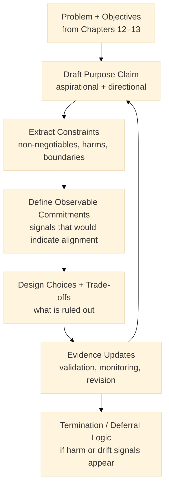
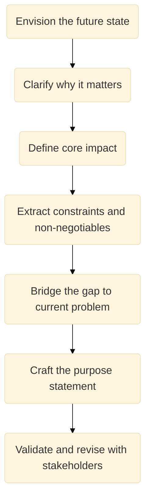
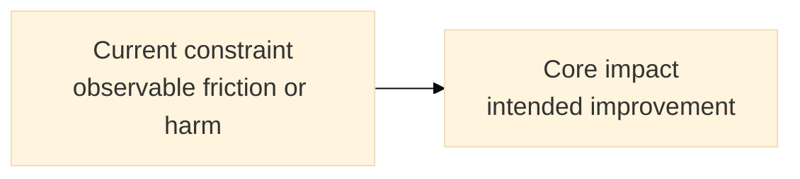

:::info What this chapter does
- Explains how “purpose” functions as a constraint system: it narrows what solutions are acceptable and what outcomes matter.
- Distinguishes aspirational narratives from testable strategic intent by forcing purpose statements to imply observable commitments.
- Shows how purpose interacts with evidence: purpose can guide hypotheses, but cannot substitute for validation.
- Connects purpose to decision thresholds by clarifying what counts as success, harm, or unacceptable trade-offs.
:::

:::warning What this chapter does not do
- Does not claim that purpose alone generates market demand or adoption.
- Does not prescribe a single “mission/vision” format or branding exercise.
- Does not guarantee that a purpose statement is ethical, feasible, or valuable without evidence and governance.
- Does not replace customer research, problem analysis, or business model validation.
:::

:::tip When you should read this
- After you have a working problem statement and early solution directions, but before scaling commitments.
- When teams are optimizing metrics without clarity on intended value, impact, or trade-offs.
- When multiple stakeholders disagree on “why this matters” and need an explicit alignment artifact.
- When you need to define non-negotiables (e.g., safety, equity, compliance) that constrain solution design.
:::

:::note Derived from Canon
This chapter is interpretive and explanatory. Its constraints and limits derive from the Canon pages below.

- [Canon → Definitions](../../canon/definitions)
- [Canon → Evidence logic](../../canon/evidence-logic)
- [Canon → Decision theory](../../canon/decision-theory)
- [Canon → Epistemic stage model](../../canon/epistemic-model)
:::

:::info Key terms (canonical)
- Evidence
- Decision threshold
- Governance boundary
- Misuse boundary
- Optionality preservation
- Termination logic
:::

:::warning Minimal evidence expectations (non-prescriptive)
Evidence used in this chapter should allow you to:
- show how a purpose claim constrains choices (what is ruled out, not only what is desired)
- state which outcomes are intended vs acceptable side-effects
- identify trade-offs and define what evidence would indicate harm or mission drift
- justify continued investment when metrics improve but purpose-aligned outcomes do not
:::

:::note Figure 11 — Purpose as a constraint system (explanatory)

This figure is explanatory. It shows purpose as a loop: purpose informs constraints and commitments, and evidence can force revision, deferral, or termination.
:::

Lighting the Way Forward. This figure captures a Transformative Purpose as a decision constraint, not a slogan. In the Book layer, purpose is used to narrow acceptable solution space, define non-negotiables, and clarify what evidence would indicate progress, harm, or mission drift.

A Transformative Purpose is an alignment artifact. It expresses a desired direction and the boundaries you are not willing to cross. In MCF 2.2 terms, purpose can guide hypotheses and priorities, but it cannot substitute for evidence.

1. Introduction
Chapters 12 and 13 produced a clarified problem, strategic intent (OKRs), and a shortlist of plausible solution directions. Chapter 14 steps back and defines a Transformative Purpose that:

constrains what “success” means,

clarifies unacceptable trade-offs,

and preserves decision integrity when incentives push teams to optimize the wrong metrics.

Purpose is not the same thing as strategy. It becomes operational only when it implies observable commitments.

Inputs
Refined solution directions or product features (from Chapter 13)

Strategic objectives and key results (OKRs) (from Chapter 12)

Stakeholder feedback and known constraints (policy, compliance, brand, operations)

Outputs
A unifying Transformative Purpose statement

A small set of explicit constraints (non-negotiables and boundaries)

A set of observable commitments (signals) that indicate alignment vs drift

2. Craft your Transformative Purpose
Use the steps below to draft and operationalize purpose as a constraint system.

:::info Transformative Purpose steps

:::

3. Envision the Future
Paint a clear end-state. This is not a roadmap; it is a description of what the world looks like if you succeed.

Ask: What changes for users, operators, and stakeholders if we succeed?

Document: capture themes and intended beneficiaries.

Avoid false precision: this is direction-setting, not forecasting.

:::tip Example — Startup Context
A startup frames the future as “time-to-value becomes minutes, not days” for a defined segment, rather than “we will disrupt the industry.”
:::

:::tip Example — Institutional Context
A public institution frames the future as “citizens complete service X in one attempt without escalation,” rather than “digital transformation.”
:::

:::tip Example — Hybrid Context
An innovation lab frames the future as “cross-organization handoffs become traceable and low-friction,” rather than “platform modernization.”
:::

4. Clarify why it matters
Purpose must resonate, but it must also be decision-relevant.

User value: what improves for users (and how you would observe it).

Public or societal value: what improves beyond the organization.

Internal coherence: how it aligns with governance boundaries and values.

:::tip Example — Startup Context
A startup clarifies why it matters by linking purpose to a measurable pain: “reduce rework loops that cost teams 3–5 hours/week,” then states what would count as meaningful improvement.
:::

:::tip Example — Institutional Context
An institution clarifies why it matters by linking purpose to trust and fairness: “reduce unequal outcomes caused by procedural friction,” and identifies what would count as drift (e.g., improving speed while increasing exclusion).
:::

:::tip Example — Hybrid Context
A lab clarifies why it matters by linking purpose to coordination costs: “reduce inter-party delays that prevent service completion,” and defines non-negotiables for data sharing.
:::

5. Define your core impact
Core impact is the positive change you aim to create, stated in a way that can later be checked against evidence.

Scope: global, regional, sector-specific.

Beneficiaries: direct and indirect.

Impact shape: what would improve, and what would be unacceptable harm.

:::info Core impact sketch (explanatory)

:::

:::tip Example — Startup Context
Core impact is framed as “reduce onboarding time without increasing support load,” with an explicit harm signal: “support tickets per activation must not increase.”
:::

:::tip Example — Institutional Context
Core impact is framed as “increase completion rate without increasing fraud risk or exclusion,” with harm signals tied to escalation and denial rates.
:::

:::tip Example — Hybrid Context
Core impact is framed as “reduce handoff delays without weakening privacy,” with harm signals tied to data exposure and audit gaps.
:::

6. Extract constraints and non-negotiables
This is the step that turns aspiration into governance.

Define:

Non-negotiables: safety, equity, compliance, auditability, privacy, reliability.

Misuse boundaries: how the system could be misused and what must be prevented.

Unacceptable trade-offs: what you refuse to optimize away.

:::tip Exercise (triad)

Startup: list 3 constraints that protect trust (e.g., no dark patterns, no silent data capture, no irreversible lock-in during validation).

Institutional: list 3 constraints that protect legitimacy (e.g., due process, audit trails, equal access).

Hybrid: list 3 constraints that protect coordination (e.g., minimal coupling, explicit data-sharing agreements, fallback paths).
:::

7. Bridge the gap to the current problem
Show how solving the near-term problem contributes to the larger purpose without claiming causality you cannot yet support.

Dependencies: what must be true for the bridge to hold.

Assumptions: what you are treating as plausible but unverified.

Evidence hooks: what you will observe to confirm progress.

:::tip Example — Startup Context
The startup states: “If we reduce time-to-value, retention should improve for segment S.” They list the evidence they will seek (activation-to-retention relationship) and what would falsify it.
:::

:::tip Example — Institutional Context
The institution states: “If we reduce verification friction at step X, completion should improve without increasing fraud.” They define both success and harm signals.
:::

:::tip Example — Hybrid Context
The lab states: “If we standardize handoff artifacts, resolution time should drop without increasing privacy risk.” They list what must be measured on both sides of the trade-off.
:::

8. Craft your Transformative Purpose statement
Synthesize direction + constraints + commitments into a single statement that can guide decisions.

A strong purpose statement:

is bold but bounded,

implies non-negotiables,

and can be operationalized into observable commitments.

:::info Example Transformative Purpose (structure)
“We exist to [intended impact] for [beneficiaries], while refusing [unacceptable trade-offs], and prioritizing [non-negotiables].”
:::

:::tip Example — Startup Context
“Enable teams to reach value in minutes, not days, while protecting user trust and avoiding irreversible lock-in during validation.”
:::

:::tip Example — Institutional Context
“Increase completion of public service X in one attempt, while preserving auditability, fairness, and fraud controls.”
:::

:::tip Example — Hybrid Context
“Reduce cross-organization service delays through traceable handoffs, while minimizing coupling and preserving privacy by design.”
:::

9. Validate and revise with stakeholders
Validation here means: ensure the statement is understood, constraints are acceptable, and the commitments are observable.

Internal alignment: leadership + delivery + governance.

External resonance: users, partners, regulators where applicable.

Revision protocol: specify how purpose is updated when evidence contradicts assumptions.

:::tip Exercise (triad)
Run a short review session and ask:

Startup: “What would we refuse to do even if it increases growth?”

Institutional: “What would count as harm even if throughput improves?”

Hybrid: “What cross-party failure mode would force deferral or termination?”
:::

Final Thoughts
Transformative Purpose is useful when it is operational: it constrains choices, defines non-negotiables, and clarifies what evidence indicates alignment or drift. In MCF 2.2, purpose guides hypotheses and prioritization, but evidence decides whether you proceed, revise, defer, or terminate.

Next Chapter: Chapter 15 introduces Rapid Prototyping—how to build reversible artifacts that generate decision-ready evidence without premature commitment.
