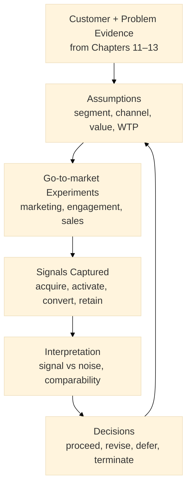
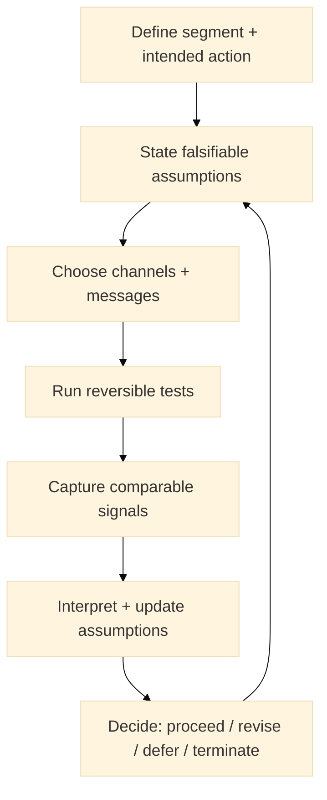
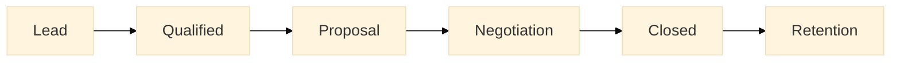

:::info What this chapter does
- Explains marketing, engagement, and sales as evidence-generating systems rather than promotion activities.
- Shows how signals from acquisition, activation, and conversion constrain claims about demand and value.
- Connects go-to-market actions to falsifiable assumptions about customers, channels, and willingness to pay.
- Clarifies how early sales and engagement data inform decision thresholds in Discovery and Validation.
:::

:::warning What this chapter does not do
- Does not provide a complete marketing playbook or channel checklist.
- Does not assume that traction implies product-market fit.
- Does not replace problem validation, solution testing, or business model evidence.
- Does not optimize for growth before epistemic clarity is established.
:::

:::tip When you should read this
- When you need evidence that customers will engage, not just express interest.
- When multiple channels appear viable and require disciplined testing.
- When early traction exists but its meaning is ambiguous.
- Before committing to scale-up, automation, or paid acquisition.
:::

:::note Derived from Canon
This chapter is interpretive and explanatory. Its constraints and limits derive from the Canon pages below.

- [Canon → Definitions](../../canon/definitions)
- [Canon → Evidence logic](../../canon/evidence-logic)
- [Canon → Decision theory](../../canon/decision-theory)
- [Canon → Epistemic stage model](../../canon/epistemic-model)
:::

:::info Key terms (canonical)
- Evidence
- Evidence quality
- Decision threshold
- Reversibility
- Optionality preservation
- Signal vs noise
:::

:::warning Minimal evidence expectations (non-prescriptive)
Evidence used in this chapter should allow you to:
- distinguish observed engagement from stated intent
- compare channels using comparable, decision-relevant metrics
- explain what would invalidate a go-to-market assumption
- justify why scaling a channel is reversible or intentionally irreversible
:::

:::note Figure 12 — From message to market (explanatory)

This figure is explanatory. It shows go-to-market as an evidence loop: actions generate signals, signals constrain claims, and decisions update assumptions.
:::

From Message to Market. In the Book layer, marketing, engagement, and sales are treated as evidence-generating systems. They do not “prove” value by themselves; they produce signals that constrain what you can claim about demand, willingness to pay, and adoption.

This chapter helps you design go-to-market work so it produces decision-ready evidence. Your objective is not “promotion.” Your objective is to reduce uncertainty about:

- who engages,
- why they engage,
- what they will pay for,
- and whether observed traction is durable or accidental.

## 1. Introduction
A marketing and sales strategy is useful in Discovery and Validation when it creates comparable signals and makes assumptions falsifiable.

In this chapter you will:
- define marketing and engagement as a system for testing messages, channels, and activation paths, and
- define sales as a system for testing willingness to pay, procurement friction, and repeatability.

### Key inputs
- Problem analysis and causal hypotheses (Chapter 12)
- Customer segments and behavioral insights (Chapter 11)
- Strategic objectives and constraints (OKRs) (Chapter 12)
- Solution direction and differentiation claims (Chapter 13)

### Expected outputs
- A marketing and engagement blueprint expressed as falsifiable assumptions + tests
- A sales funnel and sales strategy expressed as signals + decision thresholds
- A measurement plan for comparing channels and interpreting early traction

## 2. Section 1: Marketing and Engagement
### 2.1 Overview (evidence-first)
Marketing and engagement are not outcomes; they are instruments. The evidence they generate is only useful when:

- you specify what would count as “success” and “failure,” and
- you ensure signals are comparable across channels.

Common signals include:

- acquisition efficiency (reach → qualified visits),
- activation (first meaningful action),
- engagement depth (repeat usage, time-to-value),
- retention (return behavior),
- and referral (peer-driven adoption).

:::tip Triad examples (marketing as evidence)

Startup: test whether a segment will take a measurable action (signup → activation) rather than “likes.”

Institutional: test whether target users complete a service step without escalation rather than “awareness.”

Hybrid: test whether cross-party stakeholders engage with the same artifact (brief, demo, pilot request) rather than “interest.”
:::

### 2.2 Process steps
:::info Marketing and engagement process steps

:::

#### 2.2.1 Define segment + intended action
Specify the target segment and the action that matters (not just impressions).

Define what counts as “activation” for your context.

:::tip Triad examples

Startup: activation = “user completes onboarding + reaches first value in ≤10 minutes.”

Institutional: activation = “citizen completes step X without assistance.”

Hybrid: activation = “stakeholder requests a pilot with explicit constraints and success criteria.”
:::

#### 2.2.2 State falsifiable assumptions
Write assumptions in a way that can be invalidated.

Examples of assumption types:
- Channel: “Channel C will reach segment S at cost ≤X.”
- Message: “Message M will outperform message N on activation rate.”
- Value: “Benefit B will increase conversion by ≥Y.”
- Friction: “Step K is the dominant drop-off cause.”

:::info Exercise (triad)
Write 3 assumptions:

Startup: one channel, one message, one activation friction.

Institutional: one channel (official vs community), one trust claim, one accessibility friction.

Hybrid: one partner channel, one legitimacy claim, one procurement friction.
:::

#### 2.2.3 Choose channels + messages
Select a small set of channels to test. Define the message as a claim that implies an observable response.

Keep tests reversible:
- small budgets,
- short cycles,
- minimal automation.

#### 2.2.4 Run reversible tests
Run tests long enough to reduce noise, but short enough to preserve optionality.

#### 2.2.5 Capture comparable signals
Use comparable metrics so you can compare channels and messages.

Examples:
- visit → qualified lead rate
- qualified lead → activation rate
- activation → retained usage rate (time-bound)
- cost per activated user (not just cost per click)

#### 2.2.6 Interpret + update assumptions
Interpretation must separate:
- signal vs noise,
- correlation vs explanation,
- and novelty spikes vs durable patterns.

#### 2.2.7 Decide using thresholds
Decide whether to proceed, revise, defer, or terminate based on thresholds you define in advance.

:::tip Triad examples (decision thresholds)

Startup: scale only when activation rate is stable across 2 cycles and support load remains acceptable.

Institutional: scale only when completion improves without increasing exclusion or escalation.

Hybrid: scale only when partner commitments are repeatable and integration constraints remain bounded.
:::

### 2.3 Examples and exercises (triad)
:::tip Example — Startup: “Activation-first campaign”
Run two messages for the same segment. Optimize for activation, not clicks. Keep the test reversible and define what result would invalidate the message.
:::

:::tip Example — Institutional: “Trust + completion”
Run a pilot communication through two channels (official + community). Measure completion without escalation and track where trust breaks.
:::

:::tip Example — Hybrid: “Partner-led entry”
Run outreach through a partner channel and measure pilot requests with explicit constraints rather than generic interest.
:::

## 3. Section 2: Sales
### 3.1 Overview (evidence-first)
Sales is where you test willingness to pay, procurement friction, and repeatability. Early revenue can be misleading if:

- it is driven by exceptional relationships,
- it is non-repeatable,
- or the costs of delivery make it non-viable.

Sales evidence becomes decision-ready when you can:

- explain what buyers value,
- show where deals stall,
- and demonstrate that conversion can repeat under similar conditions.

### 3.2 Sales process steps
:::info Sales funnel as a signal system (explanatory)

:::

#### 3.2.1 Define sales goals as evidence targets
Avoid goals that only describe outcomes. Define evidence targets too.

Examples:
- conversion rate per stage
- cycle time per stage
- reasons for loss (categorized)
- procurement blockers (categorized)

:::tip Triad examples

Startup: evidence target = “≥30% of qualified leads reach proposal within 2 weeks.”

Institutional: evidence target = “procurement path identified and time-boxed; blockers documented.”

Hybrid: evidence target = “repeatable buyer profile + repeatable deployment constraints.”
:::

#### 3.2.2 Identify sales channels
Treat channel choice as a testable assumption. Compare channels using comparable metrics.

#### 3.2.3 Develop sales tactics (reversible where possible)
Examples:
- inbound + outbound mix,
- account-based for complex buyers,
- partner-assisted for institutional contexts.

#### 3.2.4 Map the funnel with explicit signals
Define what “qualified” means. Define what evidence each stage should produce.

Stage signals (examples):
- Qualified: buyer matches constraints; problem is decision-relevant.
- Proposal: clear scope + success criteria + constraints.
- Negotiation: explicit trade-offs surfaced; risks acknowledged.
- Closed: commitments documented; delivery assumptions confirmed.

#### 3.2.5 Equip the team (tools + artifacts)
Use tools (CRM) only if the underlying evidence model is defined.

#### 3.2.6 Monitor and iterate
Run periodic reviews:
- what signals were strongest,
- which assumptions failed,
- what is changing the decision threshold.

:::tip Triad exercises

Startup: define “qualified” in one sentence and list 5 disqualifiers.

Institutional: map the procurement path and list 5 blockers you must surface early.

Hybrid: define the minimum integration constraints for a pilot and list 5 red flags.
:::

## 4. Final Thoughts
Marketing, engagement, and sales become powerful in Discovery and Validation when they are designed as evidence systems. They help you interpret demand, adoption, and willingness to pay without mistaking noise for proof.

Next Chapter: Chapter 16 moves into User Stories and Rapid Prototyping—how to build reversible artifacts that generate decision-ready evidence while preserving optionality.

## ToDo for this Chapter
- [ ] Create Marketing + Engagement questionnaire/template, attach template to Google Drive and link to this page
- [ ] Create Sales funnel questionnaire/template, attach template to Google Drive and link to this page
- [ ] Create Chapter assessment questionnaire, attach template to Google Drive and link to this page
- [ ] Translate all content to Spanish and integrate to i18n
- [ ] Record and embed video for this chapter
