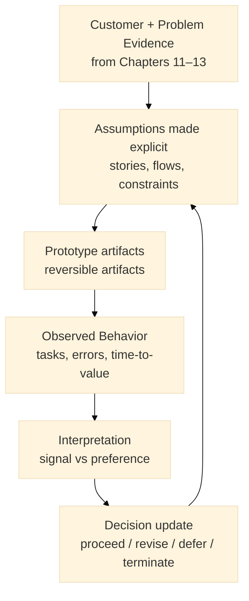
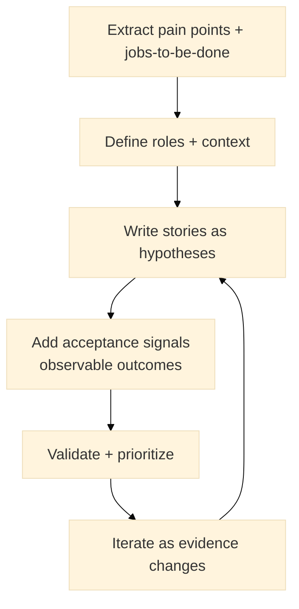
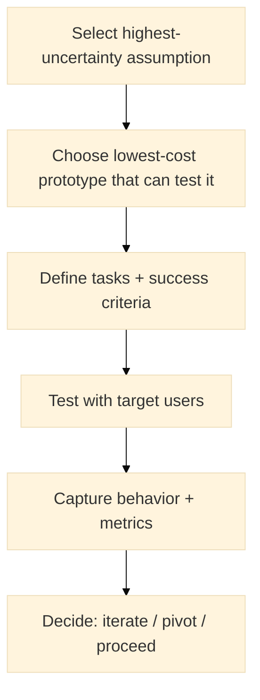

:::info What this chapter does
- Explains user stories and rapid prototyping as instruments for making assumptions explicit and testable.
- Shows how prototypes generate evidence about comprehension, usability, and adoption frictions—not just design preference.
- Connects story-based requirements to observable behaviors and measurable outcomes.
- Clarifies how prototyping reduces uncertainty while preserving optionality before irreversible implementation.
:::

:::warning What this chapter does not do
- Does not prescribe a single user story template or agile ritual.
- Does not imply that prototypes validate feasibility, scalability, or business viability by themselves.
- Does not replace solution testing, experimentation design, or decision thresholds in later steps.
- Does not encourage “prototype theatre” without evidence capture and traceability.
:::

:::tip When you should read this
- When solution ideas exist but user understanding and interaction are unclear.
- When teams are debating features without observable evidence.
- When you need to surface adoption barriers before building.
- Before investing in full implementation or architecture hardening.
:::

:::note Derived from Canon
This chapter is interpretive and explanatory. Its constraints and limits derive from the Canon pages below.

- [Canon → Definitions](../../canon/definitions)
- [Canon → Evidence logic](../../canon/evidence-logic)
- [Canon → Decision theory](../../canon/decision-theory)
- [Canon → Epistemic stage model](../../canon/epistemic-model)
:::

:::info Key terms (canonical)
- Evidence
- Evidence quality
- Decision threshold
- Optionality preservation
- Reversibility
- Auditability
:::

:::warning Minimal evidence expectations (non-prescriptive)
Evidence used in this chapter should allow you to:
- distinguish observed user behavior from subjective preference
- justify why a prototype outcome changes (or does not change) the decision state
- identify which assumptions a prototype is testing, and which it is not
- state what observations would invalidate a story, flow, or feature hypothesis
:::

:::note Figure 13 — Stories → prototypes → evidence (explanatory)

This figure is explanatory. It shows how stories and prototypes function as an evidence loop: they turn assumptions into testable artifacts, produce observations, and update the decision state.
:::

From Insight to Interaction. In the Book layer, user stories and prototypes are not “documentation” or “design output.” They are instruments for reducing uncertainty. They are valuable when they generate observations you can use to revise or defend decisions.

This chapter shows how to:

- translate insights into testable stories tied to observable behavior, and
- build reversible prototypes that surface comprehension, usability, and adoption frictions early.

### Key inputs
- Prioritized solution direction (Chapter 13)
- Strategic objectives and constraints (OKRs) (Chapter 12)
- Customer analysis and behavioral insights (Chapter 11)
- Problem analysis and causal hypotheses (Chapter 12)

### Expected outputs
- A set of user stories mapped to assumptions and success criteria
- Prototype artifacts (low to high fidelity) mapped to what they test (and what they do not)
- Evidence captured from tests (behavior + metrics) and an updated decision state

## 1. Section 1: User Stories
### 1.1 Overview (evidence-first)
User stories are short, narrative statements of intended value and usage. In this framework, a story is useful when it makes an assumption explicit:

- who the user is (role),
- what they are trying to do (goal),
- why it matters (benefit),
- and what success looks like (observable outcome).

Stories do not guarantee correctness. They are hypotheses about behavior.

:::tip Triad examples (what a “story” is testing)

Startup: “Will the user reach first value without support?”

Institutional: “Will a citizen complete a step without escalation or exclusion?”

Hybrid: “Will multiple stakeholders accept the same workflow and constraints?”
:::

### 1.2 Process steps
:::info User story process steps

:::

#### 1.2.1 Extract pain points and jobs-to-be-done
Use evidence from interviews, support logs, analytics, and observation.

#### 1.2.2 Define roles and context
Be explicit about who is acting and under what constraints.

:::tip Triad examples (roles)

Startup: end user, admin, payer.

Institutional: citizen, case worker, supervisor.

Hybrid: user, partner operator, compliance or procurement role.
:::

#### 1.2.3 Write stories as hypotheses
Use a consistent template.

Template:

As a [role], I want [goal], so that [benefit].

#### 1.2.4 Add acceptance signals (observable outcomes)
Acceptance should include at least one observable signal. Examples:

- task completion without help,
- time-to-complete,
- error rate,
- comprehension check success,
- successful handoff to next step.

:::tip Triad examples (acceptance signals)

Startup: “≥80% complete onboarding in ≤5 minutes without support.”

Institutional: “≥70% complete the transaction without escalation; track exclusion reasons.”

Hybrid: “Pilot users complete the workflow and stakeholders accept constraints in writing.”
:::

#### 1.2.5 Validate and prioritize
Prioritize based on:

- decision relevance (what uncertainty it reduces),
- risk (what breaks if wrong),
- and reversibility (how costly it is to change later).

#### 1.2.6 Iterate as evidence changes
Stories should evolve as you learn. Version them.

### 1.3 Examples and exercises (triad)
:::tip Example — Startup user story
“As a first-time buyer, I want to complete checkout in under two minutes so that I can finish my purchase without frustration.”
Acceptance signals: task completion rate, time-to-complete, error rate, drop-off reason codes.
:::

:::tip Example — Institutional user story
“As a citizen, I want to complete the service request without visiting an office so that I can resolve my need without extra travel.”
Acceptance signals: completion without escalation, accessibility issues captured, time-to-resolution.
:::

:::tip Example — Hybrid user story
“As a partner operator, I want to submit a request with required compliance fields so that the request can be processed without rework.”
Acceptance signals: completeness rate, rework rate, approval cycle time, rejection reason codes.
:::

:::info Exercise — Draft stories with signals
Write 3 stories (Startup / Institutional / Hybrid). For each story, add:

- one key assumption it tests,
- two acceptance signals,
- one observation that would invalidate the story hypothesis.
:::

## 2. Section 2: Rapid Prototyping
### 2.1 Overview (evidence-first)
Rapid prototyping builds reversible artifacts that test high-uncertainty assumptions early. A prototype is valuable when you can state:

- what it is testing,
- what it is not testing,
- what observations matter,
- and what decision update would follow from results.

Prototypes do not prove scalability or full business viability. They reduce uncertainty about interaction, comprehension, and adoption frictions.

:::tip Triad examples (why prototype)

Startup: reduce uncertainty about onboarding and first value.

Institutional: reduce uncertainty about completion, trust, and accessibility barriers.

Hybrid: reduce uncertainty about multi-stakeholder workflow acceptance and handoffs.
:::

### 2.2 Plan your prototyping strategy
Before building, define the decision you are trying to update.

Prototype objective (what uncertainty it reduces)

Mapped stories (which stories/assumptions it tests)

Success criteria (observable metrics)

Method (paper, wireframe, clickable, demo, physical)

:::info Prototyping strategy steps

:::

:::tip Triad example (prototype objective + metric)

Startup: objective = comprehension of checkout flow; metric = task completion in ≤2 minutes.

Institutional: objective = completion without assistance; metric = completion rate + escalation rate.

Hybrid: objective = workflow acceptance; metric = rework rate + stakeholder sign-off on constraints.
:::

### 2.3 Build the prototype (timeboxed, reversible)
Allocate minimal resources. Avoid over-engineering.

Prefer existing tools/templates.

Keep cycles short and versioned.

:::info Exercise — Timebox plan (triad)
Create a 1-week plan:

Startup: 2 prototype iterations + 1 user test round.

Institutional: 1 prototype iteration + accessibility review + 1 user test round.

Hybrid: 1 prototype iteration + stakeholder walkthrough + 1 pilot-path test.
:::

### 2.4 Test and validate (observe behavior)
**User testing**
Recruit representative users.

Give task scenarios.

Observe and record behavior, not opinions alone.

Suggested metrics:

- task completion,
- time-to-complete,
- error rate,
- comprehension checks,
- drop-off reasons.

**Stakeholder walkthroughs**
Validate constraints, compliance, and adoption frictions.

Document disagreements and required trade-offs.

:::tip Triad example (test scenario)

Startup: “Create account and complete first action.”

Institutional: “Complete transaction end-to-end without assistance.”

Hybrid: “Submit request, pass validation, and handoff to partner processing.”
:::

### 2.5 Refine and document outcomes
Compare results to success criteria.

Identify what changed the decision state.

Record what you learned and what remains unknown.

:::info Exercise — Decision update memo (triad)
Write a short memo for each context:

- what was tested,
- what was observed,
- what changed in the decision state,
- what is the next reversible step.
:::

### 2.6 Best practices and tools (non-prescriptive)
Start small; test the core assumption first.

Timebox iterations.

Maintain a feedback repository (tagged by story and assumption).

Use appropriate tools:

- Figma / Sketch / XD for wireframes and click-throughs
- Docs/Sheets for scripts and observation logs
- Simple forms for structured feedback capture

## 3. Final Thoughts
User stories and prototyping are effective when they reduce uncertainty and preserve optionality. Stories express hypotheses about value and behavior; prototypes turn those hypotheses into observable interactions.

Next Chapter: Implementing pilots and validating solutions—how to move from prototypes to controlled pilots and measure outcomes against decision thresholds.

## ToDo for this Chapter
- [ ] Create User Story template + scoring rubric, attach template to Google Drive and link to this page
- [ ] Create Prototype test script + observation log template, attach template to Google Drive and link to this page
- [ ] Create Chapter assessment questionnaire, attach template to Google Drive and link to this page
- [ ] Translate all content to Spanish and integrate to i18n
- [ ] Record and embed video for this chapter
