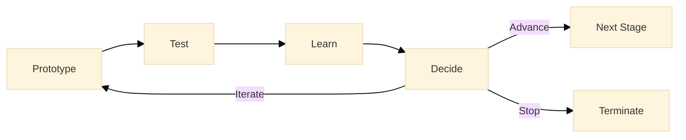

:::info What this chapter does
- Explains experimentation as a controlled method for reducing epistemic uncertainty.
- Shows how tests generate decision-relevant evidence rather than confirmation.
- Clarifies how hypotheses, experiments, and outcomes relate to decision thresholds.
- Connects experimental results to progression, iteration, or termination decisions.
:::

:::warning What this chapter does not do
- Does not guarantee validation or positive outcomes.
- Does not replace strategic judgment or governance review.
- Does not prescribe a single experimentation methodology or tool.
- Does not treat experiments as performance metrics rather than evidence mechanisms.
:::

:::tip When you should read this
- When prototypes exist but uncertainty remains.
- When assumptions must be tested under controlled conditions.
- When teams risk confusing activity with learning.
- Before committing resources to irreversible implementation.
:::

:::note Derived from Canon
This chapter is interpretive and explanatory. Its constraints and limits derive from the Canon pages below.

- [Canon → Definitions](../../canon/definitions)
- [Canon → Evidence logic](../../canon/evidence-logic)
- [Canon → Decision theory](../../canon/decision-theory)
- [Canon → Epistemic stage model](../../canon/epistemic-model)
:::

:::info Key terms (canonical)
- Evidence
- Hypothesis
- Falsifiability
- Decision threshold
- Reversibility
- Optionality preservation
:::

:::warning Minimal evidence expectations (non-prescriptive)
Evidence used in this chapter should allow you to:
- state which hypothesis an experiment is testing
- distinguish signal from noise in results
- explain how outcomes affect confidence
- justify whether the decision state should change
:::

:::info Figure 14 — Prototype → Test → Learn → Decide

:::

Prototype → Test → Learn → Decide. This figure illustrates the core experimentation loop in Phase 2. Prototypes are tested to generate evidence, learning updates confidence, and decisions determine whether to iterate, advance, or stop.

## 1. Introduction
Experimentation transforms prototypes into evidence. Rather than asking whether a solution is "good," experiments ask whether a specific assumption holds under controlled conditions. The purpose is not confirmation, but learning that informs decisions.

Experiments exist to reduce uncertainty before irreversible commitments are made.

### Inputs
- Prototypes from Chapter 16
- Strategic Objectives and Key Results (OKRs) from Chapter 12
- Customer insights from Chapter 11
- Defined problems from Chapter 12

### Outputs
- Decision-relevant evidence
- Updated confidence in assumptions
- Clear next-step decisions (iterate, advance, stop)

## 2. Defining Hypotheses
Every experiment begins with a hypothesis: a testable statement linking an assumption to an observable outcome.

### Characteristics of Good Hypotheses
- Explicit and falsifiable
- Tied to a decision
- Linked to measurable signals

:::tip Example: "Hypothesis Triad"
- Startup Example
  - "Reducing onboarding steps from five to three will increase activation by at least 15%."
- Institutional Transformation Example
  - "Automating permit intake will reduce processing time by 25% without increasing error rates."
- Hybrid Example
  - "Introducing a digital self-service channel will reduce call-center volume by 20% while maintaining satisfaction."
:::

## 3. Designing Experiments
Experiments operationalize hypotheses under controlled conditions.

### Common Experiment Types
- A/B tests
- Usability tests
- Controlled pilots
- Simulated workflows

:::tip Example: "Experiment Design Triad"
- Startup
  - A/B test comparing two onboarding flows with identical traffic allocation.
- Institutional
  - Pilot automation in one department while maintaining manual processing elsewhere.
- Hybrid
  - Parallel rollout of a digital service for a subset of users while keeping legacy channels open.
:::

## 4. Data Collection and Analysis
Evidence must be interpretable, traceable, and relevant to the hypothesis.

### Quantitative Signals
- Conversion rates
- Time to completion
- Error frequency

### Qualitative Signals
- Observed confusion
- Behavioral workarounds
- Stakeholder feedback

:::tip Example: "Signals Triad"
- Startup
  - Tracking funnel drop-off and completion time.
- Institutional
  - Measuring case throughput and rework rates.
- Hybrid
  - Comparing channel usage patterns and service escalation rates.
:::

## 5. Interpreting Results and Making Decisions
Experiments do not "pass" or "fail." They update confidence.

### Decision Options
- Iterate: adjust and re-test
- Advance: proceed to pilots or scaling
- Stop: terminate the solution path

:::tip Example: "Decision Outcomes Triad"
- Startup
  - Activation improves, but support tickets increase → iterate.
- Institutional
  - Processing time drops with no compliance impact → advance.
- Hybrid
  - Digital adoption rises but satisfaction drops → stop and reassess.
:::

## 6. Documentation and Traceability
Every experiment should leave an audit trail.

- Hypothesis tested
- Experimental setup
- Observed outcomes
- Decision taken

This ensures learning is cumulative and defensible.

## 7. Final Thoughts
Experimentation is a decision discipline. By moving systematically from prototype to test, from learning to decision, teams preserve optionality while reducing risk. Evidence-not enthusiasm-determines progress.

In the next chapter, Implementing Pilots and Validating Solutions, you will learn how to transition from controlled experiments to real-world pilots.

## ToDo for this Chapter
- [ ] Create an experimentation template and link it here
- [ ] Create a chapter assessment questionnaire
- [ ] Translate content to Spanish (i18n)
- [ ] Record and embed chapter walkthrough video

