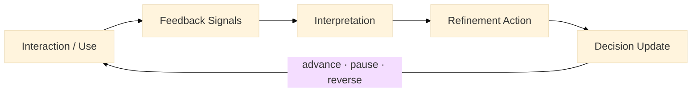

:::info What this chapter does
- Defines feedback loops as mechanisms for updating assumptions and decisions.
- Distinguishes signal quality across multiple feedback sources.
- Connects refinement actions to explicit decision states.
- Frames iteration as epistemic updating, not continuous motion.
:::

:::warning What this chapter does not do
- Does not assume feedback is representative or unbiased.
- Does not treat iteration as progress without evidence.
- Does not replace controlled experimentation.
- Does not encourage refinement without decision change.
:::

:::tip When you should read this
- When experiments, pilots, or live systems are producing signals.
- When teams need to decide what to change, pause, or reverse.
- When feedback appears contradictory or noisy.
- Before committing to irreversible scaling decisions.
:::

:::note Derived from Canon
This chapter is interpretive and explanatory. Its constraints derive from:

- [Canon → Definitions](../../canon/definitions)
- [Canon → Evidence logic](../../canon/evidence-logic)
- [Canon → Decision theory](../../canon/decision-theory)
- [Canon → Epistemic stage model](../../canon/epistemic-model)
:::

:::info Key terms (canonical)
- Evidence
- Evidence quality
- Signal vs noise
- Decision threshold
- Reversibility
- Optionality preservation
:::

:::warning Minimal evidence expectations (non-prescriptive)
Feedback used here should allow you to:
- trace signals to assumptions
- justify why a refinement occurred
- explain the resulting decision state
- show whether optionality was preserved or reduced
:::

:::info Figure 15 — Feedback → Signals → Refinement → Decision

:::

Feedback → Signals → Refinement → Decision. Feedback is interpreted into signals, signals justify refinements, and refinements explicitly update the decision state before the next cycle.

1. Introduction
Feedback loops sustain learning once solutions leave controlled conditions. Unlike experiments, feedback reflects reality as it unfolds—often noisy, delayed, and incomplete.

Within the MicroCanvas® Framework, feedback exists to update assumptions and decision states. Iteration without a decision update is activity. Iteration that changes epistemic state is progress.

Inputs
Prototypes, experiments, or pilots in operation

User behavior and qualitative feedback

Strategic objectives and OKRs

Stakeholder and operational signals

Outputs
Interpreted feedback signals

Explicit refinement decisions

Updated assumptions and roadmap state

2. Structuring Feedback Loops
2.1 Feedback Channel Triad
Effective loops rely on complementary channels.

:::tip Example: "Feedback Channel Triad — Platform Product"

User channel: observed behavior in analytics

Stakeholder channel: operational reviews

System channel: performance and error alerts
:::

Each channel compensates for blind spots in the others.

2.2 Review Cadence
Cadence constrains what decisions are possible.

:::info Exercise: "Cadence Mapping"
For each feedback channel, define:

review frequency

allowed decision types (refine, pause, reverse)
:::

3. Interpreting Feedback Signals
3.1 Signal Quality Triad
Signals vary in epistemic weight.

:::tip Example: "Signal Quality Triad — Mobile Service"

Observed behavior: task completion times

Reported feedback: user surveys

Inferred signal: repeated abandonment patterns
:::

Observed behavior carries more weight than stated preference.

3.2 Noise vs Change
Short-term variation must not drive decisions.

:::info Exercise: "Noise Filter"
For each signal, document:

sample size

duration

plausible alternative explanations
:::

4. Iterative Refinement
4.1 Refinement Action Triad
Refinement targets different layers.

:::tip Example: "Refinement Action Triad — Public Sector Pilot"

Interface refinement: clarify steps

Process refinement: reduce handoffs

Constraint refinement: relax non-essential rules
:::

Each refinement must correspond to a specific signal.

4.2 Decision Outcome Triad
Every refinement ends in a decision update.

:::tip Example: "Decision Outcome Triad"

Advance: evidence strengthened

Pause: evidence inconclusive

Reverse: assumption weakened or invalidated
:::

If no decision state changes, refinement is unjustified.

5. Documenting Learning
Learning decays without traceability.

:::info Exercise: "Learning Log"
Maintain a log containing:

assumption

signal

refinement

decision outcome
:::

6. Final Thoughts
Feedback loops prevent drift by forcing decisions. When structured as evidence mechanisms, they allow teams to refine without confusion, adapt without panic, and learn without illusion.

In the next chapter, Implementing Pilots and Validating Solutions, these updated decisions are tested under real operational constraints.

ToDo for this Chapter
 Create Feedback & Decision Log template and link here

 Create Chapter 18 assessment questionnaire

 Translate content to Spanish and integrate i18n

 Record and embed chapter walkthrough video
