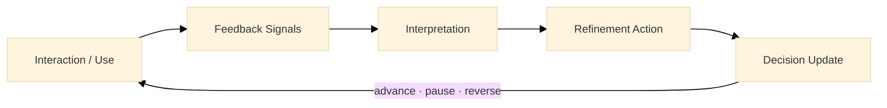

:::info What this chapter does
- Defines feedback loops as mechanisms for updating assumptions and decisions.
- Distinguishes signal quality across multiple feedback sources.
- Connects refinement actions to explicit decision states.
- Frames iteration as epistemic updating, not continuous motion.
:::

:::warning What this chapter does not do
- Does not assume feedback is representative or unbiased.
- Does not treat iteration as progress without evidence.
- Does not replace controlled experimentation.
- Does not encourage refinement without decision change.
:::

:::tip When you should read this
- When experiments, pilots, or live systems are producing signals.
- When teams need to decide what to change, pause, or reverse.
- When feedback appears contradictory or noisy.
- Before committing to irreversible scaling decisions.
:::

:::note Derived from Canon
This chapter is interpretive and explanatory. Its constraints derive from:

- [Canon → Definitions](../../canon/definitions)
- [Canon → Evidence logic](../../canon/evidence-logic)
- [Canon → Decision theory](../../canon/decision-theory)
- [Canon → Epistemic stage model](../../canon/epistemic-model)
:::

:::info Key terms (canonical)
- Evidence
- Evidence quality
- Signal vs noise
- Decision threshold
- Reversibility
- Optionality preservation
:::

:::warning Minimal evidence expectations (non-prescriptive)
Feedback used here should allow you to:
- trace signals to assumptions
- justify why a refinement occurred
- explain the resulting decision state
- show whether optionality was preserved or reduced
:::

Feedback → Signals → Refinement → Decision.
Feedback is interpreted into signals, signals justify refinements, and refinements explicitly update the decision state before the next cycle.

## 1. Introduction
Feedback loops sustain learning once solutions leave controlled conditions. Unlike experiments, feedback reflects reality as it unfolds—often noisy, delayed, and incomplete.

Within the MicroCanvas® Framework, feedback exists to update assumptions and decision states. Iteration without a decision update is activity. Iteration that changes epistemic state is progress.

In Phase 2, the purpose of feedback is not to “keep improving” by default. The purpose is to maintain decision integrity:

- which assumptions are still supported,
- which are weakening,
- and which decisions should advance, pause, or reverse.

### Inputs
- Prototypes, experiments, or pilots in operation
- User behavior and qualitative feedback
- Strategic objectives and OKRs
- Stakeholder and operational signals

### Outputs
- Interpreted feedback signals
- Explicit refinement decisions
- Updated assumptions and roadmap state

## 2. Structuring Feedback Loops
A feedback loop is an operational system. If it is informal, it becomes opinion-driven. If it is structured, it becomes evidence-driven.

A minimal loop has:

- channels that generate feedback,
- a cadence for review,
- a method for interpreting signal quality,
- a mechanism for deciding refinement actions,
- and a record that preserves traceability.

### 2.1 Feedback Channel Triad
Effective loops rely on complementary channels. Each channel is biased; using multiple channels reduces single-source failure.

User channels capture real use and perception.

Stakeholder channels capture constraints, obligations, and institutional risk.

System channels capture performance, reliability, and operational fragility.

The loop is incomplete if one channel dominates decisions without cross-checking.

:::tip Example: "Feedback Channel Triad → Startup"
Startup example
A SaaS startup uses:

- product analytics for activation and retention,
- founder-led customer calls for qualitative context,
- and system alerts for latency/error spikes that correlate with churn.
:::

:::tip Example: "Feedback Channel Triad → Large Organization"
Large organization example
A large enterprise program uses:

- support desk and call-center tagging for recurrent pain points,
- operational reviews with compliance, legal, and security,
- and reliability dashboards for incidents tied to specific releases.
:::

:::tip Example: "Feedback Channel Triad → Hybrid"
Hybrid example
A public-private initiative uses:

- citizen or beneficiary feedback channels (helpdesk + in-product prompts),
- inter-institutional governance reviews (shared KPIs + risk registers),
- and platform telemetry for uptime and service-level obligations across partners.
:::

:::info Exercise: "Define Your Channel Map"
Create a one-page channel map:

- list each channel (user / stakeholder / system),
- identify the primary bias of that channel (e.g., self-selection, political incentives, survivorship),
- specify one cross-check signal from another channel that must be present before changing a decision state.
:::

### 2.2 Review Cadence
Cadence constrains what decisions are possible. If cadence is too frequent, noise is mistaken for change. If cadence is too slow, drift becomes invisible.

A practical cadence uses two layers:

- short-cycle review for operational signals (hours to weeks),
- decision-cycle review for decision-state updates (weekly to monthly).

Cadence should be explicitly tied to reversibility:

- reversible refinements can be reviewed more frequently,
- irreversible changes require stronger evidence and slower cadence.

:::tip Example: "Cadence as a Constraint → Startup"
Startup example
A startup reviews daily operational signals (errors, activation) but only updates the decision state weekly after checking cohort retention trends.
:::

:::tip Example: "Cadence as a Constraint → Large Organization"
Large organization example
A large organization reviews system reliability weekly, but updates strategic decisions monthly after compliance, procurement, and adoption signals stabilize.
:::

:::tip Example: "Cadence as a Constraint → Hybrid"
Hybrid example
A multi-stakeholder program reviews service performance weekly, but updates roadmap decisions on a fixed governance cycle (e.g., every 4 weeks) to avoid oscillating across institutions.
:::

:::info Exercise: "Cadence Mapping"
For each feedback channel, define:

- review frequency,
- who attends,
- which decisions are allowed at that cadence (refine / pause / reverse),
- and which decisions are forbidden unless evidence quality improves.
:::

## 3. Interpreting Feedback Signals
Feedback is not automatically evidence. It becomes evidence when you:

- trace it to an assumption,
- judge its quality,
- and specify what it would take to invalidate the assumption.

### 3.1 Signal Quality Triad
Signals vary in epistemic weight. A useful triad is:

- Observed behavior (what users did)
- Reported feedback (what users said)
- Inferred signal (a model-based pattern you suspect)

Observed behavior tends to have higher decision weight than reported preference, but it can still be confounded. Inferred signals require additional confirmation.

:::tip Example: "Signal Quality Triad → Startup"
Startup example

Observed: onboarding completion rate drops after a new step.

Reported: users say “the product is confusing.”

Inferred: the new step introduces a trust friction (requires verification too early).
:::

:::tip Example: "Signal Quality Triad → Large Organization"
Large organization example

Observed: processing time increases in one region after deployment.

Reported: staff report “more manual work than before.”

Inferred: a workflow integration is failing for a specific legacy system.
:::

:::tip Example: "Signal Quality Triad → Hybrid"
Hybrid example

Observed: service completion rates differ across municipalities.

Reported: citizens say “the service is hard to finish.”

Inferred: identity or eligibility rules differ across institutions, creating hidden abandonment.
:::

:::info Exercise: "Assumption Trace"
Pick one major assumption (e.g., “users can complete the flow unassisted”). For each signal type:

- write the signal,
- write one plausible alternative explanation,
- and write what additional observation would raise or lower evidence quality.
:::

### 3.2 Noise vs Change
Short-term variation must not drive decisions. Before treating a signal as meaningful change, check:

- sample size (is it large enough to be decision-relevant?)
- duration (did it persist long enough to be more than variance?)
- confounds (did something else change at the same time?)

Noise filtering is not statistical purity; it is decision hygiene.

:::tip Example: "Noise Filters in Practice → Startup"
Startup example
A spike in churn appears after a pricing test, but cohort slicing shows the churn is limited to a single acquisition channel, suggesting a targeting mismatch rather than product failure.
:::

:::tip Example: "Noise Filters in Practice → Large Organization"
Large organization example
A rise in incident tickets follows a release, but root-cause analysis shows the ticket taxonomy changed, inflating counts without changing true incident rate.
:::

:::tip Example: "Noise Filters in Practice → Hybrid"
Hybrid example
An adoption dip occurs after rollout, but analysis shows the dip coincides with a policy change that temporarily blocks a subgroup, making the signal operational rather than product-related.
:::

:::info Exercise: "Noise Filter Checklist"
For the top 3 signals you track, document:

- minimum sample size,
- minimum observation window,
- and the top 2 confounds that must be ruled out before updating decisions.
:::

## 4. Iterative Refinement
Refinement is justified only when a signal implies an assumption update. Refinement is not “improvement”. Refinement is an evidence-linked adjustment.

### 4.1 Refinement Action Triad
Refinement typically targets one of three layers:

- Interface refinement (reduce comprehension or usability friction)
- Process refinement (reduce operational friction or handoffs)
- Constraint refinement (change rules, thresholds, or governance boundaries)

Each refinement must identify:

- the signal that triggered it,
- the assumption it updates,
- and what new evidence would confirm it was beneficial.

:::tip Example: "Refinement Action Triad → Startup"
Startup example

Interface: simplify a form step to reduce abandonment.

Process: shorten response time for support on first week users.

Constraint: narrow the target segment to preserve optionality while evidence is weak.
:::

:::tip Example: "Refinement Action Triad → Large Organization"
Large organization example

Interface: revise training and UI labels to reduce staff errors.

Process: redesign approvals to reduce cycle time.

Constraint: tighten access controls after incident signals, even if adoption slows.
:::

:::tip Example: "Refinement Action Triad → Hybrid"
Hybrid example

Interface: add guided help and language localization for citizens.

Process: align partner escalation workflows across institutions.

Constraint: adjust eligibility rules to reduce exclusion errors while monitoring misuse risk.
:::

:::info Exercise: "Refinement Brief"
For a single proposed refinement, write a short brief:

- triggering signal,
- assumption updated,
- refinement action,
- expected observable change,
- and what observation would indicate harm or mission drift.
:::

### 4.2 Decision Outcome Triad
Every refinement ends in a decision update. A stable triad is:

- Advance: evidence strengthened relative to thresholds.
- Pause: evidence inconclusive; preserve optionality.
- Reverse: evidence weakened; stop or backtrack.

If no decision state changes, refinement is unjustified.

:::tip Example: "Decision Outcome Triad → Startup"
Startup example
Advance after retention improves across cohorts; pause if metrics conflict; reverse if churn rises and support load spikes.
:::

:::tip Example: "Decision Outcome Triad → Large Organization"
Large organization example
Advance after adoption and compliance indicators improve; pause if benefits exist but risks are unclear; reverse if auditability or safety thresholds are violated.
:::

:::tip Example: "Decision Outcome Triad → Hybrid"
Hybrid example
Advance if service completion and equity metrics improve across regions; pause if benefits are uneven; reverse if governance boundaries are breached or partner risk escalates.
:::

:::info Exercise: "Decision Threshold Definition"
Pick one decision (e.g., “scale to a new segment”). Define:

- the threshold for advance,
- the condition for pause,
- and the condition for reverse,
using metrics and observable signals.
:::

## 5. Documenting Learning
Learning decays without traceability. A feedback loop must produce an audit trail that links:
assumption → signal → refinement → decision.

The goal is not documentation volume. The goal is decision explainability.

:::info Exercise: "Learning Log"
Maintain a log containing:

- assumption (one sentence),
- signal (with source + timestamp),
- evidence quality notes (sample, duration, confounds),
- refinement action,
- decision outcome (advance / pause / reverse),
- and a link to supporting artifacts (dashboards, notes, experiment IDs).
:::

## 6. Final Thoughts
Feedback loops prevent drift by forcing decisions. When structured as evidence mechanisms, they allow teams to refine without confusion, adapt without panic, and learn without illusion.

In the next chapter, Implementing Pilots and Validating Solutions, these updated decisions are tested under real operational constraints.

ToDo for this Chapter
 Create Feedback & Decision Log template and link here

 Create Chapter 18 assessment questionnaire

 Translate content to Spanish and integrate i18n

 Record and embed chapter walkthrough video

