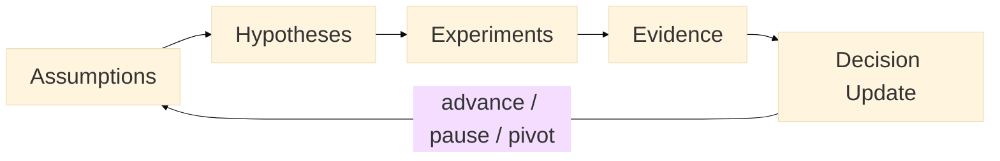

:::info What this chapter does
- Frames business model validation as structured evidence gathering.
- Connects revenue, cost, and channel assumptions to decision thresholds.
- Clarifies how validation affects go / pause / pivot decisions.
- Positions iteration as a response to evidence, not optimism.
:::

:::warning What this chapter does not do
- Does not guarantee profitability or adoption.
- Does not prescribe a single financial template.
- Does not replace user validation or governance review.
- Does not treat modeling as evidence without testing.
:::

:::tip When you should read this
- When revenue, pricing, or cost assumptions remain untested.
- When leadership requests evidence before scale.
- When investment depends on viability signals.
- Before committing to irreversible expansion.
:::

:::note Derived from Canon
Interpretive and explanatory. Derived from:

- [Canon -> Definitions](../../canon/definitions)
- [Canon -> Evidence logic](../../canon/evidence-logic)
- [Canon -> Decision theory](../../canon/decision-theory)
- [Canon -> Epistemic stage model](../../canon/epistemic-model)
:::

:::info Key terms (canonical)
- **Assumption:** a claim treated as true until tested ([Canon -> Definitions](../../canon/definitions)).
- **Hypothesis:** a testable claim with observable criteria ([Canon -> Definitions](../../canon/definitions)).
- **Evidence quality:** strength and reliability of observed signals ([Canon -> Evidence logic](../../canon/evidence-logic)).
- **Decision threshold:** minimum evidence required to change decision state ([Canon -> Decision theory](../../canon/decision-theory)).
- **Optionality preservation:** keeping alternatives viable while evidence is weak ([Canon -> Decision theory](../../canon/decision-theory)).
- **Reversibility:** ease of undoing a decision or exposure ([Canon -> Decision theory](../../canon/decision-theory)).
:::

:::warning Minimal evidence expectations (non-prescriptive)
Validation here should allow you to:
- identify which business assumptions were tested
- compare results against explicit criteria
- justify advancing, pausing, or pivoting
- show how financial exposure changes with each decision
:::

:::note Figure 16 - Business Model Validation Loop (explanatory)

This loop shows how assumptions become hypotheses, are tested, and update decision state before scale.
:::

## 1. Introduction

A functioning product does not equal a viable business model. Validation converts beliefs about
revenue, cost, and channels into explicit hypotheses, tests them under bounded exposure, and
updates decisions based on observed outcomes (see Figure 16).

Within MCF 2.2, validation reduces exposure before irreversible commitments. The goal is not
projection accuracy. The goal is decision clarity under uncertainty.

### Inputs

- Refined solution or MVP
- Market and behavioral data
- Preliminary pricing and cost assumptions
- Strategic objectives and OKRs

### Outputs

- Validated or invalidated business model assumptions
- Updated financial exposure map
- Explicit advance / pause / pivot decision

## 2. Consolidate Assumptions

List assumptions across three domains:

- Revenue logic (pricing, willingness to pay, LTV)
- Cost structure (fixed, variable, scale behavior)
- Channel and acquisition logic (CAC, distribution efficiency)

Avoid generalizations. Write each assumption explicitly.

:::tip Example — Startup Context
Assumes a $20/month subscription is acceptable and CAC stays below $15 with a 4-month payback.
:::

:::tip Example — Institutional Context
Assumes an internal service reduces operating cost per transaction by 12% while maintaining
compliance overhead.
:::

:::tip Example — Hybrid Context
Assumes a cross-institution service can be funded via a blended model (public subsidy + private fee)
without exceeding equity constraints.
:::

:::info Exercise — Assumption Inventory
Create a 3-column table:

- Assumption statement
- Risk level (High / Medium / Low)
- Exposure if wrong (financial, reputational, operational)
:::

## 3. Formulate Testable Hypotheses

Each assumption becomes a measurable hypothesis with a threshold. Structure each one as:
"If X, then Y >= threshold Z within timeframe T." Avoid vague success language.

:::tip Example — Startup Context
If priced at $20/month, then >=25% of trial users convert within 14 days.
:::

:::tip Example — Institutional Context
If the workflow is digitized, then cost per transaction decreases by >=10% within 3 months.
:::

:::tip Example — Hybrid Context
If eligibility is automated, then completion rate increases >=15% without increasing fraud above 2%.
:::

:::info Exercise — Threshold Discipline
For each hypothesis, define:

- Success threshold
- Partial validation range
- Invalidation trigger
- Reversibility level (easy / moderate / hard)
:::

## 4. Prioritize Hypotheses

Not all hypotheses deserve immediate testing. Prioritize using:

- Criticality (does failure break the model?)
- Testability (can it be tested cheaply?)
- Exposure (financial or institutional risk)

High criticality + high testability goes first.

:::tip Example — Startup Context
Test willingness to pay before optimizing UX polish.
:::

:::tip Example — Institutional Context
Test compliance and cost impact before scaling rollout.
:::

:::tip Example — Hybrid Context
Test governance viability before marketing expansion.
:::

## 5. Design Experiments

Choose experiment types proportional to exposure:

- Pricing experiments
- Limited pilot launches
- Channel tests
- Financial scenario modeling
- Controlled rollouts

Each experiment should specify:

- Metric
- Threshold
- Duration
- Decision outcome rule

:::info Exercise — Experiment Brief Template
Write:

- Hypothesis
- Experiment type
- Target metric
- Success threshold
- Observation window
- Advance / pause / pivot rule
:::

## 6. Execute and Collect Data

Run experiments within defined boundaries. Do not change multiple variables simultaneously unless
interaction is being tested deliberately. Capture:

- Raw results
- Contextual factors
- Unexpected effects

:::tip Example — Startup Context
Runs an A/B pricing test with equal traffic split and a fixed 14-day window.
:::

:::tip Example — Institutional Context
Runs a pilot in one department only before enterprise rollout.
:::

:::tip Example — Hybrid Context
Runs the program in two municipalities before expanding nationwide.
:::

## 7. Analyze Outcomes

Classify results:

- Validated (meets or exceeds threshold)
- Partially validated (mixed results)
- Invalidated (fails threshold materially)

Avoid narrative justification without data.

:::info Exercise — Outcome Log
For each hypothesis record:

- Expected result
- Actual result
- Variance explanation
- Recommended decision
:::

## 8. Iterate or Pivot

Use outcomes to update decision state:

- Refine parameters if partially validated
- Pivot model elements if invalidated
- Advance only if threshold is met sustainably
- Preserve optionality when evidence is weak

:::tip Example — Startup Context
If conversion at $20 is weak but strong at $15, adjust the pricing model before scale.
:::

:::tip Example — Institutional Context
If cost savings are marginal but adoption is high, refine the process before further investment.
:::

:::tip Example — Hybrid Context
If adoption is high but funding is unstable, redesign the revenue mix before expanding geography.
:::

## 9. Financial Exposure Mapping

Each validation cycle should reduce uncertainty in:

- Revenue stability
- Cost scalability
- Capital requirements
- Institutional risk

Document how exposure changes after each cycle.

## 10. Final Thoughts

Business model validation is not about certainty. It is about narrowing uncertainty before exposure
increases. Evidence precedes scale. Scale amplifies errors.

In the next chapter, these validated elements are deployed under live operational conditions.

## ToDo for this Chapter

- Create Business Model Validation template
- Create Chapter 19 assessment
- Translate to Spanish (i18n)
- Record and embed walkthrough video
