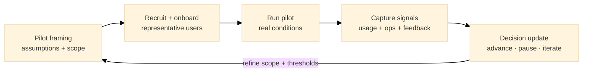

:::info What this chapter does
- Defines expanded pilots as evidence gathering for real-world user and operational fit.
- Shows how to set pilot scope, metrics, onboarding, and data capture to generate decision-ready results.
- Connects pilot outcomes to decision thresholds and scale readiness.
- Positions user validation as a bridge between experiments and broader rollout.
:::

:::warning What this chapter does not do
- Does not guarantee adoption or product-market fit.
- Does not replace business model validation, governance, or regulatory review.
- Does not prescribe a single pilot size, duration, or recruitment method.
- Does not treat "pilot completed" as approval to launch.
:::

:::tip When you should read this
- When experiments show promise but broader validation is still needed.
- When you need evidence of real user behavior under real constraints.
- When leadership requires data to approve scaling.
- Before committing to irreversible rollout decisions.
:::

:::note Derived from Canon
This chapter is interpretive and explanatory. Its constraints and limits derive from:

- [Canon -> Definitions](../../canon/definitions)
- [Canon -> Evidence logic](../../canon/evidence-logic)
- [Canon -> Decision theory](../../canon/decision-theory)
- [Canon -> Epistemic stage model](../../canon/epistemic-model)
:::

:::info Key terms (canonical)
- Evidence
- Evidence quality
- Decision threshold
- Optionality preservation
- Strategic deferral
- Reversibility
:::

:::warning Minimal evidence expectations (non-prescriptive)
Evidence used in this chapter should allow you to:
- define pilot objectives and success criteria tied to assumptions
- link user and operational metrics to validation claims
- explain what changed because of findings
- justify whether the decision state should advance, pause, or iterate
:::

:::note Figure 17 - From pilot framing to decision update (explanatory)

From pilot framing to decision update. Expanded pilots generate decision-ready evidence about user
behavior and operational fit, while preserving reversibility before scale.
:::

## 1. Introduction

User validation at pilot scale is not a marketing milestone. It is a structured evidence activity.

An expanded pilot increases realism: more users, longer exposure, and more operational constraints.
That realism improves evidence quality, but it also increases exposure. The purpose is to learn under
bounded risk.

A pilot is "expanded" when it tests not only whether users can use the solution, but whether the
organization can support it under plausible operating conditions.

### Inputs

- Solution or MVP ready for broader exposure
- Validated hypotheses and thresholds from earlier work (including business model validation)
- OKRs or strategic objectives that constrain success criteria
- Data capture plan (instrumentation + feedback channels)

### Outputs

- Decision-ready evidence about user behavior and operational fit
- Updated thresholds, onboarding, and support design
- Explicit decision: advance, pause, or iterate

## 2. What an Expanded Pilot Is Testing

Expanded pilots typically test assumptions across two categories:

- User behavior in situ
- activation and sustained use
- task completion and friction points
- comprehension and trust signals

- Operational capacity
- support load and resolution times
- throughput, reliability, and failure modes
- handoffs between teams and governance constraints

A pilot that produces activity but cannot update a decision state is not sufficient for MCF purposes.

:::tip Example — Startup Context
Tests whether onboarding plus core workflow produces sustained weekly use without human intervention
exceeding a defined support budget.
:::

:::tip Example — Institutional Context
Tests whether a new internal workflow reduces cycle time without creating compliance exceptions or
unacceptable escalations.
:::

:::tip Example — Hybrid Context
Tests whether a shared service can operate across two environments (public + private) with stable
handoffs and consistent user outcomes.
:::

## 3. Prepare the Pilot

Preparation is where reversibility is protected. The pilot plan must explicitly limit exposure.

### 3.1 Define scope and objectives

Define:

- target population (who is included and why)
- what "representative" means for this pilot
- bounded use cases (what is in scope vs out of scope)
- objectives tied to assumptions (not hopes)

Write objectives as claims you might invalidate.

:::info Exercise — Pilot scope statement
Write a one-paragraph scope statement that includes:

- target user segment definition
- in-scope use case(s)
- out-of-scope constraints
- pilot duration and maximum exposure (users, volume, regions)
:::

### 3.2 Define success criteria and thresholds

Every key metric needs:

- baseline or comparator
- threshold (validated / partially / invalidated)
- decision rule (advance / pause / iterate)

Prefer thresholds that preserve reversibility. A pilot should not force an irreversible commitment
unless explicitly intended.

:::tip Example — Startup Context
Validated if week-4 retention &gt;= 25% and median time-to-value &lt;= 10 minutes, with support tickets
&lt;= 0.15 per active user.
:::

:::tip Example — Institutional Context
Validated if cycle time decreases &gt;= 10% with no increase in compliance exceptions beyond a defined
tolerance (&lt;= 1% of cases).
:::

:::tip Example — Hybrid Context
Validated if completion rate improves &gt;= 15% across both environments without fraud/error rate
exceeding a defined ceiling (&lt;= 2%).
:::

### 3.3 Prepare data capture and feedback channels

Define and implement:

- instrumentation (events, funnels, errors, latency)
- qualitative capture (interviews, surveys, observation)
- support channels (ticketing, escalation paths)
- auditability (how changes are tracked and justified)

If a metric cannot be measured reliably, do not base decisions on it.

:::info Exercise — Signal map
Create a table with:

- assumption or hypothesis
- metric(s)
- collection method
- owner
- decision threshold
- risk if the metric is noisy or missing
:::

## 4. Engage Real Users

### 4.1 Recruitment and onboarding

Recruitment choices affect evidence quality. Bias here contaminates interpretation later.

Define:

- recruitment method (where users come from)
- inclusion or exclusion rules
- onboarding path and time-to-first-value target
- incentives (if any) and their likely distortion effects

:::tip Example — Startup Context
Recruits from a waitlist and partner communities; onboarding is self-serve with a single human
check-in only if a user stalls.
:::

:::tip Example — Institutional Context
Selects two departments with different operating profiles; onboarding includes role-based training
and a controlled access request workflow.
:::

:::tip Example — Hybrid Context
Recruits across two institutions with harmonized onboarding materials plus environment-specific
compliance steps.
:::

### 4.2 Run pilot under realistic conditions

Avoid "demo conditions" that cannot exist at scale.

Maintain:

- fixed observation window
- stable core flow (avoid constant feature churn)
- pre-declared escalation rules for incidents

Document any operational exceptions. Exceptions are evidence, not embarrassment.

:::info Exercise — Pilot operating rules
Write operating rules that specify:

- what can change during the pilot (and what cannot)
- incident escalation criteria
- communications cadence to participants
- who can authorize changes and why
:::

## 5. Operational and Organizational Validation

Expanded pilots should produce evidence about the organization, not only the solution.

Track:

- throughput limits and failure modes
- support workload and response time distributions
- cross-functional bottlenecks (handoffs, approvals, ownership)

If the organization cannot operate the solution under pilot load, scale readiness is not supported.

:::tip Example — Startup Context
Support load grows faster than users; automation backlog becomes the dominant constraint to growth.
:::

:::tip Example — Institutional Context
A governance step becomes the bottleneck; cycle time improvements plateau unless approvals are
redesigned.
:::

:::tip Example — Hybrid Context
One environment performs well while the other degrades due to policy differences; the constraint
becomes interoperability, not UX.
:::

## 6. Analyze Outcomes and Update the Decision State

### 6.1 Evaluate results against thresholds

Classify outcomes per hypothesis:

- validated
- partially validated
- invalidated

Avoid retrospective threshold changes unless explicitly documented as a learning correction.

:::info Exercise — Pilot review table
Create a table with:

- hypothesis
- threshold
- observed value
- classification
- recommended next action (advance / pause / iterate)
- reversibility impact (what becomes harder if you proceed)
:::

### 6.2 Decide: advance, pause, or iterate

Advance when the evidence meets thresholds and exposure can increase intentionally.

Pause when evidence is insufficient or measurement is unreliable.

Iterate when partial validation suggests a bounded refinement and retest.

Iteration is not "keep changing." It is an evidence-driven update with a new hypothesis.

:::tip Example — Startup Context
Advances to paid acquisition only if retention holds under pilot load; otherwise iterates onboarding
and activation path.
:::

:::tip Example — Institutional Context
Advances to additional departments only if governance and support capacity remain stable; otherwise
redesigns the operating model.
:::

:::tip Example — Hybrid Context
Advances only after harmonizing policy constraints; otherwise pauses expansion and focuses on
interoperability and compliance alignment.
:::

## 7. Final Thoughts

Expanded pilots increase realism and evidence quality, but they also increase exposure. Within MCF,
the purpose is to update decisions before irreversible commitments.

A successful pilot is not a celebration. It is a defensible decision update backed by traceable
evidence.

In the next chapter, you will formalize scale readiness under governance and regulatory constraints.

## ToDo for this Chapter

- Create the User Validation and Expanded Pilot Testing checklist + template and link it here
- Create Chapter 20 assessment questionnaire and link it here
- Translate all content to Spanish and integrate to i18n
- Record and embed walkthrough video for this chapter

