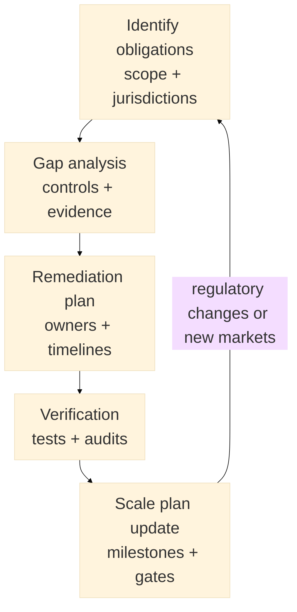

:::info What this chapter does
- Frames regulatory review as evidence-gathering for legal and compliance constraints.
- Shows how to assess gaps, prioritize remediation, and document compliance actions with owners and timelines.
- Connects scalability planning to decision thresholds and risk management.
- Aligns growth roadmaps with regulatory timelines and obligations.
:::

:::warning What this chapter does not do
- Does not provide legal advice or jurisdiction-specific guidance.
- Does not guarantee regulatory approval or eliminate compliance risk.
- Does not prescribe a single scalability model or tooling stack.
- Does not replace governance decisions or executive accountability.
:::

:::tip When you should read this
- When pilots indicate readiness but compliance requirements are unclear.
- When scaling requires regulatory approvals or operational audits.
- When risk exposure must be assessed before expansion.
- Before committing to irreversible market entry or rollout.
:::

:::note Derived from Canon
This chapter is interpretive and explanatory. Its constraints and limits derive from:

- [Canon -> Definitions](../../canon/definitions)
- [Canon -> Evidence logic](../../canon/evidence-logic)
- [Canon -> Decision theory](../../canon/decision-theory)
- [Canon -> Epistemic stage model](../../canon/epistemic-model)
:::

:::info Key terms (canonical)
- Evidence
- Evidence quality
- Decision threshold
- Optionality preservation
- Strategic deferral
- Reversibility
:::

:::warning Minimal evidence expectations (non-prescriptive)
Evidence used in this chapter should allow you to:
- identify which compliance assumptions are being verified or tested
- document gaps, remediation steps, and responsible owners
- show how regulatory constraints change scale decisions and timelines
- justify whether the decision state should advance, pause, or defer
:::

:::note Figure 18 - From obligations to scale planning (explanatory)

From obligations to scale planning. Regulatory review produces evidence about constraints, which
updates scale gates and preserves reversibility before expansion.
:::

## 1. Introduction

Regulatory review and scalability planning are not separate workstreams. In MCF terms, regulatory
obligations and compliance constraints are part of the decision environment.

Regulatory review produces evidence about what you are allowed to do, under what conditions, and
with which controls. Scalability planning translates those constraints into a growth plan that
remains feasible, auditable, and reversible.

This chapter focuses on how to:

- identify obligations without claiming legal certainty
- convert obligations into verifiable controls
- resolve gaps in a prioritized way
- update your scale roadmap using explicit gates and thresholds

### Inputs

- Expanded pilot outcomes and operational learnings
- Applicable regulatory and policy requirements (as interpreted by relevant experts)
- OKRs and strategic objectives that constrain acceptable risk
- Current operating model (processes, roles, systems, vendors)

### Outputs

- Compliance evidence map (obligations -> controls -> artifacts)
- Gap register with remediation plan (owners + timelines)
- Scale plan with explicit regulatory gates and deferral options

## 2. What Regulatory Review Is Verifying

Regulatory review is not "we are compliant." It is evidence that specific obligations have:

- an identified control
- an owner
- an operational procedure
- auditable artifacts

Typical verification areas include:

- data protection and privacy obligations
- security controls and incident response
- consumer protection and disclosure requirements
- financial integrity requirements (where relevant)
- sector-specific approvals, licenses, or certifications (where relevant)

:::tip Example — Startup Context
Verifies that data collection, retention, and deletion controls exist, and that basic incident
response is operational, not aspirational.
:::

:::tip Example — Institutional Context
Verifies that the solution aligns with enterprise policies (security, procurement, records
retention) and that audit artifacts are produced consistently.
:::

:::tip Example — Hybrid Context
Verifies that two compliance environments can coexist (public + private obligations) without
breaking handoffs or creating conflicting controls.
:::

## 3. Identify Applicable Obligations

Start by defining the compliance surface:

- jurisdictions (where users and data exist)
- sector obligations (finance, health, education, public services, etc.)
- data categories (personal, financial, sensitive, minors, etc.)
- third parties (processors, vendors, integrators)

Do not treat a checklist as proof. A checklist is an inventory that must connect to evidence.

:::info Exercise — Obligation inventory
Create an obligation inventory with:

- obligation name (plain language)
- scope (who or where it applies)
- interpretation owner (legal or compliance contact)
- control hypothesis (what control should exist)
- evidence artifact(s) expected
:::

## 4. Perform a Gap Analysis

A gap analysis compares:

- required controls (as defined in your inventory)
- current controls (what exists today)
- evidence strength (how auditable the control is)

Classify each gap by:

- risk severity (impact if wrong)
- likelihood (how exposed you are)
- remediation effort (time, cost, dependencies)
- reversibility impact (how hard it becomes to change later)

:::tip Example — Startup Context
Finds that consent and retention are documented but not enforced in systems; remediation prioritizes
enforcement and logging before market expansion.
:::

:::tip Example — Institutional Context
Finds that vendor due diligence and procurement evidence is missing; remediation prioritizes
contract artifacts and audit trail creation.
:::

:::tip Example — Hybrid Context
Finds that identity verification standards differ across environments; remediation prioritizes a
harmonized identity policy and an exceptions process.
:::

:::info Exercise — Gap register
Build a gap register with:

- obligation or control
- current state (met / partial / unmet)
- risk severity (high / medium / low)
- remediation action
- owner
- deadline
- verification method (test, audit, review)
:::

## 5. Build a Compliance Action Plan

Turn gaps into a plan that can be executed and verified.

A compliance action plan should include:

- prioritized remediation sequence (risk-first)
- dependencies (engineering, vendors, approvals)
- explicit completion criteria (what "done" means)
- monitoring cadence (how you prevent regression)

Avoid "compliance theatre." A control is only real if it is executed and produces artifacts
reliably.

:::tip Example — Startup Context
Implements minimum viable controls: logging, retention enforcement, breach response runbook, and
periodic access review before onboarding new cohorts.
:::

:::tip Example — Institutional Context
Creates a cross-functional compliance workstream: policy mapping, control implementation, audit
evidence pack, and quarterly internal review.
:::

:::tip Example — Hybrid Context
Negotiates a shared control baseline across partners and defines an exceptions process with clear
authority and documentation requirements.
:::

## 6. Plan Scale Using Regulatory Gates

Scaling is not a single decision. In MCF, scale is a sequence of gates with thresholds.

A scale plan should specify:

- what market or segment expansion means (region, volume, features)
- which obligations become relevant at each step
- the regulatory gates required (approvals, audits, certifications)
- deferral options if gates are not met (strategic deferral)

### 6.1 Define scale milestones and gate criteria

For each milestone:

- define the scope expansion
- define the required compliance state (met / partial / unmet thresholds)
- define what evidence must be produced
- define what happens if the gate fails (pause, iterate, defer)

:::info Exercise — Gate table
Create a gate table with:

- milestone (e.g., Region B launch, 10x users, new data category)
- required controls and artifacts
- decision threshold (advance / pause / defer)
- owner and reviewer (governance)
- reversibility impact if advanced
:::

### 6.2 Synchronize regulatory timelines with delivery timelines

Regulatory work often has lead times: audits, certifications, approvals, or vendor assessments. Your
roadmap should reflect those lead times explicitly.

If compliance tasks are on the critical path, treat them as such. Do not hide them behind "later."

:::tip Example — Startup Context
Defers entry into a regulated segment until basic controls and vendor terms are verified; continues
scaling in a lower-risk segment meanwhile.
:::

:::tip Example — Institutional Context
Aligns audit windows with release trains; chooses a scale milestone that matches the organization's
approval cadence.
:::

:::tip Example — Hybrid Context
Stages rollout by environment: completes public-sector approvals before expanding private-sector
integrations that introduce new data obligations.
:::

## 7. Ongoing Monitoring and Auditability

Compliance is not a one-time event. As you scale, obligations evolve:

- new markets introduce new constraints
- new features introduce new data categories
- new vendors introduce new risk

Define:

- monitoring signals (incidents, access changes, policy drift)
- review cadence (monthly / quarterly)
- audit artifact ownership (who produces and stores what)

:::info Exercise — Audit evidence pack outline
Define an evidence pack outline that includes:

- policies and procedures
- control descriptions
- system configurations (where relevant)
- logs and monitoring artifacts
- incident records and postmortems (if any)
- training and access review evidence
:::

## 8. Final Thoughts

Regulatory review reduces uncertainty about constraints. Scalability planning turns those
constraints into an executable sequence of gates and thresholds.

Within MCF, the objective is not to claim certainty. It is to produce decision-ready evidence,
preserve reversibility where possible, and expand intentionally when gates are met.

In the next chapter, you will consolidate learnings into a strategic review and define next
validation steps.

## ToDo for this Chapter

- Create the Regulatory Review + Scalability Planning checklist/template and link it here
- Create Chapter 21 assessment questionnaire and link it here
- Translate all content to Spanish and integrate to i18n
- Record and embed walkthrough video for this chapter
