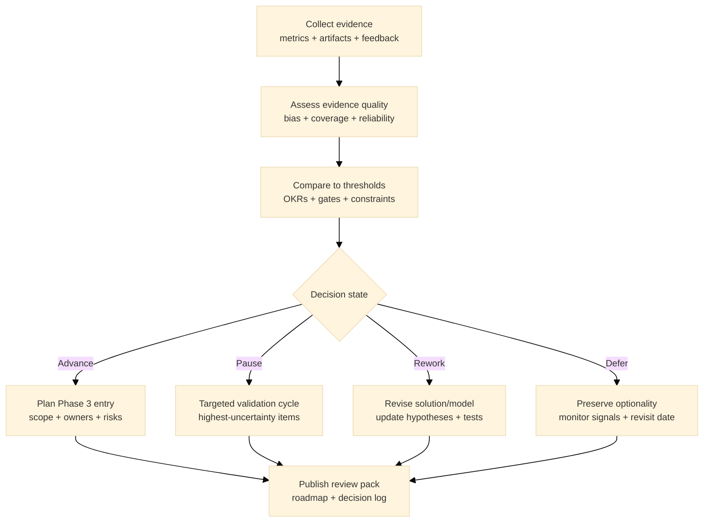

:::info What this chapter does
- Frames strategic review as consolidation of evidence across prior validation steps.
- Shows how to evaluate outcomes against objectives and decision thresholds.
- Connects review findings to roadmap adjustments and the next validation cycle.
- Aligns next steps with governance and organizational priorities.
:::

:::warning What this chapter does not do
- Does not guarantee readiness for the next phase or scale.
- Does not replace ongoing validation or operational execution.
- Does not prescribe a single review framework or reporting format.
- Does not treat retrospective summary as forward approval.
:::

:::tip When you should read this
- When validation work produced mixed or incomplete signals.
- When leadership needs a consolidated view of progress, gaps, and risk.
- When planning the next validation cycle or Phase 3 transition.
- Before committing to major strategic shifts or investments.
:::

:::note Derived from Canon
This chapter is interpretive and explanatory. Its constraints and limits derive from:

- [Canon -> Definitions](../../canon/definitions)
- [Canon -> Evidence logic](../../canon/evidence-logic)
- [Canon -> Decision theory](../../canon/decision-theory)
- [Canon -> Epistemic stage model](../../canon/epistemic-model)
:::

:::info Key terms (canonical)
- Evidence
- Evidence quality
- Decision threshold
- Optionality preservation
- Strategic deferral
- Reversibility
:::

:::warning Minimal evidence expectations (non-prescriptive)
Evidence used in this chapter should allow you to:
- synthesize outcomes from prior validation work
- compare results against explicit objectives and thresholds
- explain what changes are required before advancing
- justify whether the decision state should advance, pause, rework, or defer
:::

:::note Figure 19 - Strategic review as decision control (explanatory)

Strategic review as decision control. You consolidate evidence, evaluate its quality, compare
results to thresholds, and choose a decision state that preserves optionality where uncertainty
remains.
:::

## 1. Introduction

A strategic review is a deliberate pause to convert dispersed validation work into a decision-ready
synthesis. In MCF terms, this is not "did we do the work," but "what does the evidence currently
support, with what strength, and what should we do next."

A useful strategic review:

- separates signal from noise across experiments, pilots, and compliance work
- makes evidence quality explicit (coverage, bias, reliability, recency)
- compares outcomes to thresholds (OKRs, gates, constraints)
- outputs a decision state and a next validation cycle, not a narrative summary

### Inputs

- Evidence artifacts from Phase 2 (experiments, pilots, business model validation, feedback loops)
- Regulatory and scalability constraints and gate status (Chapter 21)
- OKRs, objectives, and decision thresholds
- Financial and operational telemetry (cost, capacity, risk posture)

### Outputs

- Strategic review pack (evidence synthesis + quality assessment + decision state)
- Roadmap update (milestones, gates, owners, dependencies)
- Next validation cycle plan (what is tested next, why, and what changes decisions)

:::tip Example — Startup Context
Validation signals are promising but thin: early retention looks good, but cohort size is small and
onboarding changes confound results.
:::

:::tip Example — Institutional Context
Multiple departments ran pilots in parallel: outcomes conflict and governance needs a single
decision view with explicit risk and dependencies.
:::

:::tip Example — Hybrid Context
A solution spans two environments (public + private): progress exists in each, but integration
evidence is incomplete and compliance gates differ.
:::

## 2. Prepare the Review Pack

Before you judge outcomes, standardize inputs so the review is comparable and auditable. Include:

- a decision log (what was decided, when, and why)
- a validation index (links to experiments, pilots, artifacts)
- the current threshold set (OKRs, gates, constraints)
- a known-issues register (open risks and their owners)

### 2.1 Create a "single evidence index"

Create a short index (one page) that points to:

- hypotheses tested
- methods used
- datasets or metrics dashboards
- qualitative sources (interviews, surveys)
- compliance artifacts (where relevant)

:::info Exercise — Evidence index
Create an evidence index table with columns:

- Assumption or hypothesis
- Test type (experiment, pilot, model validation, compliance verification)
- Primary metric(s)
- Sample or coverage notes
- Artifact link(s)
- Current status (validated / weakened / invalidated / unknown)
:::

:::tip Example — Startup Context
Uses a single spreadsheet with links to analytics snapshots, interview notes, and pilot changelogs.
:::

:::tip Example — Institutional Context
Uses a controlled repository with versioned artifacts and a formal decision memo per gate.
:::

:::tip Example — Hybrid Context
Maintains two artifact tracks (one per environment) plus an integration track that records
cross-boundary evidence.
:::

## 3. Assess Evidence Quality (Not Just Outcomes)

Outcome numbers can be misleading if evidence quality is poor. Evaluate:

- coverage: are key segments represented?
- bias: are incentives, selection, or measurement skewing results?
- reliability: are metrics stable and repeatable?
- recency: are results still representative of current behavior?
- confounding: what changed during measurement?

### 3.1 Evidence quality rubric (lightweight)

Use a simple rubric per key claim:

- Strong: consistent across sources + adequate coverage + low confounding
- Moderate: directional but limited coverage or potential confounds
- Weak: small samples, high bias risk, unclear measurement
- Unknown: not tested, or artifacts are missing

:::info Exercise — Quality scoring
Pick the 5 most decision-critical claims and score each claim:

- Coverage (low / med / high)
- Bias risk (low / med / high)
- Reliability (low / med / high)
- Confounding (low / med / high)

Then label overall quality: Strong / Moderate / Weak / Unknown.
:::

:::tip Example — Startup Context
Retention improved after onboarding changes, but marketing spend also changed; causal attribution
is uncertain.
:::

:::tip Example — Institutional Context
A pilot met targets, but the pilot population was not representative due to internal champion
selection.
:::

:::tip Example — Hybrid Context
One environment shows strong results, but the other is constrained by policy; evidence cannot be
generalized without integration testing.
:::

## 4. Compare to Thresholds and Gates

Strategic review is not a debate. It is a comparison against declared thresholds:

- OKR targets
- gate criteria (advance / pause / rework)
- compliance and scalability gates
- budget or time constraints and reversibility impact

### 4.1 Decide what "meets the bar" means

For each threshold:

- define current measured status
- define margin vs target
- define whether evidence quality is adequate to treat it as decision-ready

:::info Exercise — Threshold table
Create a threshold table with:

- Threshold (OKR / gate / constraint)
- Target value (or condition)
- Current value (or condition)
- Evidence quality label
- Decision implication (advance / pause / rework / defer)
:::

:::tip Example — Startup Context
Sets a threshold for activation and week-4 retention before paying for broader acquisition.
:::

:::tip Example — Institutional Context
Sets a threshold for security review completion and operational readiness before expanding to
additional business units.
:::

:::tip Example — Hybrid Context
Sets a threshold for cross-environment identity and audit logging parity before enabling shared
workflows.
:::

## 5. Select a Decision State and Define the Next Validation Cycle

The output of this chapter is a decision state with an execution plan.

### 5.1 Decision states (MCF-aligned)

Advance: thresholds met with adequate evidence quality; move into Phase 3 with defined scope and
risks.

Pause: signals promising but insufficient; run a targeted validation cycle.

Rework: evidence weakens core assumptions; revise solution or model and update hypotheses.

Defer: preserve optionality; monitor signals and revisit on a declared date or trigger.

:::info Exercise — Decision memo (one page)
Write a one-page decision memo that includes:

- Decision state (advance / pause / rework / defer)
- 3 to 5 strongest evidence points (with artifact links)
- 3 to 5 highest-uncertainty items (what is unknown and why)
- Next validation cycle plan (tests, owners, dates, thresholds)
- Reversibility note (what becomes harder to change if you proceed)
:::

:::tip Example — Startup Context
Pauses and runs a targeted cycle on pricing and retention because evidence is moderate and CAC is
unstable.
:::

:::tip Example — Institutional Context
Advances with constraints: limited rollout scope, explicit monitoring, and a governance checkpoint
after 60 days.
:::

:::tip Example — Hybrid Context
Defers a cross-boundary feature while advancing within each environment, preserving optionality
and reducing coordination risk.
:::

## 6. Update the Roadmap and Governance Cadence

A strategic review must change the roadmap. Update:

- milestones and owners
- gates and criteria
- monitoring signals and review cadence
- open risks and mitigation actions

### 6.1 Establish the next checkpoint

Set the next checkpoint based on uncertainty:

- high uncertainty: shorter cycles (2 to 4 weeks)
- moderate uncertainty: monthly checkpoints
- low uncertainty with stable metrics: quarterly governance reviews

:::info Exercise — Roadmap patch
Produce a roadmap patch that includes:

- the next 3 milestones
- each milestone's gate criteria
- who owns each gate
- what evidence must exist before the milestone is considered "done"
:::

## 7. Final Thoughts

Strategic review is a control function: it consolidates evidence, evaluates quality, compares to
thresholds, and selects a decision state that preserves optionality where uncertainty remains.

If you cannot explain why you are advancing, pausing, reworking, or deferring using explicit
thresholds and evidence quality, you are not doing strategic review. You are summarizing activity.

Phase 3 begins when the decision state is "advance" and the entry conditions are satisfied.

## ToDo for this Chapter

- Create the Strategic Review checklist/template and link it here
- Create Chapter 22 assessment questionnaire and link it here
- Translate all content to Spanish and integrate to i18n
- Record and embed walkthrough video for this chapter

