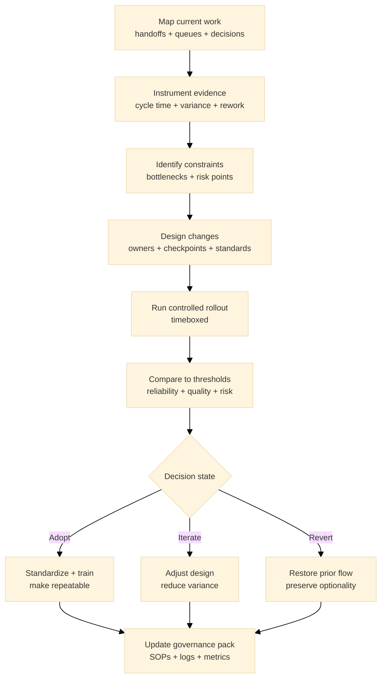

:::info What this chapter does
- Defines operational process design as a delivery enabler.
- Shows how streamlining removes friction and delays.
- Connects process choices to evidence and decision thresholds.
- Frames operations as part of innovation reliability.
:::

:::warning What this chapter does not do
- Does not provide a full operations manual.
- Does not replace governance or strategy decisions.
- Does not guarantee efficiency without resources.
- Does not prescribe specific tooling.
:::

:::tip When you should read this
- When delivery is inconsistent or slow.
- When handoffs create recurring bottlenecks.
- When scaling requires process stability.
- Before expanding operational capacity.
:::

:::note Derived from Canon
This chapter is interpretive and explanatory. Its constraints and limits derive from the Canon pages below.

- [Canon -> Definitions](../../canon/definitions)
- [Canon -> Evidence logic](../../canon/evidence-logic)
- [Canon -> Decision theory](../../canon/decision-theory)
- [Canon -> Epistemic stage model](../../canon/epistemic-model)
:::

:::info Key terms (canonical)
- Evidence
- Evidence quality
- Decision threshold
- Optionality preservation
- Strategic deferral
- Reversibility
:::

:::warning Minimal evidence expectations (non-prescriptive)
Evidence used in this chapter should allow you to:
- document current process constraints and risks
- show which changes reduce uncertainty
- explain how outcomes improved after changes
- justify whether operations are ready to scale
:::

:::note Figure 20 - Operational reliability as evidence stabilization (explanatory)

Operational reliability as evidence stabilization. You reduce variance, clarify ownership, and make
delivery outcomes comparable so operational evidence can support threshold-based decisions.
:::

## 1. Introduction

Operational processes are the repeatable pathways that turn decisions into consistent outcomes. In
Phase 3, the primary question is not speed alone but reliability: can the organization deliver
predictable quality as conditions change?

In MCF 2.2 terms, operations matter because they stabilize evidence. If the same inputs produce
inconsistent outputs, evidence becomes noisy and decision thresholds lose meaning. Streamlining is
justified when it lowers variance, clarifies cause and effect, and preserves reversibility when
signals degrade.

### Inputs

- Phase 2 validated decisions and constraints (what is being delivered and why)
- Current delivery flow (handoffs, queues, roles, tools)
- Evidence sources (cycle time, variance, quality defects, rework, escalations)
- Governance constraints (decision rights, compliance, risk posture)

### Outputs

- A documented operational process (baseline and target flow)
- A change plan with owners, checkpoints, and success thresholds
- Evidence that reliability improved (variance reduced, rework lowered, decision clarity increased)

:::tip Example — Startup Context
Delivery is fast but inconsistent; small team context switching creates hidden rework and unstable
quality.
:::

:::tip Example — Institutional Context
Work spans departments; unclear decision rights and handoff ambiguity create queues and delays that
look like "capacity problems."
:::

:::tip Example — Hybrid Context
A solution crosses two environments (public + private); each side is internally stable, but
integration handoffs create recurring failure points.
:::

## 2. Define What Reliability Means for This Work

Reliability must be operationalized as thresholds, not slogans. Define what "repeatable" means for
your context.

### 2.1 Choose reliability indicators

Pick a small set of decision-relevant indicators:

- cycle time (median and variance)
- defect rate or quality escapes
- rework rate (including hidden rework)
- escalation frequency
- adherence to decision checkpoints (did the right decisions happen at the right time)

:::info Exercise — Reliability threshold table
Create a table with:

- Indicator
- Current baseline (with timeframe)
- Target threshold (what "good enough" means)
- Evidence source (dashboard or log)
- Owner
- Review cadence
:::

:::tip Example — Startup Context
Sets a threshold for release stability: fewer than N rollbacks per month and rework below X% of
capacity.
:::

:::tip Example — Institutional Context
Sets a threshold for handoff integrity: decision approvals within Y days and escalations reduced by
Z%.
:::

:::tip Example — Hybrid Context
Sets a threshold for cross-boundary flows: end-to-end completion time within a band and audit logs
complete across systems.
:::

## 3. Map the Current Process and Decision Points

Process design starts with a map that includes decision rights, not just activities.

### 3.1 Map the flow

Capture:

- entry conditions (what qualifies work to start)
- roles and ownership at each step
- handoffs and queues
- decision checkpoints (what must be decided and by whom)
- exit conditions (what qualifies work as "done")

Prefer a simple flow first, then add detail only where evidence indicates friction.

:::info Exercise — Process map (minimum viable)
Create a one-page flow with:

- 8 to 15 steps max
- explicit owners per step
- at least 3 decision checkpoints
- known queue points marked
:::

:::tip Example — Startup Context
Discovers "invisible steps" (context switch, rework, last-minute approvals) that dominate cycle
time variance.
:::

:::tip Example — Institutional Context
Finds multiple parallel approval paths with unclear authority, producing non-deterministic delivery
outcomes.
:::

:::tip Example — Hybrid Context
Identifies that integration testing is treated as an exception rather than a step, so failures
repeat without learning.
:::

## 4. Identify Constraints and Failure Modes Using Evidence

Operational failure modes often show up as evidence quality problems rather than obvious delivery
breakdowns.

Look for:

- high variance (unpredictability) even if the average is improving
- recurring handoff friction and unowned dependencies
- process exceptions that never become part of the canonical flow
- tooling mismatches that produce inconsistent artifacts

Use the book references below as diagnostic lenses rather than checklists.

### 4.1 Convert observations into testable process hypotheses

Examples:

"If we standardize intake and definition-of-ready, rework will drop below X%."

"If we make decision rights explicit at checkpoint Y, queue time will reduce by Z%."

:::info Exercise — Process hypothesis triad
Write three process hypotheses:

- a handoff hypothesis (ownership or decision rights)
- a quality hypothesis (defects or rework)
- a throughput hypothesis (cycle time or variance)

Each must include a measurable threshold and a timebox.
:::

:::tip Example — Startup Context
Cycle time is short, but variance is huge; quality issues cluster after releases, indicating weak
checkpoints.
:::

:::tip Example — Institutional Context
Queues form at governance gates because inputs are inconsistent; evidence artifacts are not
comparable across teams.
:::

:::tip Example — Hybrid Context
Integration failures spike after changes on one side; lack of shared release cadence produces
unstable joint evidence.
:::

## 5. Design Streamlining Changes That Preserve Optionality

Streamlining is not "optimize everything." It is a targeted change that reduces variance and
improves decision integrity without locking in prematurely.

Typical changes:

- clarify entry or exit criteria ("definition of ready/done")
- introduce or tighten decision checkpoints
- standardize artifact formats for comparability
- reduce handoffs or make them explicit and owned
- implement a rollback or revert path (reversibility)

### 5.1 Timebox and stage the rollout

Treat process change like a controlled intervention:

- define scope (which teams or work types)
- define timebox (e.g., 2 to 4 weeks)
- define success thresholds (what evidence changes the decision)
- define rollback criteria (what triggers revert)

:::info Exercise — Streamlining change brief
Write a one-page change brief with:

- problem signal (evidence)
- change description
- scope and timebox
- thresholds (success + rollback)
- owners and decision rights
:::

:::tip Example — Startup Context
Introduces a lightweight intake standard and a weekly decision checkpoint; keeps flexibility while
reducing rework.
:::

:::tip Example — Institutional Context
Creates a standard artifact pack for approvals and a single accountable owner per handoff; reduces
queue ambiguity.
:::

:::tip Example — Hybrid Context
Defines an integration contract (interfaces + audit logs + release cadence) and adds a joint
checkpoint before rollout.
:::

## 6. Validate Operational Improvements Against Thresholds

After the timebox, compare outcomes against thresholds with evidence quality explicit.

Evaluate:

- did variance reduce (not just mean cycle time)?
- did rework decrease or just shift earlier or later?
- did decision checkpoints become clearer and more consistent?
- did risks decrease, or did you hide them with speed?

### 6.1 Choose a decision state

Adopt: thresholds met with adequate evidence quality; standardize.

Iterate: directional improvement but gaps remain; adjust and re-test.

Revert: evidence worsens reliability, quality, or decision integrity; restore prior flow and
redesign.

:::info Exercise — Operational review memo
Create a short memo containing:

- baseline vs post-change metrics (including variance)
- evidence quality notes (coverage or confounds)
- decision state (adopt / iterate / revert)
- next actions and owners
:::

:::tip Example — Startup Context
Iterates: cycle time improved but defect rate rose; adds a checkpoint and reruns for two weeks.
:::

:::tip Example — Institutional Context
Adopts: queue time at approvals drops and artifact consistency improves; trains teams and updates
governance pack.
:::

:::tip Example — Hybrid Context
Reverts: integration failures increased; restores prior release cadence and redesigns the
integration checkpoint.
:::

## 7. Cross-References

Book: /docs/book/decision-logic, /docs/book/governance-and-roles, /docs/book/failure-modes,
/docs/book/boundaries-and-misuse

Canon: /docs/canon/definitions, /docs/canon/evidence-logic, /docs/canon/decision-theory,
/docs/canon/epistemic-model

## ToDo for this Chapter

- Create the Operational process design checklist/template and link it here
- Create Chapter 23 assessment questionnaire and link it here
- Translate all content to Spanish and integrate to i18n
- Record and embed walkthrough video for this chapter

