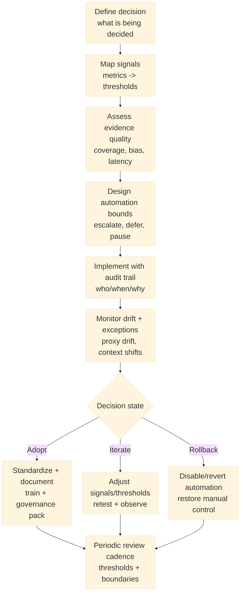

:::info What this chapter does
- Defines automation as a leverage point for reliability.
- Shows how data signals improve decision cadence.
- Connects metrics to evidence thresholds.
- Frames automation as a support for governance.
:::

:::warning What this chapter does not do
- Does not guarantee correct decisions without governance.
- Does not prescribe a specific data stack.
- Does not replace human judgment.
- Does not treat metrics as goals on their own.
:::

:::tip When you should read this
- When decisions are slow or inconsistent.
- When data is available but underused.
- When manual work limits throughput.
- Before scaling decision-dependent processes.
:::

:::note Derived from Canon
This chapter is interpretive and explanatory. Its constraints and limits derive from the Canon pages below.

- [Canon -> Definitions](../../canon/definitions)
- [Canon -> Evidence logic](../../canon/evidence-logic)
- [Canon -> Decision theory](../../canon/decision-theory)
- [Canon -> Epistemic stage model](../../canon/epistemic-model)
- [Canon -> Governance boundaries](../../canon/governance-boundaries)
:::

:::info Key terms (canonical)
- Evidence
- Evidence quality
- Decision threshold
- Optionality preservation
- Strategic deferral
- Reversibility
:::

:::warning Minimal evidence expectations (non-prescriptive)
Evidence used in this chapter should allow you to:
- define which signals drive which decisions
- show data quality and limitations
- explain why automation changes outcomes
- justify when to escalate or pause
:::

:::note Figure 21 - Automation as bounded pre-commitment (explanatory)

Automation as bounded pre-commitment. You encode decision rules only when signals are reliable,
exceptions are explicit, and rollback remains feasible under governance.
:::

## 1. Introduction

Automation and data-driven decision making are leverage points in Phase 3. Automation can reduce
variability; data can clarify whether decisions are justified. The purpose is not speed for its own
sake. It is to reduce variance so evidence can support defensible decisions.

In MCF 2.2 terms, automation is a form of pre-commitment: once a workflow encodes a decision rule,
that rule executes repeatedly. This raises the bar for auditability, traceability, and boundary
checks. "Data-driven" does not mean "data-determined." Evidence is necessary but not sufficient;
decisions still require judgment about reversibility, optionality, and context shifts.

### Inputs

- Target decisions to stabilize (what decisions repeat and matter)
- Candidate signals (metrics, events, qualitative inputs) and their data sources
- Evidence quality assessment (coverage, bias, latency, drift risk)
- Governance constraints (decision rights, audit requirements, escalation owners)

### Outputs

- A decision-to-signal map (signals -> thresholds -> actions)
- Bounded automation rules with explicit escalation or deferral paths
- Audit trails for rule changes and approvals
- Evidence that automation improved reliability (and did not degrade decision integrity)

:::tip Example — Startup Context
Automates release checks and incident routing to reduce rework, but keeps pricing and roadmap
decisions manual due to high uncertainty.
:::

:::tip Example — Institutional Context
Automates intake triage and compliance checks, but requires approval checkpoints before
irreversible actions (data access, user-impacting enforcement).
:::

:::tip Example — Hybrid Context
Automates cross-system reconciliation and alerting, but escalates any cross-boundary identity or
policy conflicts to a joint governance owner.
:::

## 2. Define the Decision Before You Define the Dashboard

Start with the decision. Automation and metrics are valid only relative to a decision threshold.

### 2.1 Specify the decision and decision state

Document:

- what is being decided (approve, ship, scale, block, escalate)
- who owns the decision (and who can override)
- what "advance / pause / rollback" means operationally
- what is reversible vs effectively irreversible

:::info Exercise — Decision definition card
Write a one-page card with:

- Decision name
- Owner + decision rights
- Decision states (advance/pause/rollback) and what each triggers
- Reversibility notes (rollback cost, time, dependencies)
:::

:::tip Example — Startup Context
Defines a "ship to production" decision with a rollback window and an owner on-call.
:::

:::tip Example — Institutional Context
Defines an "expand access to sensitive data" decision with audit requirements and dual approval.
:::

:::tip Example — Hybrid Context
Defines a "sync identity across systems" decision with conflict resolution ownership and a pause
state.
:::

## 3. Map Signals to Thresholds and Actions

Signals must map to actions through thresholds. If a metric cannot change an action, it is
observational, not decision-relevant.

### 3.1 Build a signal map

For each decision, map:

- signal name and source
- threshold definition (including bands, not just a single number)
- action tied to threshold (advance/pause/escalate)
- sampling window and latency constraints
- known limitations (coverage gaps, bias, seasonality, confounders)

:::info Exercise — Signal-to-threshold table
Create a table with:

- Decision
- Signal
- Threshold band
- Action
- Evidence quality notes (bias/latency/coverage)
- Owner
- Review cadence
:::

:::tip Example — Startup Context
Maps deployment frequency and rollback rate to a "release stability" threshold that triggers pause
and investigation.
:::

:::tip Example — Institutional Context
Maps SLA breach risk and audit findings to escalation thresholds for operational and compliance
leaders.
:::

:::tip Example — Hybrid Context
Maps reconciliation error rate to a threshold that disables automation and forces manual
verification across systems.
:::

## 4. Assess Evidence Quality Before Automating

Automation should be bounded by evidence quality. If evidence is unstable, automation amplifies
error.

### 4.1 Check for common evidence risks

Proxy drift: metrics become targets and lose meaning.

Coverage gaps: critical states are not observed.

Latency blindness: decisions run on stale evidence.

Context shifts: thresholds become wrong when conditions change.

Treat these as conditions that should trigger escalation, deferral, or rollback paths.

:::info Exercise — Evidence quality pre-check
For each key signal, record:

- What it fails to measure (blind spots)
- How stale it can be before decisions degrade (max latency)
- How it can be gamed (proxy drift vectors)
- What confounders can flip interpretation
:::

:::tip Example — Startup Context
A "signups" metric rises because of a campaign, masking retention collapse; automation based on
signups would misfire.
:::

:::tip Example — Institutional Context
A compliance metric is updated monthly; automation that runs daily on it creates false confidence.
:::

:::tip Example — Hybrid Context
One side changes definitions; the shared metric drifts and triggers incorrect reconciliation
actions.
:::

## 5. Design Bounded Automation With Explicit Exception Paths

Automation must know when to defer, escalate, or pause. Boundedness preserves optionality.

### 5.1 Define automation boundaries

Document:

- trigger conditions (signals + thresholds)
- allowed actions (what the system can do)
- escalation conditions (what it cannot do)
- pause conditions (when to stop automation)
- rollback procedure (how to revert)

### 5.2 Encode traceability

Every automation change should be traceable:

- who approved changes
- why the change was made (evidence)
- what changed (thresholds, logic, scope)
- when it was deployed

:::info Exercise — Automation rule brief
Write a brief including:

- Rule name and scope
- Signals + thresholds
- Actions + bounds
- Escalation owners and SLAs
- Rollback trigger and procedure
- Audit trail fields (who/when/why)
:::

:::tip Example — Startup Context
Automates incident routing and deploy checks, but escalates user-impacting rollbacks to an owner.
:::

:::tip Example — Institutional Context
Automates case classification, but requires human approval for enforcement actions or irreversible
account changes.
:::

:::tip Example — Hybrid Context
Automates reconciliation, but pauses and escalates whenever identity or policy conflicts appear
between systems.
:::

## 6. Monitor Drift, Exceptions, and Governance Alignment

Automation reliability degrades when context changes. Monitoring is part of the decision system,
not an afterthought.

### 6.1 Monitor what can invalidate your thresholds

Track:

- drift indicators (threshold violations trending, seasonal shifts)
- exception volume and category (are edge cases becoming the norm?)
- override frequency (are humans disagreeing with automation?)
- audit findings (traceability or boundary violations)

### 6.2 Choose a decision state for the automation itself

Adopt: evidence supports stable thresholds and bounded behavior; standardize.

Iterate: evidence is directional but incomplete; adjust signals/thresholds and retest.

Rollback: evidence shows harm or boundary violations; disable/revert and redesign.

:::info Exercise — Automation review memo
Create a short memo containing:

- baseline vs current reliability metrics (including variance)
- exception analysis (types + volume + root causes)
- governance notes (approvals, audit trail completeness)
- decision state (adopt/iterate/rollback) and next actions
:::

:::tip Example — Startup Context
Iterates: automation speeds routing but increases false positives; adjusts thresholds and adds an
escalation band.
:::

:::tip Example — Institutional Context
Adopts: bounded automation reduces queue time while audit trails remain complete; publishes the
governance pack.
:::

:::tip Example — Hybrid Context
Rolls back: cross-boundary exceptions spike; disables automation and switches to a joint manual
checkpoint until signals stabilize.
:::

## 7. Cross-References

Book: /docs/book/decision-logic, /docs/book/governance-and-roles, /docs/book/failure-modes,
/docs/book/boundaries-and-misuse

Canon: /docs/canon/definitions, /docs/canon/evidence-logic, /docs/canon/decision-theory,
/docs/canon/epistemic-model, /docs/canon/governance-boundaries

## ToDo for this Chapter

- Create the Automation + data decision mapping template and link it here
- Create Chapter 24 assessment questionnaire and link it here
- Translate all content to Spanish and integrate to i18n
- Record and embed walkthrough video for this chapter
