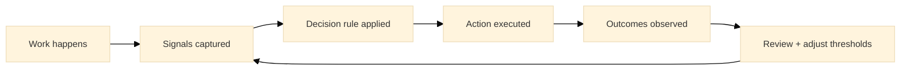

:::info What this chapter does
- Defines automation as a leverage point for reliability.
- Shows how data signals improve decision cadence.
- Connects metrics to evidence thresholds.
- Frames automation as a support for governance.
:::

:::warning What this chapter does not do
- Does not guarantee correct decisions without governance.
- Does not prescribe a specific data stack.
- Does not replace human judgment.
- Does not treat metrics as goals on their own.
:::

:::tip When you should read this
- When decisions are slow or inconsistent.
- When data is available but underused.
- When manual work limits throughput.
- Before scaling decision-dependent processes.
:::

:::note Derived from Canon
This chapter is interpretive and explanatory. Its constraints and limits derive from the Canon pages below.

- [Canon -> Definitions](../../canon/definitions)
- [Canon -> Evidence logic](../../canon/evidence-logic)
- [Canon -> Decision theory](../../canon/decision-theory)
- [Canon -> Epistemic stage model](../../canon/epistemic-model)
- [Canon -> Governance boundaries](../../canon/governance-boundaries)
:::

:::info Key terms (canonical)
- Evidence
- Evidence quality
- Decision threshold
- Optionality preservation
- Strategic deferral
- Reversibility
:::

:::warning Minimal evidence expectations (non-prescriptive)
Evidence used in this chapter should allow you to:
- define which signals drive which decisions
- show data quality and limitations
- explain why automation changes outcomes
- justify when to escalate or pause
:::

:::note Figure 21 - Automation -> Signal -> Decide -> Review (explanatory)

Automation -> Signal -> Decide -> Review. This diagram shows automation as a bounded evidence
mechanism: signals inform decisions, actions produce outcomes, and review updates thresholds and
rules. In MCF 2.2, automation is valuable when it improves reliability without removing
auditability or reversibility.
:::

## 1. Introduction

Automation and data-driven decision making are leverage points in Phase 3. Automation can reduce
variability; data can clarify whether decisions are justified. The purpose is not speed for its own
sake. It is to reduce variance so evidence can support defensible decisions.

In MCF 2.2 terms, automation is a form of pre-commitment: once a workflow encodes a decision rule,
that rule executes repeatedly. This raises the bar for auditability, traceability, and boundary
checks. "Data-driven" does not mean "data-determined." Evidence is necessary but not sufficient;
decisions still require judgment about reversibility, optionality, and context shifts.

### Inputs

- Operational processes and decision points (Chapter 23)
- Candidate signals (logs, events, KPIs, audits, QA outcomes)
- Governance boundaries and decision rights
- Known risks and failure modes relevant to the process

### Outputs

- A signal-to-decision map (which signals drive which decisions)
- Bounded automation rules with explicit escalation paths
- Evidence that automation improved reliability without reducing auditability
- Updated thresholds, exceptions, and review cadence

## 2. Map Decisions to Signals

You cannot be "data-driven" without naming the decisions. Start by defining what is being decided,
who owns it, and what evidence can change it.

### 2.1 What to do

- List the recurring decisions that meaningfully affect outcomes (approve, route, escalate, pause,
  rollback).
- For each decision, write the decision trigger and the decision owner (role, not person).
- Identify candidate signals that could update the decision and document known limitations.

### 2.2 How to run it

Create a one-page Signal-to-Decision Map with columns:
Decision | Owner | Trigger | Signals | Threshold | Escalation | Review cadence

Start with 3 to 5 decisions. Expand only when the map is stable.

:::tip Example — Startup Context
A startup wants to reduce support response variance without increasing headcount.

Decision: Escalate to engineering.

Signal: error rate on a critical endpoint plus a spike in refund requests.

Threshold: error rate > 2% for 10 minutes and refunds > baseline + 30%.

Escalation: on-call engineer plus incident channel.

Review: weekly, adjust threshold when false positives exceed 10%.
:::

:::tip Example — Institutional Context
A large organization wants consistent handling of high-risk requests.

Decision: Route to compliance review.

Signal: data classification label plus region plus customer type.

Threshold: any "restricted" label or cross-border transfer indicator.

Escalation: compliance officer approval required.

Review: monthly audit with sampling to check false negatives.
:::

:::tip Example — Hybrid Context
A public-private program needs speed, but also auditability and reversibility.

Decision: Approve onboarding step.

Signal: completed KYC/KYB checks plus signed data-sharing terms plus risk score.

Threshold: risk score at or below the defined bound and mandatory docs present.

Escalation: manual review when risk score is "unknown" or docs mismatch.

Review: per cohort, revise rules when exception volume exceeds capacity.
:::

## 3. Define Data Quality and Limits

Signals are only useful when their reliability and scope are known. Data quality is part of the
evidence.

### 3.1 What to do

- Define what "good enough" means for each signal: timeliness, completeness, accuracy.
- Document where the signal can mislead (seasonality, sampling bias, proxy drift).
- Define a "no-signal" condition: what happens when evidence is missing.

### 3.2 How to run it

For each key signal, add a short Signal Contract:
Source | Update frequency | Known gaps | Expected range | Owner | Fallback path

Add an explicit rule: if a signal is stale or missing, escalate or defer.

:::info Exercise — Write two Signal Contracts
Pick two signals you rely on. Write their Signal Contracts and define the fallback path when each
signal is missing or stale.
:::

## 4. Automate with Bounds and Escalation Paths

Automation is a pre-commitment. In MCF 2.2, automation should be bounded: it must know when to
escalate, pause, or defer.

### 4.1 What to do

- Convert a decision rule into an automation rule only when signals are stable enough, escalation
  is defined, and rollback is feasible.
- Define exception categories and which ones require manual review.
- Keep reversibility explicit: define rollback triggers tied to evidence.

### 4.2 How to run it

Implement automation as a small set of rules with an "escape hatch":

- If in-bounds, automate.
- If out-of-bounds, escalate.
- If unknown, defer or require manual review.

Add a rollback trigger tied to evidence, not optimism.

:::info Exercise — Design one bounded automation rule
Choose one decision from your map. Draft the in-bounds rule, the out-of-bounds escalation rule,
and the rollback trigger.
:::

## 5. Monitor Outcomes Against Thresholds

Automation is justified by outcomes that improve decision reliability. The evaluation must connect
to thresholds and decision quality, not vanity metrics.

### 5.1 What to do

- Define what "improved" means (lower variance, fewer escalations, faster recovery).
- Compare to a baseline (before automation) using comparable work units.
- Track false positives and false negatives explicitly.

### 5.2 How to run it

Create a simple before/after comparison:
Cycle time variance | Rework rate | Escalation rate | Incident recurrence

Review on a fixed cadence and update thresholds when drift appears.

:::info Exercise — Define an automation review cadence
Define review cadence (weekly or monthly), owners, and the criteria that would trigger threshold
changes or rollback.
:::

## 6. Typical Failure Modes and Boundary Notes

Automation and data can reduce epistemic quality when they detach from decision integrity.

### 6.1 What to do

- Watch for proxy drift: metrics become targets and lose meaning.
- Watch for coverage gaps: critical decisions lack reliable signals.
- Watch for latency blindness: decisions are made on stale evidence.
- Watch for over-automation: reversible decisions are treated as irreversible.

### 6.2 How to run it

Add a boundary check: if the system keeps running through known exception conditions because
escalation is undefined, automation is premature. Escalate or pause until boundaries are defined.

## 7. Final Thoughts

Automation is valuable when it makes outcomes more reliable while keeping decisions auditable and
reversible. Data becomes evidence only when it maps to a decision threshold and can change what you
do next. In Phase 3, the target is not more dashboards. It is defensible decisions at repeatable
cadence.

## ToDo for this Chapter

- Create an Automation Decision Map template and link it here
- Create a Signal Contract template and link it here
- Translate this chapter to Spanish and integrate i18n
- Record and embed walkthrough video for this chapter

