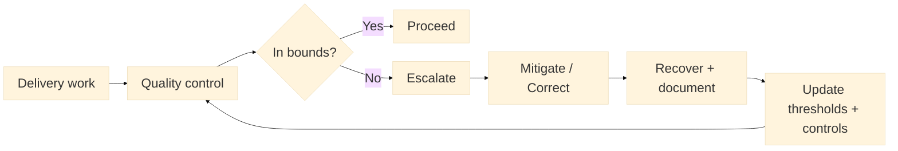

:::info What this chapter does
- Defines quality control as evidence of delivery reliability.
- Shows how risk management limits downside exposure.
- Connects controls to decision thresholds.
- Frames risk as part of governance discipline.
:::

:::warning What this chapter does not do
- Does not provide legal or compliance advice.
- Does not eliminate risk entirely.
- Does not replace executive accountability.
- Does not prescribe specific audit frameworks.
:::

:::tip When you should read this
- When defects or failures recur.
- When regulatory exposure increases.
- When scaling raises operational risk.
- Before making irreversible commitments.
:::

:::note Derived from Canon
This chapter is interpretive and explanatory. Its constraints and limits derive from the Canon pages below.

- [Canon - Definitions](../../canon/definitions)
- [Canon - Evidence logic](../../canon/evidence-logic)
- [Canon - Decision theory](../../canon/decision-theory)
- [Canon - Epistemic stage model](../../canon/epistemic-model)
- [Canon - Governance boundaries](../../canon/governance-boundaries)
- [Canon - Failure modes](../../canon/failure-modes)
- [Canon - Versioning and termination](../../canon/versioning-termination)
:::

:::info Key terms (canonical)
- Evidence
- Evidence quality
- Decision threshold
- Optionality preservation
- Strategic deferral
- Reversibility
:::

:::warning Minimal evidence expectations (non-prescriptive)
Evidence used in this chapter should allow you to:
- identify critical quality risks
- document controls and owners
- show how controls change outcomes
- justify whether risk is acceptable
:::

:::note Figure 22 - Control -> Detect -> Escalate -> Recover (explanatory)

Control -> Detect -> Escalate -> Recover. This diagram shows quality control and risk management as
evidence mechanisms: controls detect drift, escalation routes exceptions to owners, mitigation
reduces exposure, and recovery updates thresholds and practices. In MCF 2.2, controls matter when
they preserve auditability and reversibility as execution scales.
:::

## 1. Introduction

Quality control and risk management protect decision integrity when execution scales. In Phase 3,
the goal is not to eliminate risk, but to make it visible, owned, and governed. This chapter
explains how to interpret quality and risk signals without turning them into rigid compliance
steps.

### Inputs

- Operational processes and handoffs (Chapter 23)
- Automation and signals (Chapter 24)
- Known failure modes and historical incidents
- Governance boundaries and decision rights

### Outputs

- A critical quality surface (what must remain in-bounds)
- A risk register with owners and escalation paths
- Controls mapped to decision thresholds
- Evidence that controls reduce uncertainty and protect reversibility

## 2. Define the Quality Surface

Quality control starts with a boundary: what "good enough" means for outcomes that matter.

### 2.1 What to do

- Define the outcomes where defects would invalidate readiness claims (safety, privacy, financial
  correctness, uptime).
- Identify where quality drift first appears (inputs, handoffs, automation rules, supplier
  variability).
- Decide what "in-bounds" means using observable thresholds.

### 2.2 How to run it

Create a one-page Quality Surface with:
Outcome | Why it matters | Observable signal | Threshold | Owner | Escalation | Recovery action

Start with 3 to 7 outcomes. Add only if they change decisions.

:::tip Example — Startup Context
A SaaS startup defines quality around billing correctness, login success rate, and incident
recurrence.
:::

:::tip Example — Institutional Context
A bank defines quality around transaction integrity, audit trail completeness, and PII access
controls.
:::

:::tip Example — Hybrid Context
A public-private service defines quality around identity verification outcomes, service
availability, and complaint resolution time.
:::

:::info Exercise — Draft your Quality Surface
Draft 3 outcomes, one signal per outcome, and a threshold for "in-bounds." Assign an owner role and
an escalation path.
:::

## 3. Define Risk as Decision-Relevant Exposure

In MCF 2.2, risk is not a vague worry. It is a condition that would invalidate a decision or
create irreversible harm.

### 3.1 What to do

- List the exposures that would change a scaling decision (legal, safety, financial, reputational,
  operational).
- Convert each exposure into a condition you can monitor.
- Assign owners and escalation routes.

### 3.2 How to run it

Create a Risk Register with:
Risk condition | Trigger signal | Likely impact | Reversibility | Owner | Mitigation | Escalation |
Review cadence

Require a "no-signal" rule: if the trigger signal is missing or stale, escalate or defer.

:::info Exercise — Write two risk conditions with triggers
Write two risk conditions that would change a scale decision. Add a trigger signal, an owner role,
and the escalation path for each.
:::

## 4. Map Controls to Thresholds and Owners

Controls are only meaningful when they protect a decision threshold and have a responsible owner.

### 4.1 What to do

- List the controls you already have (tests, reviews, audits, monitoring, sampling).
- For each control, state which threshold it protects and what happens when it fails.
- Remove or simplify controls that do not reduce uncertainty.

### 4.2 How to run it

Build a Control Map with:
Control | Protected threshold | Detection method | Owner | Escalation | Recovery | Evidence artifact

Ensure each control produces at least one auditable artifact (log, report, ticket, checklist
result).

:::info Exercise — Create one Control Map entry
Pick one control you rely on. Write the threshold it protects and the recovery action if the
threshold is breached.
:::

## 5. Detect Drift and Recover Without Losing Optionality

Phase 3 failures often happen because drift is detected late, or recovery paths are unclear.

### 5.1 What to do

- Define drift conditions (variance increases, defect rate trends, repeated near-misses).
- Establish recovery actions that preserve reversibility (pause, rollback, scope reduction).
- Require a post-incident update: thresholds, controls, and decision rules must be revised.

### 5.2 How to run it

Use a short Drift Review cadence (weekly or biweekly) that answers:
What drift appeared? | What threshold moved? | What action was taken? | What changed in controls?

Track false positives and false negatives; both degrade epistemic quality.

:::info Exercise — Draft a Drift Review template
Write the four Drift Review questions above in a template and define who owns the review.
:::

## 6. Typical Failure Modes and Boundary Notes

Common signals indicate quality and risk evidence is insufficient.

### 6.1 What to do

- Watch for hidden variance: quality appears stable until scale exposes defects.
- Watch for late detection: failures surface after irreversible commitments.
- Watch for unowned exposure: no clear decision owner for risk monitoring.
- Watch for compliance drift: controls are bypassed under delivery pressure.

### 6.2 How to run it

Add a boundary check: if controls exist but no one can explain which decision they protect or what
threshold would trigger a pause, the system is not governance-ready. Re-map controls to decision
thresholds and owners.

Use `/docs/book/failure-modes` and `/docs/book/boundaries-and-misuse` to keep controls aligned with
Canon constraints.

## 7. Final Thoughts

Quality and risk management in Phase 3 are about preserving decision integrity at scale. Controls
should reduce uncertainty, protect thresholds, and keep reversibility credible. The goal is not to
eliminate risk; it is to make exposure observable and owned so decisions remain defensible as the
system grows.

## ToDo for this Chapter

- Create a Quality Surface template and link it here
- Create a Risk Register template and link it here
- Translate this chapter to Spanish and integrate i18n
- Record and embed walkthrough video for this chapter
