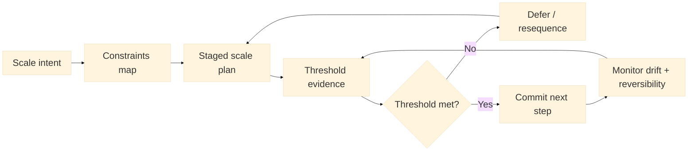

:::info What this chapter does
- Defines scaling strategy as a structured growth plan.
- Shows how constraints shape scale decisions.
- Connects scale readiness to evidence thresholds.
- Frames scaling as staged commitments.
:::

:::warning What this chapter does not do
- Does not guarantee growth outcomes.
- Does not replace market validation.
- Does not prescribe a single scaling model.
- Does not ignore operational constraints.
:::

:::tip When you should read this
- When validation indicates market readiness.
- When resources must be allocated for growth.
- When leadership needs scale approval evidence.
- Before expanding into new markets.
:::

:::note Derived from Canon
This chapter is interpretive and explanatory. Its constraints and limits derive from the Canon pages below.

- [Canon - Definitions](../../canon/definitions)
- [Canon - Evidence logic](../../canon/evidence-logic)
- [Canon - Decision theory](../../canon/decision-theory)
- [Canon - Epistemic stage model](../../canon/epistemic-model)
- [Canon - Governance boundaries](../../canon/governance-boundaries)
- [Canon - Failure modes](../../canon/failure-modes)
- [Canon - Versioning and termination](../../canon/versioning-termination)
:::

:::info Key terms (canonical)
- Evidence
- Evidence quality
- Decision threshold
- Optionality preservation
- Strategic deferral
- Reversibility
:::

:::warning Minimal evidence expectations (non-prescriptive)
Evidence used in this chapter should allow you to:
- document scale assumptions and risks
- show evidence that readiness criteria are met
- explain why scale steps are sequenced
- justify whether scaling should proceed
:::

:::note Figure 23 - Stage -> Constrain -> Prove -> Commit (explanatory)

Stage -> Constrain -> Prove -> Commit. This diagram frames scaling as staged commitments.
Constraints shape what is possible; thresholds determine what is justified. In MCF 2.2, scale
proceeds when evidence supports less-reversible commitments and when escalation and recovery paths
remain explicit.
:::

## 1. Introduction

Scaling is not a single decision. It is a sequence of commitments that become harder to reverse.
This chapter explains how to interpret scaling strategy in MCF 2.2, focusing on evidence
thresholds, constraints, and staged expansion.

In Phase 4, the decision context changes. The organization is no longer testing feasibility; it is
making commitments that reshape costs, teams, channels, and obligations. A scaling strategy is
defensible when it makes these commitments explicit, sequences them, and ties each step to evidence
thresholds that match the level of irreversibility.

### Inputs

- Validated outcomes from prior phases (demand, viability, delivery reliability)
- Constraints map (regulatory, operational, capital, governance)
- Quality and risk controls (Chapter 25)
- Decision thresholds and approval roles

### Outputs

- A staged scaling plan with explicit commitments and dependencies
- Threshold definitions for each step (what evidence must be true)
- A constraints register and monitoring cadence
- A decision trail linking evidence to approvals

## 2. Why This Matters In Phase 4

Phase 4 is where decisions become less reversible. The organization is no longer proving
feasibility; it is committing to expansion. Scaling strategy defines which commitments are
justified, in what order, and under which constraints. Without a defensible strategy, scaling
converts uncertainty into irreversible risk.

### 2.1 What to do

- Name the next irreversible commitments you are considering (markets, production volume, hiring,
  contractual obligations).
- Identify what must remain reversible and how you will preserve optionality while learning
  continues.
- Treat scale as a sequence of steps, not a single event.

### 2.2 How to run it

Write the next 3 scale steps as commitments, each in the form:
We will commit to X only if evidence Y meets threshold Z and constraints remain in-bounds.

For each step, add a reversibility note: what you can still undo if signals degrade.

:::tip Example — Startup Context
A SaaS startup considers adding a second paid acquisition channel and hiring customer success. The
key question is whether CAC and retention evidence justify ongoing spend and headcount commitments.
:::

:::tip Example — Institutional Context
A ministry program considers expanding a service to multiple provinces. The key question is
whether operational capacity and compliance evidence can sustain scale without degrading outcomes
or fairness.
:::

:::tip Example — Hybrid Context
A public-private platform considers onboarding new partners and increasing transaction volume. The
key question is whether governance boundaries and auditability evidence remain stable as more
actors join.
:::

:::info Exercise — Convert scale into 3 staged commitments
Write three scale steps. For each, define the evidence threshold and the constraint that would
force deferral.
:::

## 3. What Good Looks Like

Good scaling strategy has three explanatory properties:

- It is staged: each step is tied to evidence that the next commitment is safe.
- It is constrained: capital, regulatory, and governance limits are explicit.
- It is reversible where possible: optionality is preserved until thresholds are met.

Good strategy does not eliminate risk. It clarifies where risk is acceptable, where it is bounded,
and where it must trigger a pause. The result is a sequence of defensible commitments rather than a
single go or no-go event.

### 3.1 What to do

- Define a small set of readiness criteria that are decision-relevant (not vanity metrics).
- Make constraints explicit (time, budget, regulation, talent, vendor capacity, governance
  approvals).
- Design escalation and recovery paths before the scale step begins.

### 3.2 How to run it

Create a one-page Scaling Step Card per step:
Step | Commitment | Dependencies | Evidence threshold | Constraints | Owner | Escalation |
Recovery | Review cadence

Limit to 3 to 5 steps in view at any time to avoid speculative planning.

:::info Exercise — Draft one Scaling Step Card
Draft one step card and include a recovery action if signals fall out of bounds.
:::

## 4. Typical Failure Modes

Scaling often fails not because growth is impossible, but because evidence is misread. Common
failure patterns include:

- Premature commitment: scale decisions made before thresholds are met.
- Constraint blindness: regulatory or capacity limits ignored in planning.
- Evidence overreach: pilot evidence treated as proof of systemic readiness.
- Irreversibility creep: optionality lost without explicit decisions.

Misuse signal: the plan advances because the calendar says scale now, while decision thresholds
remain undocumented.

### 4.1 What to do

- Look for where you are substituting signals (demand does not equal readiness; adoption does not
  equal reliability).
- Identify where constraints are assumed away rather than monitored.
- Treat one-context success as a prompt to test transferability, not as permission to commit
  broadly.

### 4.2 How to run it

Add a short failure mode check to each Scaling Step Card:
What could make this evidence non-transferable? What constraint could tighten? What would we do if
it happens?

:::info Exercise — Write a non-transferability hypothesis
Pick one successful context and write a hypothesis about what might not transfer to the next
context. Define what evidence would detect that.
:::

## 5. Evidence You Should Expect To See

Evidence for scaling strategy should be decision-relevant and auditable:

- Stable outcomes across multiple contexts, not single-market success.
- Clear threshold definitions for irreversible commitments.
- Evidence that constraints are monitored and within acceptable bounds.
- Documented decision trails linking evidence to scaling approvals.

If the evidence cannot justify a commitment, the correct response is deferral, not acceleration.
Evidence sufficiency is not static: as commitments become less reversible, the threshold for
acceptable evidence rises.

### 5.1 What to do

- Separate evidence into transfer evidence (what generalizes) and local evidence (what is
  context-specific).
- Raise the evidence bar as reversibility decreases.
- Require a decision trail: what evidence changed the decision, and who approved it.

### 5.2 How to run it

Maintain a small Scaling Evidence Log aligned to step cards:
Step | Claim | Evidence artifact | Quality limits | Threshold status | Decision | Date |
Approver

Keep it auditable: link to artifacts, not summaries.

:::info Exercise — Add one entry to a Scaling Evidence Log
Write one claim, name the artifact you would accept as evidence, and state the quality limitation
you would note (e.g., sample bias, short duration).
:::

## 6. Common Misuse And Boundary Notes

Scaling strategy is often misused as a performance target rather than a decision framework. Common
boundary violations include:

- Treating growth projections as evidence.
- Locking commitments before governance review.
- Using scale to compensate for unresolved validation gaps.

Scale is not inherently directional. Organizations may pause, retrench, or resequence when
evidence weakens or optionality erodes.

### 6.1 What to do

- Explicitly state what you are not claiming (for example, this plan does not prove adoption).
- Ensure governance review precedes less-reversible steps.
- Treat pauses and resequencing as valid outcomes when evidence weakens.

### 6.2 How to run it

Add a one-line boundary statement to each step card:
This step is justified by evidence X; it does not establish claim Y.

:::info Exercise — Write one boundary statement
Write a boundary statement for your next scale step, separating what evidence supports from what
it does not.
:::

## 7. Cross-References

Book: /docs/book/decision-logic, /docs/book/governance-and-roles, /docs/book/failure-modes,
/docs/book/boundaries-and-misuse

Canon: /docs/canon/definitions, /docs/canon/evidence-logic, /docs/canon/decision-theory,
/docs/canon/governance-boundaries, /docs/canon/versioning-termination

## ToDo for this Chapter

- Create a Scaling Step Card template and link it here
- Create a Scaling Evidence Log template and link it here
- Translate this chapter to Spanish and integrate i18n
- Record and embed walkthrough video for this chapter
