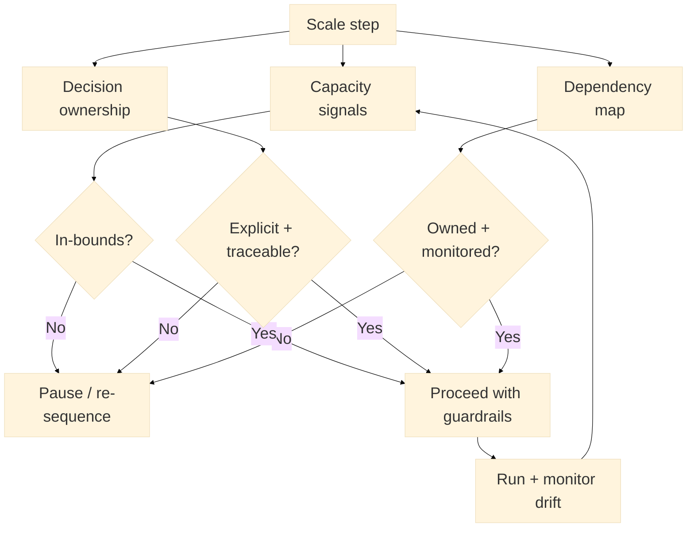

:::info What this chapter does
- Defines infrastructure alignment as a scaling requirement.
- Shows how organization design supports growth.
- Connects alignment to evidence of readiness.
- Frames capacity planning as a governance decision.
:::

:::warning What this chapter does not do
- Does not prescribe an org chart.
- Does not replace operational execution.
- Does not guarantee performance without investment.
- Does not prescribe specific infrastructure vendors.
:::

:::tip When you should read this
- When systems strain under demand.
- When teams are misaligned on priorities.
- When scaling introduces new dependencies.
- Before expanding capacity commitments.
:::

:::note Derived from Canon
This chapter is interpretive and explanatory. Its constraints and limits derive from the Canon pages below.

- [Canon - Definitions](../../canon/definitions)
- [Canon - Evidence logic](../../canon/evidence-logic)
- [Canon - Decision theory](../../canon/decision-theory)
- [Canon - Epistemic stage model](../../canon/epistemic-model)
- [Canon - Governance boundaries](../../canon/governance-boundaries)
- [Canon - Failure modes](../../canon/failure-modes)
:::

:::info Key terms (canonical)
- Evidence
- Evidence quality
- Decision threshold
- Optionality preservation
- Strategic deferral
- Reversibility
:::

:::warning Minimal evidence expectations (non-prescriptive)
Evidence used in this chapter should allow you to:
- document capacity limits and risks
- show alignment gaps and remedies
- explain how alignment changes outcomes
- justify readiness for scale
:::

:::note Figure 24 - Align capacity, ownership, and dependencies (explanatory)

Align capacity, ownership, and dependencies. This diagram frames alignment as a scale readiness
condition. Scale steps remain defensible when capacity signals are in-bounds, decision ownership is
explicit, and dependencies are owned and monitored. When any of these fail, the correct response is
pause, remediation, or resequencing.
:::

## 1. Introduction

Scaling depends on whether infrastructure and organization can carry the decisions already made.
This chapter explains how to interpret alignment in MCF 2.2 and how evidence signals readiness or
constraint.

In Phase 4, you are no longer proving whether something can work. You are proving whether it can
keep working when volume, variance, and dependencies increase. Infrastructure and organizational
alignment is the mechanism that keeps decision integrity intact as commitments become less
reversible.

### Inputs

- Scaling steps and commitments (Chapter 26)
- Operational performance and reliability signals (Phase 3)
- Dependency map across teams, vendors, and systems
- Governance roles and escalation paths
- Capacity and risk constraints (budget, talent, regulatory timelines)

### Outputs

- An alignment plan tied to scaling steps (what must change before proceeding)
- Explicit ownership for cross-functional decisions and dependencies
- Capacity thresholds and monitoring cadence
- A decision trail showing why capacity commitments were approved

## 2. Why This Matters In Phase 4

Phase 4 turns validated initiatives into scaled commitments. The limiting factor is rarely vision;
it is alignment. Infrastructure and organizational design determine whether decisions remain
executable at higher volume and complexity. If alignment fails, evidence quality drops and
governance loses visibility.

### 2.1 What to do

- Identify the next scale steps that increase load or dependency complexity.
- Name the minimum alignment conditions for those steps: capacity, ownership, dependency
  governance.
- Treat alignment gaps as reasons to resequence, not as problems to ignore until failure.

### 2.2 How to run it

For each scale step, write a one-paragraph Alignment Claim:
We believe we can sustain X at scale because capacity signals Y are in-bounds, ownership Z is
explicit, and dependencies D are governed.

Then define what evidence would invalidate the claim (latency spikes, escalations bypassed,
incident rate drift).

:::tip Example — Startup Context
A startup increases traffic via partnerships. The key alignment question is whether the platform,
on-call coverage, and customer support can absorb variance without silent degradations.
:::

:::tip Example — Institutional Context
An agency expands a digital service nationally. The key alignment question is whether identity,
data-sharing, and case handling ownership remain traceable across regions and contractors.
:::

:::tip Example — Hybrid Context
A public-private interoperability program adds new institutions. The key alignment question is
whether dependency ownership, change control, and auditability remain stable as more actors join.
:::

:::info Exercise — Write one Alignment Claim
Pick your next scale step and write one Alignment Claim. Name one capacity signal, one ownership
boundary, and one dependency that must be governed.
:::

## 3. What Good Looks Like

Good alignment is visible in properties rather than structures:

- Capacity is matched to decision cadence and risk level.
- Ownership and escalation paths are explicit and traceable.
- Dependencies are mapped and governed across functions.
- Infrastructure can absorb variance without hiding it.

This does not mandate a specific org chart. It describes the conditions that support reliable
execution and evidence preservation during scale.

### 3.1 What to do

- Define what in-bounds means for capacity (latency, throughput, error budgets, response times).
- Define explicit ownership for cross-functional decisions (who can decide, who must be consulted,
  who escalates).
- Make dependency governance visible: who owns integration health, versioning, and change windows.

### 3.2 How to run it

Establish a lightweight Alignment Scorecard for each scale step:

- Capacity signals: 3 to 5 metrics with thresholds and sampling cadence.
- Ownership: decision owner plus escalation path.
- Dependencies: top dependencies plus owners plus monitoring.

Keep it auditable and small: if it cannot change a decision, it does not belong.

:::info Exercise — Draft an Alignment Scorecard
Draft a scorecard for one step. Include at least one threshold that would force a pause.
:::

## 4. Typical Failure Modes

Alignment failure often appears as operational noise:

- Decision bottlenecks: approvals lag behind execution reality.
- Hidden dependencies: cross-team inputs are unowned or untracked.
- Capacity mirage: infrastructure appears stable until demand spikes.
- Role drift: accountability shifts without explicit governance.

Misuse signal: teams meet delivery targets but cannot explain who owns cross-functional decisions or
why escalation paths are bypassed.

### 4.1 What to do

- Look for decisions that are repeatedly stuck and ask whether the owner and criteria are explicit.
- Identify where workarounds are hiding capacity issues (manual retries, unofficial queues, shadow
  systems).
- Treat recurring escalations as evidence that dependency ownership is unclear.

### 4.2 How to run it

Add a short misalignment probe to your weekly review:
What decision was delayed, and why? What dependency caused rework, and who owns it? What capacity
signal drifted, and what changed?

If the same probe triggers repeatedly, treat it as a resequencing signal.

:::info Exercise — Write one misalignment probe
Write one probe question you will ask weekly that would reveal hidden dependencies or role drift.
:::

## 5. Evidence You Should Expect To See

Evidence that alignment is sufficient should include:

- Stable performance under increased load without hidden workarounds.
- Documented ownership for critical decisions and dependencies.
- Escalation paths used consistently when thresholds are breached.
- Evidence of constraint monitoring (capacity, latency, failure rates).

If evidence shows variance is rising, the scaling decision must pause until the alignment gap is
closed. Evidence sufficiency depends on reversibility: the harder it is to unwind a capacity
decision, the higher the evidence threshold must be.

### 5.1 What to do

- Require evidence that performance stability is real (not masked by heroics or manual patching).
- Require evidence that escalation paths work (not merely that they exist).
- Tie capacity upgrades to decision value: what decision becomes safer if you invest.

### 5.2 How to run it

Maintain a small Alignment Evidence Log:
Scale step | Claim | Evidence artifact | Quality limits | Threshold status | Decision | Date | Approver

Prefer artifacts that can be audited (incident reviews, SLO reports, dependency runbooks, approval
notes).

:::info Exercise — Add one evidence artifact
Name one artifact you will treat as evidence for alignment (e.g., SLO report, incident postmortem)
and state one limitation (e.g., short time window).
:::

## 6. Common Misuse And Boundary Notes

Misuse occurs when alignment is treated as a one-time checklist:

- Scaling before governance roles are explicit.
- Treating infrastructure upgrades as proof of readiness.
- Ignoring dependency risks because outputs appear acceptable.

Alignment progress is not linear. Scale, reorganizations, or technology shifts can reopen alignment
gaps even after earlier fixes appeared to work.

### 6.1 What to do

- Avoid claiming readiness from activity (new tools, new teams) without outcome evidence.
- Keep reversibility explicit: what can you still undo if alignment fails under load?
- Treat dependency governance as part of scaling strategy, not a separate ops concern.

### 6.2 How to run it

Add a boundary line to each scale step:
This alignment work reduces uncertainty about X; it does not prove Y.

Use that line to prevent infrastructure work from becoming a success claim.

:::info Exercise — Write one boundary line
Write a boundary line for your next infrastructure or org change, separating what it reduces
uncertainty about from what it does not establish.
:::

## 7. Cross-References

Book: /docs/book/decision-logic, /docs/book/governance-and-roles, /docs/book/failure-modes,
/docs/book/boundaries-and-misuse

Canon: /docs/canon/definitions, /docs/canon/evidence-logic, /docs/canon/decision-theory,
/docs/canon/governance-boundaries

## ToDo for this Chapter

- Create an Alignment Scorecard template and link it here
- Create an Alignment Evidence Log template and link it here
- Translate this chapter to Spanish and integrate i18n
- Record and embed walkthrough video for this chapter
