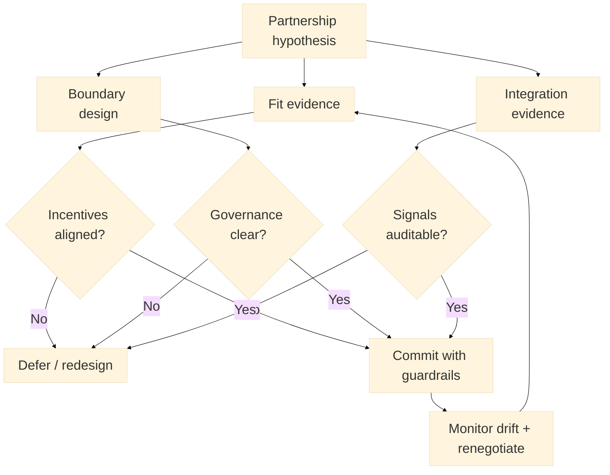

:::info What this chapter does
- Defines partnerships as leverage for scale.
- Shows how ecosystem integration reduces friction.
- Connects partner choices to evidence thresholds.
- Frames partnerships as strategic commitments.
:::

:::warning What this chapter does not do
- Does not guarantee partner performance.
- Does not replace internal capability building.
- Does not prescribe contract terms.
- Does not treat partnerships as optional in all cases.
:::

:::tip When you should read this
- When scale depends on external capabilities.
- When distribution requires partners.
- When integration risk must be managed.
- Before committing to ecosystem expansion.
:::

:::note Derived from Canon
This chapter is interpretive and explanatory. Its constraints and limits derive from the Canon pages below.

- [Canon - Definitions](../../canon/definitions)
- [Canon - Evidence logic](../../canon/evidence-logic)
- [Canon - Decision theory](../../canon/decision-theory)
- [Canon - Epistemic stage model](../../canon/epistemic-model)
- [Canon - Governance boundaries](../../canon/governance-boundaries)
- [Canon - Framework boundaries](../../canon/framework-boundaries)
:::

:::info Key terms (canonical)
- Evidence
- Evidence quality
- Decision threshold
- Optionality preservation
- Strategic deferral
- Reversibility
:::

:::warning Minimal evidence expectations (non-prescriptive)
Evidence used in this chapter should allow you to:
- document partnership assumptions and risks
- show evidence of partner fit
- explain how integration changes outcomes
- justify whether to commit or defer
:::

:::note Figure 25 - Partnership decision as an evidence-backed commitment (explanatory)

Partnership decision as an evidence-backed commitment. This diagram frames partnership commitments
as decisions that remain defensible when fit evidence is credible, governance boundaries are
explicit, and integration signals are auditable. When any condition fails, the default response is
deferral, redesign, or renegotiation to preserve optionality.
:::

## 1. Introduction

Strategic partnerships and ecosystem integration extend capability, reach, and resilience. This
chapter explains how to interpret partnerships in MCF 2.2 as evidence-backed commitments, not as
shortcuts to scale.

In Phase 4, partnerships often shift from helpful to structural. They can amplify reach, reduce
time-to-capability, and accelerate integration into a broader ecosystem. They can also introduce
dependency depth that reduces reversibility.

### Inputs

- Scaling strategy and planned commitments (Chapter 26)
- Capability gaps and constraints (technical, operational, regulatory)
- Candidate partner list and partner incentives
- Integration requirements and dependency map
- Governance boundaries and escalation paths

### Outputs

- A partnership hypothesis set with explicit success criteria
- Pilot collaboration results and integration evidence
- A boundary and governance design across the partnership seam
- A decision trail: commit, defer, renegotiate, or unwind

## 2. Why This Matters In Phase 4

Partnerships often become irreversible commitments at scale. They introduce external dependencies
that shape decision integrity and evidence quality. In Phase 4, the question is not "Can a partner
help?" but "Is a partner commitment defensible under Canon constraints?"

### 2.1 What to do

- Identify which scale steps require external capability (distribution, compliance, operations,
  data).
- Define what you will still own after partnering (decision rights, quality thresholds, user
  outcomes).
- Treat partner availability as insufficient. Require fit evidence and boundary design.

### 2.2 How to run it

Write one Partnership Claim per candidate:
We believe Partner P can reduce uncertainty about X because they provide capability C, under
boundary B, with evidence E.

Add an explicit deferral trigger:
If evidence remains ambiguous by date D, we defer to preserve optionality.

:::tip Example — Startup Context
A startup partners with a payments provider to reduce time-to-market. The commitment is defensible
only if chargeback handling, fraud thresholds, and support escalation are explicitly owned and
auditable.
:::

:::tip Example — Institutional Context
A government program partners with a systems integrator for rollout. The commitment is defensible
only if decision rights, change control, and data handling obligations remain traceable across
vendors.
:::

:::tip Example — Hybrid Context
A public-private platform integrates identity or interoperability services. The commitment is
defensible only if boundary governance, audit logs, and incident escalation paths work across
institutions.
:::

:::info Exercise — Write one Partnership Claim
Pick one partner and write a Partnership Claim that includes: capability, boundary, evidence, and
a deferral trigger.
:::

## 3. What Good Looks Like

Good partnership strategy shows evidence of:

- Complementary capability that reduces uncertainty rather than replacing it.
- Shared decision cadence and escalation paths.
- Clear ownership of integration risk and data quality.
- Governance boundaries that preserve reversibility.

The goal is to treat partnerships as decision hypotheses, not as growth guarantees.

### 3.1 What to do

- Define partner fit beyond features: incentives, operational cadence, and failure behavior.
- Define boundary responsibilities: who owns what when something breaks.
- Require exit realism: what would it cost to unwind, and what evidence justifies that cost?

### 3.2 How to run it

Use a lightweight Partner Fit Card:

- Capability provided (and what uncertainty it reduces)
- Incentives and conflict risks
- Integration surface area and single points of failure
- Evidence artifacts (pilot results, references, SLA history)
- Exit path (time, cost, data portability)

:::info Exercise — Create a Partner Fit Card
Draft one Fit Card. Include one conflict risk and how you would observe it early.
:::

## 4. Typical Failure Modes

Partnership failures often appear after commitments are made:

- Dependency lock-in: optionality is lost due to single-source reliance.
- Integration drift: mismatched timelines or quality standards.
- Signal contamination: external data obscures internal evidence quality.
- Boundary confusion: unclear governance over shared outcomes.

Misuse signal: a partner is retained despite repeated boundary violations because exit costs are
treated as sunk.

### 4.1 What to do

- Identify where you are dependent on one partner for a critical path and whether you can switch.
- Look for integration drift indicators (missed change windows, incompatible incident processes).
- Treat data access constraints as an evidence risk (if you cannot audit, you cannot defend).

### 4.2 How to run it

Add a short Partnership Health Review to your scaling cadence:
What boundary was violated this cycle? What evidence is now less trustworthy because of the
partner seam? What would trigger renegotiation or unwind?

:::info Exercise — Define one unwind trigger
Define one unwind trigger that is observable and name who can authorize it.
:::

## 5. Evidence You Should Expect To See

Evidence that supports a partnership decision should include:

- Consistent performance in pilot collaborations.
- Evidence that incentives align with decision thresholds.
- Explicit risk ownership for integration failures.
- Traceable data and accountability across the boundary.

If evidence is ambiguous, deferral preserves optionality. Evidence sufficiency must scale with
dependency depth. The more a partner becomes a single point of failure, the higher the evidence bar
becomes.

### 5.1 What to do

- Require pilot evidence that reflects real operating conditions, not demos.
- Require auditability across the seam (logs, metrics, incident records, contractual reporting).
- Raise thresholds when the partner is a critical dependency.

### 5.2 How to run it

Maintain a small Partnership Evidence Log:
Partner | Claim | Evidence artifact | Limits | Boundary status | Decision | Date | Approver

Ensure artifacts are comparable over time; trend evidence beats one-off wins.

:::info Exercise — Add two evidence artifacts
Name two artifacts you will treat as evidence (e.g., SLA history, incident postmortems) and state
one limitation for each.
:::

## 6. Common Misuse And Boundary Notes

Misuse happens when partnerships are treated as substitutes for internal capability or validation:

- Using a partner to bypass unresolved uncertainty.
- Treating integration progress as evidence of market fit.
- Locking dependencies before governance review.

Partnership maturity is not linear. Evidence can degrade as incentives change, so decisions may
need to pause, renegotiate, or unwind.

### 6.1 What to do

- Separate integration shipped from outcome evidence.
- Avoid long commitments when evidence is still immature or ambiguous.
- Treat renegotiation as a normal mechanism to preserve reversibility.

### 6.2 How to run it

Add a boundary line to each partnership decision:
This partnership reduces uncertainty about X; it does not establish Y.

Use the boundary line in reviews to prevent partner activity from becoming a success claim.

:::info Exercise — Write one boundary line
Write one boundary line for a partnership you are considering.
:::

## 7. Cross-References

Book: /docs/book/decision-logic, /docs/book/governance-and-roles, /docs/book/failure-modes,
/docs/book/boundaries-and-misuse

Canon: /docs/canon/definitions, /docs/canon/evidence-logic, /docs/canon/decision-theory,
/docs/canon/framework-boundaries

## ToDo for this Chapter

- Create a Partner Fit Card template and link it here
- Create a Partnership Evidence Log template and link it here
- Translate this chapter to Spanish and integrate i18n
- Record and embed walkthrough video for this chapter
