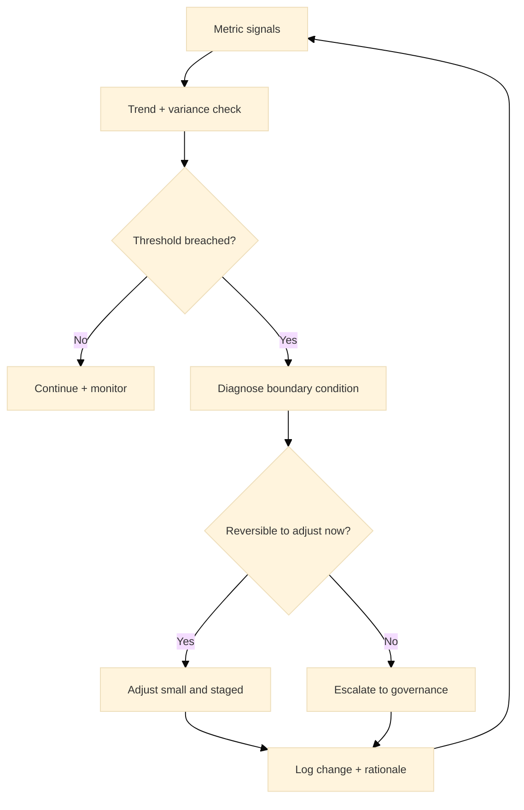

:::info What this chapter does
- Defines growth metrics as evidence signals.
- Shows how metrics inform scaling adjustments.
- Connects metric trends to decision thresholds.
- Frames adjustment as part of governance.
:::

:::warning What this chapter does not do
- Does not define a fixed KPI set.
- Does not guarantee growth outcomes.
- Does not replace market validation.
- Does not treat metrics as goals alone.
:::

:::tip When you should read this
- When growth signals conflict or drift.
- When scaling decisions require evidence updates.
- When performance needs continuous adjustment.
- Before expanding investment commitments.
:::

:::note Derived from Canon
This chapter is interpretive and explanatory. Its constraints and limits derive from the Canon pages below.

- [Canon -> Definitions](../../canon/definitions)
- [Canon -> Evidence logic](../../canon/evidence-logic)
- [Canon -> Decision theory](../../canon/decision-theory)
- [Canon -> Epistemic stage model](../../canon/epistemic-model)
- [Canon -> Governance boundaries](../../canon/governance-boundaries)
:::

:::info Key terms (canonical)
- Evidence
- Evidence quality
- Decision threshold
- Optionality preservation
- Strategic deferral
- Reversibility
:::

:::warning Minimal evidence expectations (non-prescriptive)
Evidence used in this chapter should allow you to:
- define which metrics signal readiness
- show how trends affect decisions
- explain why adjustments are required
- justify whether to continue scaling
:::

:::note Figure 26 - Metrics -> thresholds -> action loops (explanatory)

Metrics -> thresholds -> action loops. This diagram frames growth metrics as evidence inputs to
decisions. Trends and variance are interpreted against explicit thresholds. When thresholds are
breached, the response is diagnosis and staged adjustment or escalation, preserving reversibility
and decision integrity.
:::

## 1. Introduction

Growth metrics are evidence signals, not goals. This chapter explains how to interpret metrics as
inputs to scaling decisions and how to adjust when signals shift.

In Phase 4, scaling creates new dynamics: acquisition channels saturate, support load changes, and
partner dependencies can distort outcomes. Metrics make these shifts observable. In MCF 2.2, the
goal is not more measurement. The goal is to run a small set of decision-relevant signals that can
trigger action, deferral, or escalation.

Metrics become evidence only when they are tied to thresholds and a decision owner. A dashboard
without thresholds is descriptive, not decision-ready.

### Inputs

- Scaling strategy and staged commitments (Chapter 26)
- Operational reliability and quality controls (Phase 3 outputs)
- A defined decision cadence (weekly, biweekly, or monthly)
- A minimal metric set with owners
- Known boundary conditions (market shocks, seasonality, policy changes)

### Outputs

- A decision-relevant metric map (metric -> threshold -> decision)
- A trend and variance interpretation record
- Adjustments with traceable evidence and rationale
- Escalation triggers and governance review notes

## 2. Why This Matters In Phase 4

Phase 4 requires continuous decision review. Scaling introduces new variables that can invalidate
prior evidence. Metrics provide the signals that show whether the decision environment is still
stable. Without disciplined interpretation, metrics become noise or justification rather than
evidence.

### 2.1 What to do

- Define 5-12 metrics maximum that directly inform Phase 4 decisions.
- For each metric, define owner, threshold, and action if breached.
- Prefer trend and variance over single-point wins.

### 2.2 How to run it

Start from decisions, not KPIs:

- Should we expand spend on Channel X?
- Should we enter Market Y?
- Should we increase capacity?

For each decision, write one Decision Trigger:
If metric M crosses threshold T for N cycles, we take action A (or escalate).

:::tip Example — Startup Context
A SaaS startup ties CAC payback and churn variance to a threshold that triggers spend cuts and
onboarding fixes, not growth at all costs.
:::

:::tip Example — Institutional Context
A public digital service uses completion rate and complaint severity trends to trigger escalation
and policy review before nationwide rollout.
:::

:::tip Example — Hybrid Context
A platform with public-private partners uses SLA breach rates and incident recurrence as a joint
threshold for renegotiation and integration redesign.
:::

:::info Exercise — Define three Decision Triggers
Pick three Phase 4 decisions and write one Decision Trigger for each (metric, threshold, N cycles,
action, owner).
:::

## 3. What Good Looks Like

Good metric practice is defined by decision relevance:

- Each metric is tied to a decision threshold.
- The metric's limitations are explicitly documented.
- Signals are monitored for variance, not just averages.
- Adjustments are logged with evidence and rationale.

Good metrics support decision integrity; they do not replace it.

### 3.1 What to do

- Define a minimal core set and a small context set.
- Core: metrics that trigger decisions.
- Context: metrics that explain why the core moved.
- Document the limitation of each core metric (what it cannot prove).

### 3.2 How to run it

Maintain a one-page Metric Map:
Metric | Decision | Threshold | Owner | Data source | Limitations | Action

Review the map at a fixed cadence. Change the map only with a logged rationale.

:::info Exercise — Draft a Metric Map
Draft a Metric Map with at least 6 rows and include one limitation per metric.
:::

## 4. Typical Failure Modes

Common metric failures distort decisions:

- Vanity metrics: high numbers with no threshold relevance.
- Lag bias: signals arrive too late to protect reversibility.
- Local optimization: a metric improves while system integrity declines.
- Confirmation bias: metrics selected to justify a prior decision.

Misuse signal: the dashboard is active, but no one can point to a threshold that would trigger a
decision reversal.

### 4.1 What to do

- Identify which metrics are vanity and remove or demote them.
- Identify which decisions lack signals and add one signal or downgrade confidence.
- Treat latency as a risk: a late signal is not a safe signal.

### 4.2 How to run it

Run a monthly Metric Audit:

- Which metrics triggered actions in the last 30 days?
- Which metrics never triggered action and why?
- Which decisions were made without adequate signals?

:::info Exercise — Run a Metric Audit
List 10 metrics you currently track. Mark which ones triggered an action in the last 30 days and
which ones did not.
:::

## 5. Evidence You Should Expect To See

Evidence that metrics are decision-useful includes:

- Documented thresholds and how they change decisions.
- Evidence of signal stability under scale, not just early wins.
- Clear actions taken when thresholds are breached.
- Audit trails tying adjustments to evidence, not preference.

If evidence cannot be interpreted against a threshold, it should not drive scaling decisions.
Evidence sufficiency rises as optionality shrinks. The same metric may be adequate in early scale
and inadequate once commitments become harder to undo.

### 5.1 What to do

- Capture trend and variance for each core metric (not only current value).
- Explicitly track the boundary condition that could invalidate a signal (seasonality, regulatory
  change, partner outage).
- Raise thresholds for actions that are harder to reverse.

### 5.2 How to run it

Keep a lightweight Adjustment Log (one line per adjustment):
Date | Metric breach | Boundary check | Decision | Action | Expected effect | Owner | Next review

Require at least one boundary check before acting on a breach.

:::info Exercise — Create an Adjustment Log entry
Write one Adjustment Log entry for a hypothetical churn variance breach.
:::

## 6. Common Misuse And Boundary Notes

Metrics are often misused as targets or proxies for success:

- Using metrics to justify irreversible commitments.
- Ignoring boundary conditions that invalidate signals.
- Treating adjustment as a performance failure rather than governance.

Metric maturity is non-linear. Signals can degrade after scaling, requiring deferral or
de-escalation rather than onward expansion.

### 6.1 What to do

- Separate measurement from claims: a metric shift is not automatically proof of cause.
- Avoid metric theater: dashboards that increase confidence without increasing decision quality.
- Treat de-escalation as a valid action when thresholds indicate risk.

### 6.2 How to run it

Add a boundary statement to major reviews:
These metrics reduce uncertainty about X; they do not establish Y.

Require explicit approval when using metrics to justify less reversible commitments.

:::info Exercise — Write one boundary statement
Write one boundary statement for a metric you use frequently (for example, DAU, CAC, NPS).
:::

## 7. Cross-References

Book: /docs/book/decision-logic, /docs/book/governance-and-roles, /docs/book/failure-modes,
/docs/book/boundaries-and-misuse

Canon: /docs/canon/definitions, /docs/canon/evidence-logic, /docs/canon/decision-theory,
/docs/canon/governance-boundaries

## ToDo for this Chapter

- Create a Metric Map template and link it here
- Create an Adjustment Log template and link it here
- Translate this chapter to Spanish and integrate i18n
- Record and embed walkthrough video for this chapter

