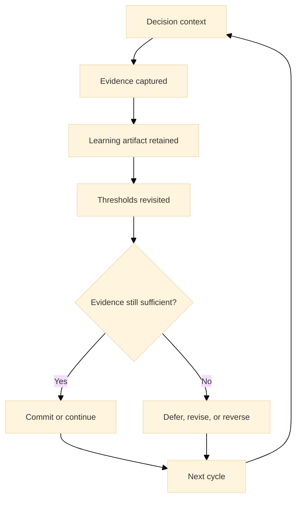

:::info What this chapter does
- Defines continuous learning as a long-term capability.
- Shows how feedback loops reinforce adaptation.
- Connects learning practices to evidence quality.
- Frames learning as a governance requirement.
:::

:::warning What this chapter does not do
- Does not guarantee learning without leadership.
- Does not prescribe a single training system.
- Does not replace execution discipline.
- Does not treat learning as optional.
:::

:::tip When you should read this
- When teams need sustained adaptation.
- When innovation cycles repeat and scale.
- When performance plateaus.
- Before long-term scaling commitments.
:::

:::note Derived from Canon
This chapter is interpretive and explanatory. Its constraints and limits derive from the Canon pages below.

- [Canon -> Definitions](../../canon/definitions)
- [Canon -> Evidence logic](../../canon/evidence-logic)
- [Canon -> Decision theory](../../canon/decision-theory)
- [Canon -> Epistemic stage model](../../canon/epistemic-model)
- [Canon -> Governance boundaries](../../canon/governance-boundaries)
- [Canon -> Failure modes](../../canon/failure-modes)
:::

:::info Key terms (canonical)
- Evidence
- Evidence quality
- Decision threshold
- Optionality preservation
- Strategic deferral
- Reversibility
:::

:::warning Minimal evidence expectations (non-prescriptive)
Evidence used in this chapter should allow you to:
- document learning objectives and signals
- show how learning changes outcomes
- explain where gaps remain
- justify whether learning systems are sufficient
:::

:::note Figure 27 - Continuous Learning as Evidence Retention (explanatory)

Learning is treated as a system that preserves evidence, enables threshold updates, and supports
defensible revision of decisions over time.
:::

## 1. Introduction

Continuous learning is the long-term stabilizer of innovation systems. In MCF 2.2, learning is
interpreted as evidence quality over time, not as training volume. The intent is to preserve
decision integrity after scale: when contexts shift, the organization can revise commitments based
on traceable evidence rather than habit or intuition.

### 1.1 What to do

- Define the learning purpose in decision terms: which decisions should become easier, faster, or
  more defensible over time.
- Identify the evidence that must persist across cycles (what would be costly to rediscover).
- Define the review cadence for evidence expiration and threshold updates.

### 1.2 How to run it

Create a lightweight decision review set (a short list of decisions you will revisit on a fixed
cadence).

For each decision, link: the evidence used, the threshold applied, and the owner responsible for
revisiting it.

Use a single canonical repository for learning artifacts so evidence is searchable and traceable.

:::tip Exercise — Define a learning scope (non-prescriptive)
Write down three decisions you expect to repeat at scale (for example: expand to a new segment,
increase automation, change onboarding). For each, define the evidence you will retain, the
threshold you will revisit, and the cadence (monthly or quarterly) for review.
:::

## 2. Why This Matters in Phase 5

Phase 5 is about sustaining decision integrity after scale. As scope expands, the organization
accumulates irreversible commitments, and the cost of being wrong rises. Without learning systems,
evidence decays, decisions drift, and teams repeat failure modes that were previously understood.

Learning preserves reversibility where possible. When new evidence invalidates a prior assumption,
the organization can defer, revise, or reverse without needing a crisis to justify change.

### 2.1 What to do

- Treat evidence as expirable: define when evidence must be revalidated.
- Define which thresholds become stricter as optionality declines.
- Make revision acceptable: define how decisions are updated without blame.

### 2.2 How to run it

Add an evidence expiry field to key artifacts (date-based or condition-based).

Maintain a small set of Phase 5 thresholds that must be reaffirmed for long-lived commitments.

Use a short review ritual: identify what changed, what evidence supports it, and what decision
update follows.

:::note Exercise — Evidence expiry mapping
Select one critical assumption (for example: churn stability, defect rate, partner reliability).
Define what would count as expired evidence (time, volume, or context change), and define the
minimum revalidation you will run.
:::

## 3. What Good Looks Like (Explanatory)

Good learning systems show consistent, observable properties:

- Evidence is retained, not just produced.
- Decisions are revisited when evidence expires or contexts shift.
- Learning signals are linked to decision thresholds.
- Feedback loops are transparent and traceable.

This is not a requirement to maximize documentation. The intent is to maintain a small, auditable
set of artifacts that can change decisions.

### 3.1 What to do

- Define the few artifacts that must exist for decisions to be revisitable.
- Define who owns each artifact and who can update thresholds.
- Define how learning signals translate into decision action.

### 3.2 How to run it

Establish a learning artifact contract (what is stored, where, by whom).

Track decision updates as short entries: what changed, why, and what evidence supports the change.

Use versioning for thresholds so teams can see how standards evolved.

:::tip Example — Startup Context
A startup keeps a single decision log for pricing changes. Each entry links to the experiment
evidence, the success threshold, and the revision outcome. When market conditions shift, the team
can justify a reversal without re-running the full discovery process.
:::

:::tip Example — Institutional Context
A public institution runs quarterly evidence reviews for a citizen-facing service. It treats
policy constraints and operational risks as thresholds that must be reaffirmed. When evidence
weakens, the institution defers expansion and documents the remediation path with clear owners.
:::

:::tip Example — Hybrid Context
A corporate venture maintains two cadences: weekly product learning and monthly governance
learning. Product teams can iterate quickly, while the governance review protects reversibility for
commitments like vendor lock-in or region expansion.
:::

## 4. Typical Failure Modes

Learning failures often appear as evidence quality failures:

- Knowledge loss: decisions repeat past mistakes because evidence is lost.
- Signal stagnation: feedback exists but does not change decisions.
- Incentive mismatch: learning is discouraged when it threatens delivery.
- Over-correction: reacting to weak signals and destabilizing commitments.

Misuse signal: retrospectives occur, but thresholds remain unchanged even when evidence contradicts
them.

### 4.1 What to do

- Identify which failure mode is present (loss, stagnation, incentives, or over-correction).
- Decide whether the remedy is epistemic (evidence), executional (process), or governance (roles and
  boundaries).
- Define one change that should produce observable improvement in evidence quality within a short
  window.

### 4.2 How to run it

Use a short failure-mode review: what was expected, what evidence appeared, what threshold should
have changed, and why it did not.

Assign an owner to implement one remedy and set a check date.

Reassess using the same threshold logic to avoid activity as learning.

:::warning Exercise — Failure-mode diagnosis
Pick one recurring issue (for example: repeated incidents, repeated churn spikes, repeated
delivery delays). Classify it under one of the failure modes above and define the evidence you are
missing, the threshold that should change decisions, and the smallest remedy you can test in the
next cycle.
:::

## 5. Evidence You Should Expect To See

Learning evidence should be decision-relevant and auditable:

- Documented decision updates based on new evidence.
- Reduced recurrence of known failure modes.
- Observable improvement in evidence quality over time.
- Traceable threshold changes when conditions shift.

If learning does not change decisions, it is not functioning. Evidence sufficiency rises as
optionality declines. When reversibility is low, learning must be stronger before a commitment is
reaffirmed.

### 5.1 What to do

- Define the minimum evidence that proves learning is working.
- Define where evidence is expected to improve (quality, timeliness, traceability).
- Define the escalation path when learning signals are weak or contradictory.

### 5.2 How to run it

Create a small learning scorecard tied to decisions (not vanity metrics).

Track a handful of indicators: recurrence, time-to-decision, threshold updates, and evidence
completeness.

Use escalation rules: if evidence stays ambiguous past a timebox, defer the commitment and
prioritize revalidation.

:::tip Exercise — Build a decision-linked learning scorecard
Create a one-page scorecard with four rows: recurring failure modes, decisions revisited,
thresholds updated, and evidence completeness. For each row, write what would trigger: continue,
pause, or defer.
:::

## 6. Common Misuse and Boundary Notes

Learning can be misused as activity without decision impact:

- Treating training attendance as evidence of learning.
- Accumulating insights without revising thresholds.
- Ignoring evidence expiration and revalidation needs.

Learning maturity is non-linear. Evidence can degrade, and decisions may need deferral or reversal
even after prior progress.

### 6.1 What to do

- Check that learning artifacts are tied to decisions and thresholds.
- Check that evidence expiry and revalidation are explicit.
- Check that learning does not reduce reversibility through premature lock-in.

### 6.2 How to run it

Use /docs/book/boundaries-and-misuse as the boundary check.

If learning artifacts do not change decisions, simplify: keep fewer artifacts but make them
auditable and decision-linked.

Treat defer as a legitimate outcome when evidence is insufficient.

## 7. Cross-References

Book: /docs/book/decision-logic, /docs/book/failure-modes, /docs/book/boundaries-and-misuse,
/docs/book/versioning-and-change-control

Canon: /docs/canon/definitions, /docs/canon/evidence-logic, /docs/canon/decision-theory,
/docs/canon/governance-boundaries
