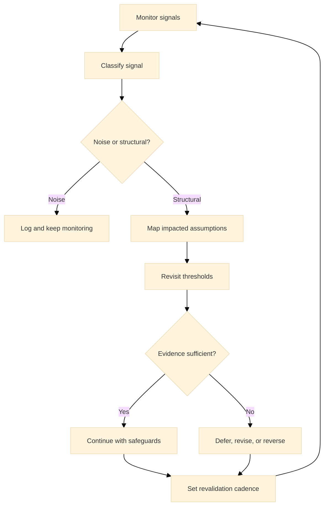

:::info What this chapter does
- Defines adaptive strategy as resilience planning.
- Shows how disruption signals inform decisions.
- Connects foresight to evidence thresholds.
- Frames adaptability as ongoing readiness.
:::

:::warning What this chapter does not do
- Does not predict specific disruptions.
- Does not replace risk management.
- Does not guarantee resilience without investment.
- Does not provide market forecasts.
:::

:::tip When you should read this
- When market volatility increases.
- When long-term bets require resilience.
- When signals suggest structural change.
- Before committing to irreversible expansion.
:::

:::note Derived from Canon
This chapter is interpretive and explanatory. Its constraints and limits derive from the Canon pages below.

- [Canon -> Definitions](../../canon/definitions)
- [Canon -> Evidence logic](../../canon/evidence-logic)
- [Canon -> Decision theory](../../canon/decision-theory)
- [Canon -> Epistemic stage model](../../canon/epistemic-model)
- [Canon -> Governance boundaries](../../canon/governance-boundaries)
- [Canon -> Failure modes](../../canon/failure-modes)
:::

:::info Key terms (canonical)
- Evidence
- Evidence quality
- Decision threshold
- Optionality preservation
- Strategic deferral
- Reversibility
:::

:::warning Minimal evidence expectations (non-prescriptive)
Evidence used in this chapter should allow you to:
- document disruption signals and scenarios
- show how strategies adapt to evidence
- explain why resilience actions are chosen
- justify whether to proceed or defer
:::

:::note Figure 28 - Adaptive Strategy as Threshold-Based Revalidation (explanatory)

Adaptive strategy treats disruption as a trigger for assumption mapping and threshold review,
preserving optionality while keeping decisions auditable.
:::

## 1. Introduction

Anticipating disruptions is an evidence exercise, not a prediction exercise. This chapter explains
how to interpret adaptive strategy in MCF 2.2 and how to respond to weak signals without
overreacting.

Disruptions matter when they change the decision environment: the same action may no longer be
defensible under the same threshold. Adaptive strategy is the discipline of monitoring signals,
mapping which assumptions are affected, and deciding when to continue, safeguard, defer, or revise.

### 1.1 What to do

- Define which commitments are sensitive to disruption (low reversibility or deep dependency).
- Define the signal categories you will monitor (regulatory, market structure, supply chain,
  security, platform dependencies).
- Define revalidation points: when a signal triggers assumption review and threshold updates.

### 1.2 How to run it

Keep a small signal register with: signal source, category, frequency, and the decision it could
affect.

For each high-sensitivity commitment, define a revalidation cadence (monthly, quarterly, or
condition-triggered).

Record decisions as: signal -> assumption impact -> threshold reviewed -> action.

:::tip Exercise — Build a disruption signal register (non-prescriptive)
List 10 signals that could invalidate key assumptions (for example: new data rules, pricing
shocks, platform policy changes, competitor entry). For each, write the assumption affected, the
threshold you would revisit, and what you would do if evidence becomes insufficient.
:::

## 2. Why This Matters in Phase 5

Phase 5 is where long-term commitments meet shifting environments. Disruptions matter because they
can invalidate prior evidence and move decisions past their safe thresholds. The goal is not to
predict the future, but to detect when the evidence landscape changes enough to warrant a decision
review.

Adaptive strategy preserves optionality. It creates pathways to defer, pause, or revise commitments
without breaking governance integrity.

### 2.1 What to do

- Treat long-lived commitments as revalidatable: define what would break the current evidence.
- Define which thresholds become stricter as optionality declines.
- Define governance ownership for adaptation decisions.

### 2.2 How to run it

Add revalidation gates to your roadmap: explicit checkpoints where evidence is reviewed before
additional irreversibility is accepted.

Use a short disruption review format: what changed, which assumptions are impacted, what evidence
remains valid, what thresholds change, what action follows.

Prefer safeguards first (bounded changes) before irreversible redesigns.

:::note Exercise — Define a revalidation gate
Pick one irreversible commitment (for example: multi-year vendor contract, new market entry).
Define the assumptions that must remain true, the signals that would threaten them, and the
minimum evidence required to continue without deferral.
:::

## 3. What Good Looks Like (Explanatory)

Good adaptive strategy is evidence-aligned:

- Signals are monitored for structural change, not noise.
- Decisions include explicit revalidation points.
- Reversibility is preserved until thresholds are crossed.
- Governance ownership is clear when adjustments are required.

Adaptation is a decision discipline, not a reaction cycle. It is the capacity to pause or reverse
when evidence weakens, even if earlier progress looked stable.

### 3.1 What to do

- Define what counts as structural versus noise for your context.
- Define the minimum evidence that justifies changing course.
- Define how adaptation decisions will be logged for auditability.

### 3.2 How to run it

Classify signals using a simple rubric: frequency, magnitude, persistence, and directness of
impact on assumptions.

Keep thresholds explicit: if X persists for Y period, we revisit Z decision.

Maintain a single decision log for adaptation-related updates.

:::tip Example — Startup Context
A startup monitors platform policy changes that could block distribution. When signals persist, it
runs a bounded diversification experiment and sets a threshold: invest further only if acquisition
cost stays within bounds for two cycles.
:::

:::tip Example — Institutional Context
A public program monitors regulatory and procurement shifts. When signal quality improves, it
triggers a formal threshold review and updates governance approvals before changing a citizen
service workflow.
:::

:::tip Example — Hybrid Context
A corporate venture tracks market structure signals while the parent organization tracks risk and
compliance signals. The venture can run small adaptation experiments, but irreversible commitments
require a governance-backed threshold review using shared evidence.
:::

## 4. Typical Failure Modes

Disruption handling often fails at the extremes:

- Overreaction: pivoting on weak signals and losing coherence.
- Underreaction: ignoring signals until options are gone.
- Signal cherry-picking: selecting evidence that confirms prior bets.
- Delayed governance: adapting without accountability or audit trails.

Misuse signal: changes are announced as agile but no threshold is documented to explain why the
decision environment changed.

### 4.1 What to do

- Identify which extreme is present (overreaction vs underreaction).
- Identify whether the root cause is evidence quality, execution limits, or governance ambiguity.
- Define one corrective control that improves decision integrity quickly.

### 4.2 How to run it

Require threshold documentation for any adaptation decision beyond safeguards.

Timebox signal watching: if evidence remains weak, defer irreversible action.

Establish an escalation rule: when uncertainty persists past a timebox, route to governance review.

:::warning Exercise — Failure mode countermeasure
Pick one recent adaptation you made or considered. Identify which failure mode it risked. Define
the smallest control you can add (threshold rule, timebox, escalation path) to make the next
adaptation defensible.
:::

## 5. Evidence You Should Expect To See

Evidence that supports adaptive strategy includes:

- Tracked signals tied to explicit decision thresholds.
- Documented revalidation of assumptions as conditions shift.
- Clear criteria for pausing, deferring, or revising commitments.
- Evidence that adaptation improved decision integrity, not just speed.

If signals cannot be tied to thresholds, adaptation becomes guesswork. Evidence sufficiency rises
with irreversibility. The more a decision locks in resources, the more disruption evidence must be
explicit and traceable.

### 5.1 What to do

- Define the minimum evidence that is enough to adapt for each commitment type.
- Define how you will measure whether adaptation improved decision integrity.
- Define what triggers a pause or deferral.

### 5.2 How to run it

Keep a short evidence bundle per disruption: signal logs, impacted assumptions, threshold review
notes, and the decision update.

Prefer staged adaptation: small safeguards first, then broader change if evidence remains
sufficient.

Reassess after one cycle: if evidence did not improve, revert or defer.

:::tip Exercise — Define a staged adaptation plan
Choose one disruption category (regulatory, platform, supply chain). Define a two-step adaptation:
a reversible safeguard you can run in 2-4 weeks, and a conditional next step only if thresholds
are met.
:::

## 6. Common Misuse and Boundary Notes

Misuse occurs when adaptation is used to avoid accountability:

- Treating volatility as a reason to abandon evidence thresholds.
- Rebranding panic as agility without traceable decisions.
- Making irreversible changes without governance review.

Adaptation is non-linear. It may require stepping back, deferring, or reversing prior commitments
when new evidence weakens earlier assumptions.

### 6.1 What to do

- Confirm that adaptation decisions keep reversibility where possible.
- Confirm that governance boundaries are respected for irreversible steps.
- Confirm that adaptation is not used to bypass unresolved validation gaps.

### 6.2 How to run it

Use /docs/book/boundaries-and-misuse as the boundary check.

If evidence is ambiguous, defer irreversible commitments and prioritize revalidation.

Keep a single owner accountable for the adaptation decision trail.

## 7. Cross-References

Book: /docs/book/decision-logic, /docs/book/failure-modes, /docs/book/boundaries-and-misuse,
/docs/book/versioning-and-change-control

Canon: /docs/canon/definitions, /docs/canon/evidence-logic, /docs/canon/decision-theory,
/docs/canon/governance-boundaries
