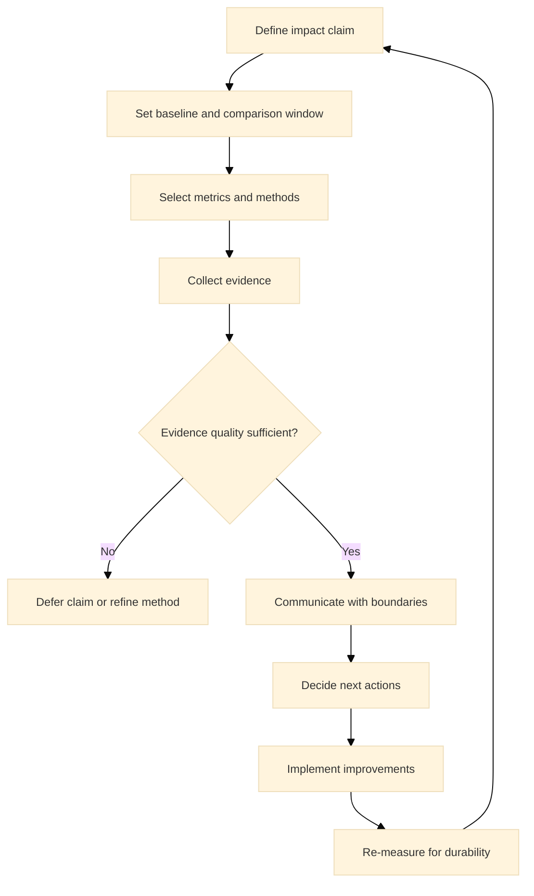

:::info What this chapter does
- Defines impact as measurable outcomes beyond delivery.
- Shows how communication aligns stakeholders.
- Connects impact claims to evidence quality.
- Frames impact as a continuous improvement input.
:::

:::warning What this chapter does not do
- Does not provide a fixed impact framework.
- Does not replace stakeholder governance.
- Does not guarantee outcomes without execution.
- Does not reduce impact to marketing.
:::

:::tip When you should read this
- When outcomes must be demonstrated externally.
- When impact claims require evidence.
- When stakeholders need transparency.
- Before scaling impact communications.
:::

:::note Derived from Canon
This chapter is interpretive and explanatory. Its constraints and limits derive from the Canon pages below.

- [Canon - Definitions](../../canon/definitions)
- [Canon - Evidence logic](../../canon/evidence-logic)
- [Canon - Decision theory](../../canon/decision-theory)
- [Canon - Epistemic stage model](../../canon/epistemic-model)
- [Canon - Governance boundaries](../../canon/governance-boundaries)
- [Canon - Framework boundaries](../../canon/framework-boundaries)
:::

:::info Key terms (canonical)
- Evidence
- Evidence quality
- Decision threshold
- Optionality preservation
- Strategic deferral
- Reversibility
:::

:::warning Minimal evidence expectations (non-prescriptive)
Evidence used in this chapter should allow you to:
- define impact metrics and baselines
- show evidence behind impact claims
- explain how impact is improved
- justify whether impact targets are met
:::

:::note Figure 29 - Impact as a Threshold-Based Evidence Loop (explanatory)

Impact is treated as an evidence loop: define claims, establish baselines, measure with stated
limitations, communicate without overreach, and improve based on decision-relevant signals.
:::

## 1. Introduction

Impact is not a claim; it is evidence of change. This chapter explains how to interpret impact
measurement in MCF 2.2 without turning it into marketing.

Impact measurement answers a decision question: what changed, how do we know, and what should we
do next? In Phase 5, impact is expected to be durable and auditable. Communication is part of
impact only when it preserves evidence quality, boundaries, and uncertainty.

### 1.1 What to do

- Define the impact claim you want to evaluate (outcome, for whom, and over what time window).
- Define a baseline and a comparison period that makes change interpretable.
- Decide which decisions the impact evidence will influence (continue, pause, rescope, invest,
  terminate, expand).

### 1.2 How to run it

Write each claim in a structured form: We believe X changed by Y for Z, compared to baseline B,
within window W.

Attach a baseline definition (time window, population, exclusions).

Pre-register the metric, method, and minimum evidence required before scaling communications.

:::tip Exercise — Draft one impact claim with a baseline (non-prescriptive)
Choose one outcome you care about (retention, time-to-service, defect rate, cost-to-serve, citizen
satisfaction). Define baseline B and comparison window W. Write the claim and list two limitations
that could weaken attribution.
:::

## 2. Why This Matters in Phase 5

Phase 5 is where impact claims become durable. Stakeholders, partners, and governance bodies
expect evidence that outcomes are real and sustained. If impact is overstated or weakly supported,
decision integrity collapses and the framework is misrepresented.

Impact evidence also determines whether innovation efforts should continue, pause, or be re-scoped.
Without credible impact signals, decisions become performative rather than defensible.

### 2.1 What to do

- Treat impact claims as decision-relevant evidence, not narrative assets.
- Increase evidence thresholds as irreversibility increases (bigger budgets, wider rollout, public
  commitments).
- Require durability checks before locking in an impact story.

### 2.2 How to run it

Use a simple impact review cadence (monthly or quarterly) tied to governance.

Add a durability rule: claims must hold across multiple periods or contexts before being used for
irreversible commitments.

Maintain an audit trail linking intervention, observed change, method, limitations, and decision.

:::note Exercise — Define a durability check
Pick one claim you would present externally. Define the minimum duration and number of measurement
cycles required before you treat the claim as durable.
:::

## 3. What Good Looks Like (Explanatory)

Good impact practice has three characteristics:

- Claims are tied to measurable outcomes with clear baselines.
- Evidence quality is stated alongside the claim.
- Communication preserves boundaries and avoids overreach.

Impact is not a metric dashboard; it is a decision input. The goal is to show what changed, why it
matters, and how confident you can be about the claim.

### 3.1 What to do

- Pair each claim with baseline, method, confidence, and boundary conditions.
- Prefer a small set of decision-useful metrics over a large KPI catalog.
- Define how impact evidence will trigger improvement actions.

### 3.2 How to run it

Publish a short impact note format: claim, metric, baseline, method, evidence quality, limitations,
decision implications.

Explicitly state what you cannot conclude from the evidence.

Keep communication aligned with Canon boundaries.

:::tip Example — Startup Context
A startup measures activation and retention improvement after onboarding changes. It reports the
uplift with baseline windows, states confounders (campaign mix), and uses thresholds to decide
whether to invest in scaling onboarding further.
:::

:::tip Example — Institutional Context
A public service team measures time-to-completion and error rate reduction after a workflow change.
It communicates outcomes with documented baselines and a boundary note about policy changes
affecting demand.
:::

:::tip Example — Hybrid Context
A venture program measures portfolio outcomes (cycle time, adoption) while the product team
measures user outcomes. The organization publishes a combined impact note that separates
attribution confidence and avoids mixing proxies with outcomes.
:::

## 4. Typical Failure Modes

Impact failure modes are often epistemic:

- Attribution inflation: crediting outcomes not caused by the work.
- Selection bias: reporting only favorable signals.
- Proxy drift: substituting weak metrics for meaningful outcomes.
- Narrative drift: claims grow while evidence stays constant.

Misuse signal: impact claims are updated more frequently than the evidence used to justify them.

### 4.1 What to do

- Identify which failure mode is present and what decision it corrupts.
- Tighten the baseline or method so evidence quality improves.
- Add one governance control that prevents narrative drift.

### 4.2 How to run it

Require that every claim includes baseline, method, and limitations.

Add a claim freeze rule: no claim expansion without new evidence.

Timebox attribution debates: if unresolved, defer the claim.

:::warning Exercise — Stress-test one impact claim
Pick one claim you are currently making. List three alternative explanations for the observed
change. For each, write one additional data point that would increase or decrease confidence.
:::

## 5. Evidence You Should Expect To See

Impact evidence should include:

- Baselines and comparison periods that make change visible.
- Methods that explain how outcomes were measured.
- Evidence of durability, not just point-in-time gains.
- Traceable links between decisions and observed impact.

If evidence cannot be reviewed, impact claims should be deferred. Evidence sufficiency rises with
irreversibility. The more permanent the decision, the stronger the impact evidence must be.

### 5.1 What to do

- Define minimum evidence bundles per claim type (operational, financial, user, institutional).
- Define thresholds that trigger improvement actions, not just reporting.
- Decide when to defer external communication due to evidence limits.

### 5.2 How to run it

Package evidence as raw metric definition, collection method, baseline, comparison, limitations,
and decision implications.

Re-measure after changes to confirm impact is stable.

Escalate when thresholds are breached (pause, rescope, or reverse).

:::tip Exercise — Build an evidence bundle checklist
For one claim, list the artifacts you would need to convince an independent reviewer: metric
definition, baseline, comparison, method, confounders, durability checks, and the decision it
supports.
:::

## 6. Common Misuse and Boundary Notes

Impact communication is often misused to justify decisions:

- Treating marketing narratives as evidence.
- Using impact claims to bypass governance review.
- Ignoring boundary conditions that limit generalization.

Impact progress is non-linear. Evidence can weaken or reverse over time, and decisions must remain
revisable as that happens.

### 6.1 What to do

- Keep impact claims within evidence boundaries and avoid generalization.
- Ensure governance review exists for claims tied to irreversible commitments.
- Preserve reversibility by treating claims as revalidatable.

### 6.2 How to run it

Use /docs/book/boundaries-and-misuse as a communication gate.

If evidence degrades, downgrade or retract claims with traceable rationale.

Keep a single owner for impact claim integrity and updates.

## 7. Cross-References

Book: /docs/book/decision-logic, /docs/book/failure-modes, /docs/book/boundaries-and-misuse,
/docs/book/versioning-and-change-control

Canon: /docs/canon/definitions, /docs/canon/evidence-logic, /docs/canon/decision-theory,
/docs/canon/framework-boundaries
