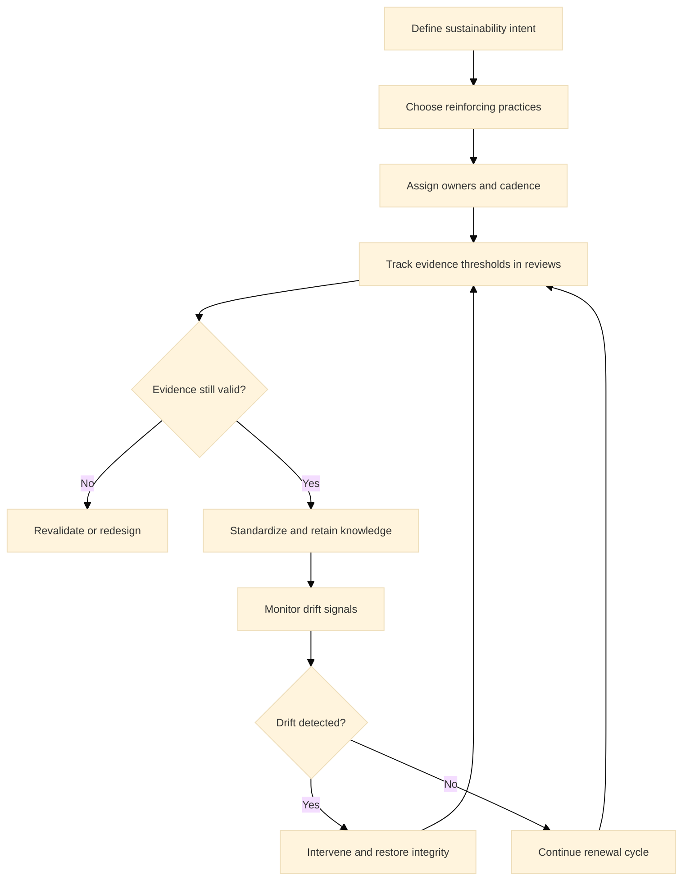

:::info What this chapter does
- Defines sustainability as long-term innovation capacity.
- Shows how systems reinforce consistent outcomes.
- Connects sustainability to evidence of impact.
- Frames long-term success as iterative renewal.
:::

:::warning What this chapter does not do
- Does not guarantee long-term performance.
- Does not replace leadership commitment.
- Does not prescribe a single operating model.
- Does not treat sustainability as static.
:::

:::tip When you should read this
- When innovation must persist beyond pilots.
- When organizational memory erodes progress.
- When success needs to be sustained over cycles.
- Before exiting the transformation program.
:::

:::note Derived from Canon
This chapter is interpretive and explanatory. Its constraints and limits derive from the Canon pages below.

- [Canon - Definitions](../../canon/definitions)
- [Canon - Evidence logic](../../canon/evidence-logic)
- [Canon - Decision theory](../../canon/decision-theory)
- [Canon - Epistemic stage model](../../canon/epistemic-model)
- [Canon - Governance boundaries](../../canon/governance-boundaries)
- [Canon - Failure modes](../../canon/failure-modes)
:::

:::info Key terms (canonical)
- Evidence
- Evidence quality
- Decision threshold
- Optionality preservation
- Strategic deferral
- Reversibility
:::

:::warning Minimal evidence expectations (non-prescriptive)
Evidence used in this chapter should allow you to:
- document sustainability signals
- show how practices are institutionalized
- explain where renewal is needed
- justify whether systems are durable
:::

:::note Figure 30 - Sustainability as a Renewal Loop (explanatory)

Sustainability is maintained through reinforcing practices, explicit ownership, threshold-based
reviews, drift detection, and renewal actions when evidence expires or conditions shift.
:::

## 1. Introduction

Sustaining innovation means keeping decision integrity after the initial transformation. This
chapter explains how to interpret long-term sustainability in MCF 2.2 as a system of reinforcing
practices, not a fixed state.

Sustainability is the ability to keep innovation decisions evidence-aligned after external
pressure decreases. In Phase 5, sustainability is tested by time and turnover: evidence expires,
incentives shift, and governance must remain active without being rescued by a program.

### 1.1 What to do

- Define what sustained means in your context (which decisions, which thresholds, which cycles).
- Identify the minimum set of practices that keep evidence and governance alive (reviews, decision
  logs, revalidation cadence).
- Decide which outcomes must remain reversible and which can be locked.

### 1.2 How to run it

Write a short sustainability intent: We will keep X decisions evidence-based by maintaining Y
review cadence and Z evidence artifacts.

Assign one accountable owner per practice, not per document.

Set a renewal trigger: when evidence expires or drift is detected, revalidate or redesign.

:::tip Exercise — Define one sustainability intent
Pick one decision area (product roadmap, service design, portfolio governance). Define thresholds
used, review cadence, and a renewal trigger when evidence expires.
:::

## 2. Why This Matters in Phase 5

Phase 5 is where innovation either becomes a durable capability or decays into legacy habits.
Sustainability is not about maintaining momentum; it is about maintaining decision integrity and
evidence quality over time.

Sustained innovation depends on renewal. Evidence expires, contexts change, and governance must
adapt. A sustainable system can revalidate assumptions without losing accountability.

### 2.1 What to do

- Treat sustainability as a governance problem, not a motivation problem.
- Increase rigor when commitments are long-lived or hard to reverse.
- Make renewal explicit: decide when revalidation is required.

### 2.2 How to run it

Add a threshold check step to standard review meetings.

Define evidence expiration windows for key claims (quarterly, semiannual, annual).

Log renewals: what evidence changed, what decision changed, and why.

:::note Exercise — Define evidence expiration windows
Choose three recurring decisions. For each, define how long evidence remains decision-useful
before it must be refreshed or revalidated.
:::

## 3. What Good Looks Like (Explanatory)

Good sustainability shows in observable properties:

- Evidence thresholds remain in active use.
- Governance continues without external pressure.
- Learning systems update assumptions as conditions shift.
- Optionality is preserved rather than locked.

Sustainability is a living system, not a static outcome. It requires the ability to pause,
re-evaluate, or reverse commitments when evidence weakens.

### 3.1 What to do

- Keep thresholds visible and used in decision forums.
- Ensure accountability persists across role changes.
- Preserve optionality by making exit and rollback pathways explicit.

### 3.2 How to run it

Use a small sustainability scorecard (threshold usage, renewal cadence, drift incidents, decision
reversals).

Tie role handoffs to evidence artifacts (decision log, assumptions register, recent revalidations).

Review reversibility quarterly: what became harder to undo, and is the evidence sufficient?

:::tip Example — Startup Context
A startup documents key thresholds (activation, retention, CAC payback). When the team changes,
onboarding includes the decision log and the last two renewal notes, preventing metric drift and
repeated mistakes.
:::

:::tip Example — Institutional Context
An institution keeps governance alive via a quarterly threshold review, a standing agenda item for
evidence expiration, and explicit decision owners even when leadership rotates.
:::

:::tip Example — Hybrid Context
A hybrid organization sustains innovation by linking portfolio decisions to delivery evidence:
renewals trigger when operational variance increases or when impact evidence weakens, preventing
scale by inertia.
:::

## 4. Typical Failure Modes

Sustainability failures are often slow:

- Institutional memory loss: practices fade as people change roles.
- Metric decay: evidence signals lose relevance over time.
- Governance drift: decision integrity weakens as urgency declines.
- Ritualization: practices persist without evidential justification.

Misuse signal: the organization reports stability while decision thresholds are no longer referenced
in reviews.

### 4.1 What to do

- Identify which failure mode is present and what decisions it corrupts.
- Restore one reinforcing practice (threshold review, renewal cadence, drift monitoring).
- Remove symbolic rituals that do not change decisions.

### 4.2 How to run it

Run a threshold audit: list decisions made in the last 60-90 days and whether thresholds were
referenced.

Add drift detection: define 2-3 signals that indicate governance or evidence quality is degrading.

When drift is confirmed, pause expansion decisions until renewal completes.

:::warning Exercise — Run a lightweight threshold audit
List 10 recent decisions. For each: was a threshold referenced, was evidence traceable, and was
reversibility considered? Summarize the top two gaps.
:::

## 5. Evidence You Should Expect To See

Evidence of sustainability includes:

- Continued use of decision thresholds in review cycles.
- Documented revalidation of assumptions and outcomes.
- Stable accountability for governance decisions.
- Evidence that learning changes decisions, not just documentation.

If evidence is not refreshed, sustainability becomes symbolic. Evidence sufficiency rises as
optionality narrows. Long-lived commitments require stronger proof to remain defensible.

### 5.1 What to do

- Define sustainability signals that are decision-relevant (threshold usage, renewal completion,
  drift rate).
- Require revalidation before reaffirming long-lived commitments.
- Keep accountability and auditability visible.

### 5.2 How to run it

Maintain a renewal log (what expired, what was revalidated, what changed).

Track recurrence of known failure modes and show whether it decreases.

Use escalation rules: when drift rises, trigger a governance review.

:::tip Exercise — Define 3 sustainability signals
Pick three signals that indicate the system is durable (for example, renewal completion rate,
threshold usage rate, recurrence of a failure mode). Define what threshold would trigger a
renewal or pause.
:::

## 6. Common Misuse and Boundary Notes

Misuse happens when sustainability becomes compliance theater:

- Treating documentation as proof of capability.
- Ignoring evidence expiration because outcomes look stable.
- Using sustainability language to avoid necessary change.

Sustainability is non-linear. It can regress as contexts shift, and it can recover when evidence
improves.

### 6.1 What to do

- Keep sustainability within Canon boundaries: evidence must stay reviewable.
- Avoid stability stories that outrun evidence refresh.
- Preserve reversibility: make renewal and rollback legitimate options.

### 6.2 How to run it

If evidence weakens, downgrade commitments or defer expansion with a logged rationale.

Treat policy or org changes as renewal triggers, not as excuses.

Revisit boundary conditions when stakeholder expectations change.

## 7. Cross-References

Book: /docs/book/decision-logic, /docs/book/failure-modes, /docs/book/boundaries-and-misuse,
/docs/book/versioning-and-change-control

Canon: /docs/canon/definitions, /docs/canon/evidence-logic, /docs/canon/decision-theory,
/docs/canon/governance-boundaries
