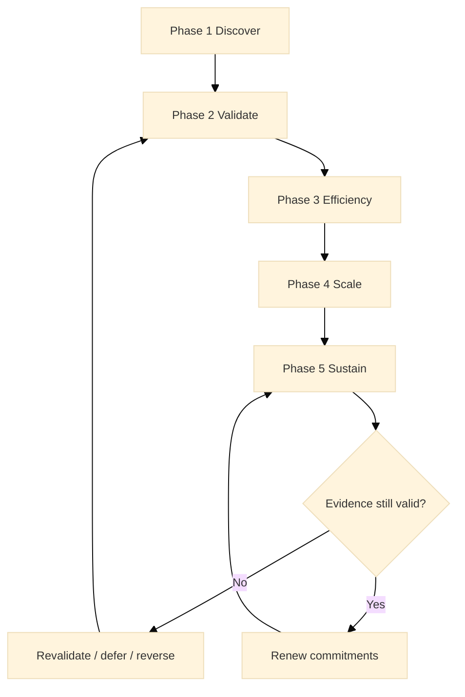

:::info What this chapter does
- Synthesizes the five-phase journey.
- Reinforces the evidence-first framing.
- Clarifies how to continue beyond the book.
- Anchors the framework in long-term intent.
:::

:::warning What this chapter does not do
- Does not introduce new rules.
- Does not replace Canon definitions.
- Does not provide operational steps.
- Does not serve as a checklist.
:::

:::tip When you should read this
- After completing the five phases.
- When summarizing outcomes for stakeholders.
- When planning post-book next steps.
- Before long-term program renewal.
:::

:::note Derived from Canon
This chapter is interpretive and explanatory. Its constraints and limits derive from the Canon pages below.

- [Canon - Definitions](/docs/canon/definitions)
- [Canon - Framework boundaries](/docs/canon/framework-boundaries)
- [Canon - Governance boundaries](/docs/canon/governance-boundaries)
- [Canon - Versioning and termination](/docs/canon/versioning-termination)
:::

:::info Key terms (canonical)
- Evidence
- Evidence quality
- Decision threshold
- Optionality preservation
- Strategic deferral
- Reversibility
:::

:::warning Minimal evidence expectations (non-prescriptive)
Evidence used in this chapter should allow you to:
- summarize outcomes and gaps
- show evidence of transformation
- explain ongoing commitments
- justify future priorities
:::

:::note Figure 31 - The Five Phases as an Evidence Renewal Loop (explanatory)

The five phases reduce uncertainty over time. At maturity, the system cycles through renewal: if
evidence weakens, decisions are revalidated, deferred, or reversed; if evidence holds, commitments
are renewed.
:::

## 1. Introduction

MCF 2.2 is not a checklist. It is a decision system grounded in evidence. The five phases describe
how uncertainty is reduced and how commitments become defensible over time. This conclusion closes
the narrative arc by reaffirming the epistemic nature of the framework and the boundary between
Canon and Book.

The Book layer explains how to interpret and apply the system. The Canon layer defines what counts
as valid, bounded, and defensible. This conclusion is not a new rule set. It is a reminder of what
must remain true for the framework to remain epistemic rather than narrative.

### 1.1 What to do

- Summarize what changed, what is now defensible, and what remains uncertain.
- Restate the Canon boundary: Canon defines validity; the Book explains usage.
- Decide what must be renewed, what can be scaled, and what must be deferred.

### 1.2 How to run it

Produce a short decision summary for stakeholders: outcomes, gaps, and next priorities tied to
thresholds.

Link the summary to the specific Canon pages that govern your commitments.

Establish a renewal cadence for long-lived decisions (quarterly or semiannual).

:::tip Exercise — Write a one-page decision summary
In one page: list key decisions, the evidence behind each, the thresholds used, and what remains
uncertain and must be revalidated.
:::

## 2. Why This Matters In Phase 5

Phase 5 is where continuity must outlast the initial program. If the Book and Canon boundary
blurs, the framework becomes a narrative rather than a decision system. The conclusion reinforces
that MCF is epistemic, not procedural, and that Canon remains the authoritative source.

### 2.1 What to do

- Treat continuity as a governance responsibility, not a communications task.
- Protect reversibility until evidence justifies long-lived commitments.
- Ensure learning and renewal are part of done, not optional add-ons.

### 2.2 How to run it

Add an explicit boundary check to governance reviews: what claims are being made, and which Canon
constraints apply.

Track evidence expiration and renewals as part of normal operations.

Require decision logs for commitments that reduce optionality.

:::note Exercise — Identify 3 boundary checks
Name three places where Book text could be misread as Canon. For each, define the Canon page that
anchors the constraint and how you will enforce it in reviews.
:::

## 3. What Good Looks Like (Explanatory)

The journey is coherent when the following are true:

- Evidence is consistently tied to decision thresholds.
- Governance protects integrity as scope and scale expand.
- Execution remains reversible until evidence justifies commitment.
- Learning prevents regression to intuition-only decisions.

These are not outcomes to claim; they are properties of a defensible decision system.

### 3.1 What to do

- Keep threshold usage visible in decision forums.
- Make governance ownership explicit for long-lived commitments.
- Preserve optionality by defining exit and rollback pathways.

### 3.2 How to run it

Maintain a lightweight integrity dashboard: threshold usage rate, renewal completion rate, drift
incidents, and decision reversals.

Ensure leadership reviews include at least one evidence-based deferral or reversal example per
cycle (to normalize reversibility).

Tie renewals to explicit evidence refresh, not calendar promises.

:::tip Example — Startup Context
A startup uses the conclusion as a board narrative: what is now defensible, what is still
uncertain, and which thresholds trigger renewed investment versus deferral.
:::

:::tip Example — Institutional Context
An institution summarizes outcomes for oversight bodies, explicitly separating Book interpretation
from Canon constraints, and logs which commitments will be renewed next cycle.
:::

:::tip Example — Hybrid Context
A hybrid initiative reports impact with stated evidence quality, boundary conditions, and clear
revalidation points before expansion to new partners.
:::

## 4. Typical Failure Modes

Common misreadings undermine the framework:

- Framework is not a guarantee: outcomes are not promised by structure alone.
- Maturity is not linear progress: the path includes reversals and deferrals.
- Tools are not rules: artifacts do not replace Canon constraints.
- Book is not Canon: explanatory text does not define norms.

When these misreadings appear, revisit Canon boundaries and governance rules.

### 4.1 What to do

- Detect narrative drift early (claims growing faster than evidence).
- Re-anchor decisions in thresholds and boundaries.
- Normalize deferral and reversal when evidence weakens.

### 4.2 How to run it

Add a claim vs evidence review step to reports.

Require a threshold reference for any ready to scale statement.

When drift is detected, pause new commitments until revalidation completes.

:::warning Exercise — Run a claim vs evidence check
Select five claims you have made about outcomes. For each, write the evidence, the baseline, the
boundary conditions, and the decision threshold it supports.
:::

## 5. Evidence You Should Expect To See

Evidence that the framework is functioning at maturity includes:

- Decisions that are reversible until thresholds are met.
- Traceable rationale for scale commitments and governance approvals.
- Explicit use of boundary constraints when new tools or programs are proposed.
- Evidence that learning updates assumptions rather than preserving narrative.

If these signals are absent, the system is drifting from evidence-first decision integrity.

### 5.1 What to do

- Require traceability for long-lived commitments.
- Refresh evidence before reaffirming large resource allocations.
- Treat learning as decision change, not documentation.

### 5.2 How to run it

Maintain a renewal log: what expired, what was revalidated, and what changed.

Use escalation rules: when integrity signals degrade, trigger governance review.

Explicitly record when a decision is reaffirmed and why.

:::tip Exercise — Define 3 integrity signals
Pick three signals that indicate decision integrity (threshold usage, renewal completion, drift
incidents). Define what threshold triggers a review.
:::

## 6. Common Misuse And Boundary Notes

Misuse often shows up as narrative drift:

- Treating the Book as a ruleset rather than an interpretation layer.
- Using tools to assert compliance without evidence.
- Claiming maturity progression as linear or guaranteed.

Use /docs/book/boundaries-and-misuse to reassert the interpretive boundary. Canon defines what is
valid; the Book explains how to read and apply it.

### 6.1 What to do

- Keep the Book and Canon boundary explicit in communications.
- Avoid completion language that implies permanence.
- Preserve reversibility as a first-class governance outcome.

### 6.2 How to run it

Add boundary notes to external-facing summaries (what is claimed, what is not).

Require revalidation before public impact claims are expanded.

Treat done as renewable, with explicit expiration windows.

## 7. Cross-References

Book: /docs/book/decision-logic, /docs/book/governance-and-roles, /docs/book/failure-modes,
/docs/book/boundaries-and-misuse

Canon: /docs/canon/definitions, /docs/canon/framework-boundaries, /docs/canon/governance-boundaries,
/docs/canon/versioning-termination
