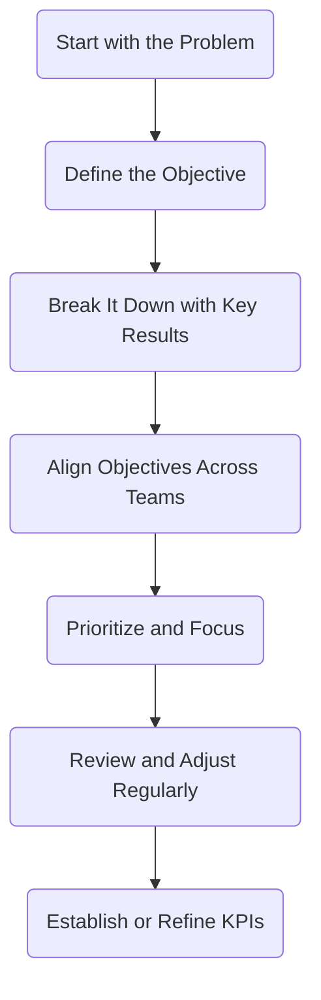

# Chapter 12: Defining the Problem and Setting Strategic Objectives


**From Questions to Clarity**. *This illustration symbolizes the transition from problem identification to strategic direction. By defining the core challenge and aligning objectives, organizations using the MicroCanvas&reg; Framework sharpen their innovation focus and lay the groundwork for impactful outcomes*.

This chapter aligns **Problem Analysis** and **Setting Strategic Objectives** with the **MCF 2.1** guidelines. In **Section 1**, you will follow the steps to identify, analyze, and validate the core problem your innovation must address. In **Section 2**, you will translate these insights into actionable objectives and measurable key results (OKRs), incorporating KPI steps for comprehensive performance tracking.

## Section 1: Problem Analysis

This process typically follows six main steps, which ensures you uncover the real challenge your innovation must solve and confirm its significance for stakeholders:

:::info Problem Analysis Steps

```mermaid
    flowchart TB
    A(Identify the Main Problem) --> B(Describe Symptoms)
    B --> C(Analyze Root Causes)
    C --> D(Understand Stakeholder Impact)
    D --> E(Examine Cause-and-Effect Relationships)
    E --> F(Validate with Vertical Logic)
 ```    
:::

### 1. Identify the Main Problem
Begin by clarifying the core issue your innovation aims to solve. This step aligns with "defining your research focus" from earlier chapters.

- **Review Existing Data**: Gather any pilot results, user feedback, or market insights.

- **Select Focus Areas**: Choose the problems with the highest negative impact or greatest strategic importance.

:::info Example 
A fintech startup discovers that urban professionals frequently abandon their carts due to long checkout times. They decide to focus on analyzing the checkout process to confirm the exact cause and impact. 
:::

### 2. Describe Symptoms
Document the visible indicators that confirm the problem exists.

- **Quantify Negative Effects**: List issues like *high cart abandonment*, *long processing times*, or *user complaints*.

- **Collect Metrics**: Gather data on *churn*, *user satisfaction scores*, or *operational inefficiencies*.

### 3. Analyze Root Causes
Dig deeper to find the underlying factors contributing to each symptom.

- **Apply "5 Whys"**: Repeatedly ask *"Why does this occur?"* to isolate the fundamental cause.

- **Consolidate Findings**: Organize root causes in a structured format for easier review.

### 4. Understand Stakeholder Impact
Identify who is affected and how:

- **Map Stakeholders**: Customers, employees, partners, or regulators.

- **Assess Challenges**: Note the specific frustrations or costs incurred by each stakeholder group.

### 5. Examine Cause-and-Effect Relationships
Create a Problem Tree or similar diagram to visualize how root causes lead to specific effects.

- **Trunk**: *The main problem*.

- **Branches Below**: *Root causes*.

- **Branches Above**: *Effects* (e.g., *lost revenue*, *user dissatisfaction*).

:::info Example Problem Tree

```mermaid
flowchart LR

    subgraph **Causes**
      C1(**Cause 1**: <br/>*Outdated payment software*)
        C1a("**C1a**:  <br/> *Legacy integration issues*")
        C1b("**C1b**:  <br/> *Infrequent patching/updates*")
      C2(**Cause 2**: <br/>*Inefficient workflow*)
        C2a("**C2a**:  <br/> *Excessive manual steps*")
        C2b("**C2b**:  <br/> *Very few standardized processes*")
      C3(**Cause 3**: <br/>Insufficient staff training)
        C3a("**C3a**:  <br/> *No onboarding program for new hires*")
        C3b("**C3b**:  <br/> *Insufficient ongoing skill development*")
    end

    subgraph **Effects**
      E1(**Effect 1**: <br/>*15% increase in cart abandonment*)
        E1a("**E1a**:  <br/> *Revenue drops by 10%*")
        E1b("**E1b**:  <br/> *Negative word-of-mouth*")
      E2(**Effect 2**: <br/>*Lower satisfaction scores*)
      E2a("**E2a**:  <br/> *Higher user churn*")
      E2b("**E2a**:  <br/> *Poor brand reputation*")
    end

    %% Main problem in the middle
    C1 --> M((**Main Problem**<br/>*Long Checkout Times*))
    C2 --> M
    C3 --> M

    %% Connect sub-causes to main causes
    C1a --> C1
    C1b --> C1
    C2a --> C2
    C2b --> C2
    C3a --> C3
    C3b --> C3

    %% Connect primary effects to secondary effects
    E1 --> E1a
    E1 --> E1b
    E2 --> E2a
    E2 --> E2b

    M --> E1
    M --> E2
```
:::

:::tip **How it works:**

    - **Causes** groups all root causes together.
        - Each cause node (C1, C2, C3) has sub-causes (C1a, C1b).
    - **Primary effects** groups all the identified effects together.
        - Each effect node (E1, E2) has sub-effects (E1a, E1b).
    - Each cause node (C1, C2, C3) flows into the **Main Problem** (M).
    - The **Main Problem** flows into each effect (E1, E2).
:::

### 6. Validate with Vertical Logic

Craft and finalize a concise, actionable Problem Statement:

- **Synthesize Findings**: Combine root causes, metrics, and stakeholder feedback into a clear statement.

- **Quantify Impact**: Include specific data (e.g., *"25% longer checkout process"*).

- **Cross-Check Data**: Compare historical or baseline metrics to ensure accuracy.

- **Finalizing the Problem**:

    - Host a review workshop with key stakeholders.

    - Incorporate feedback and document the final problem statement.

---

## Section 2: Setting Strategic Objectives and Key Results
The OKR process also typically follows six steps We add a seventh step for KPIs, ensuring you capture essential performance metrics:

Each step translates your validated problem into a structured plan for action and measurement.

:::info OKR Steps + KPI


:::

### 1. Start with the Problem
Use your finalized problem statement from Section 1 as the foundation.

- **Link Negative Impacts to Objectives**: If checkout times cause a 15% cart abandonment rate, your objective might focus on reducing that rate.

:::info Example:

- **Problem**: *"Customers face a 25% longer checkout process, causing a 15% cart abandonment rise."*

- **Objective**: *"Reduce checkout time by 20% to decrease cart abandonment."* 

:::

### 2. Define the Objective
Craft clear, actionable objectives that address the core challenge:

- **Active, Concise Language**: e.g., *"Transform our payment system to reduce average checkout time from 3 to 2.4 minutes."*

- **Measurable Targets**: Specify quantifiable outcomes or deadlines.

### 3. Break It Down with Key Results
For each objective, define 2-5 Key Results that measure progress:

- **KR Example**: *"Increase conversion rate by 10% within six months."*

- **KR Example**: *"Achieve a customer satisfaction score of at least 4.5/5 on checkout surveys."*

### 4. Align Objectives Across Teams
Ensure each department or cross-functional group knows its role:

- **Operations**: *Optimize workflow*.

- **Tech/IT**: *Update payment software*.

- **Customer Service**: *Gather and track user feedback*.

### 5. Prioritize and Focus
Limit the number of objectives to avoid scattering resources:

- **Impact vs. Feasibility**: Focus on OKRs that significantly move the needle.

- **Review Resource Constraints**: *Budget*, *timeline*, *staff*.

### 6. Review and Adjust Regularly
OKRs should be living documents:

- **Frequent Check-Ins**: Weekly or monthly reviews to track metrics.

- **Pivot if Needed**: If certain KRs consistently lag, adjust tactics or re-evaluate the objective.

### 7. Establish or Refine Relevant KPIs
Integrate KPIs that reflect operational or strategic health:

- **Revenue or Cost Metrics**: *Profit margins*, *average order value*.

- **User Engagement**: *DAU*, *churn rate*, or *net promoter score (NPS)*.

- **Operational Efficiency*: *Time to fulfill orders*, *error rates*.

- **Document KPIs in a shared dashboard**. Align them with each Key Result for transparent, real-time monitoring.

:::info Example Key Results & KPI Integration

```mermaid
flowchart LR

    %% Main Objective
    O(("**Main objective**: <br />*Reduce average checkout time from 3 to 2.4 minutes within six months*."))

    %% Key Results
    KR1("**Key Result 1**: <br />*Decrease checkout steps from 5 to 3*")
    KR2("**Key Result 2**: <br />*Achieve 4.5/5 satisfaction on checkout surveys*.")

    %% KPIs
    KPI1("**KPI**: <br />*Conversion rate +10%*")
    KPI2("**KPI**: <br />*Customer satisfaction 4.5/5*")

    %% Connect Objective -> Key Results -> KPIs
    O --> KR1
    O --> KR2

    KR1 --> KPI1
    KR2 --> KPI2

:::

:::tip How it works:

    - Objective node (O) is the **main goal** (e.g. *"Reduce average checkout time from 3 to 2.4 minutes within six months*.").

        - Key Results (KR1, KR2) each target a **measurable milestone** under the Objective.

            - KPIs (KPI1, KPI2) define **how success is measured** for each Key Result.
:::

### Create a Structured OKR Framework

#### Inputs

- Finalized objectives, key results, and KPIs
- A defined review process

#### Outputs

- A documented OKR framework that connects strategic objectives to measurable outcomes
- A schedule for periodic reviews and adjustments

:::info Steps to create a structured OKR framework

```mermaid

flowchart TB
    A(**Document Your OKRs**.
    *Write your objectives, key results, and KPIs clearly in a shared document or digital tool.*) --> B(**Integrate KPIs with Key Results**.
    *Ensure each key result includes the relevant KPIs and target values*.)
    B --> C(**Set Regular Review Cycles**)
```
:::

:::tip Exercise:

Create a digital dashboard that displays your OKRs and KPIs in real time. Hold regular review meetings to assess progress, celebrate wins, and make necessary adjustments.
:::

###  Integrating Problem Definition and Strategic Objectives into Your Innovation Roadmap
Embed your problem analysis and strategic objectives into your innovation strategy to ensure continuity and alignment across phases.

#### A. Align with the Innovation Cycle

- **Map to Phases**: Connect your problem statement and strategic objectives to specific phases (e.g., Discovery and Validation).
- **Create a Visual Flowchart**: Develop a flowchart that shows how customer insights from Chapter 11 lead to the problem statement and then to strategic objectives and key results. This visual aid reinforces clarity and alignment.

:::info Example:
    Design a flowchart that begins with customer feedback on long checkout times, moves to root causes identified in your Problem Tree, and culminates with strategic objectives like reducing checkout time and increasing conversion rates.
:::

#### B. Use Data to Inform Objectives

- **Establish Baselines**: Use current performance metrics from Chapter 11 as your baseline.
- **Set Realistic Targets**: Define targets based on historical data and industry benchmarks.
- **Monitor Progress**: Use digital dashboards to track changes and adjust objectives as necessary.

:::info Example:
    If your average checkout time is 3 minutes, set a target to reduce it to 2.4 minutes and review the monthly metric.
:::

#### C. Create a Continuous Feedback Loop

- **Schedule Regular Reviews**: Hold periodic meetings to assess your OKRs and update them based on fresh insights.
- **Iterate Objectives**: Use feedback from ongoing projects to refine your problem statement and strategic objectives, ensuring they remain aligned with evolving conditions.

:::tip Exercise:
    Conduct a workshop with cross-functional teams to review current OKRs, gather feedback, and update your innovation roadmap accordingly.
:::

#### 3. Best Practices and Tools
Follow these best practices to maximize the effectiveness of your problem analysis and objective-setting processes:

- **Be Specific and Clear**: Write problem statements and objectives in active, unambiguous language. Include measurable data to define challenges clearly.
- **Engage Stakeholders**: Involve team members from various departments to gather diverse insights and build consensus.
- **Document and Visualize**: Use visual aids such as problem trees, flowcharts, and digital dashboards to illustrate the connections between customer insights, the problem, and strategic objectives.
- **Apply a Weighted Scoring System**: Use the weighted scoring system from Chapter 11 for customer segmentation (incorporating TAM, SAM, and SOM) and apply those insights to inform your problem analysis.
- **Review Regularly**: Schedule frequent reviews to update your problem statements and OKRs based on new data.
- **Use Digital Tools**: Leverage tools like SurveyMonkey, Google Forms, Miro, Trello, and Power BI to collect data, visualize processes, and track progress.

:::info Example:
    A multinational company uses a weighted scoring system to prioritize customer segments and develop detailed personas. It then creates a Problem Tree to map out the root causes of long checkout times and documents its final problem statement and strategic objectives in a digital dashboard. The company reviews its OKRs quarterly and adjusts them based on updated data.
:::

## Final Thoughts
Defining a clear problem and setting strategic objectives are essential to driving your innovation efforts. You build on the outputs from Chapter 11 by gathering and analyzing customer data, using a Problem Tree to map causes and effects, and transforming negative impacts into actionable objectives with measurable key results and aligned KPIs. This comprehensive process produces a clear, actionable roadmap that seamlessly integrates your innovation strategy.

Following this chapter's detailed steps, exercises, and best practices, you build a robust foundation that guides your innovation initiatives and aligns every effort with your organizational goals. You document inputs, generate clear outputs, and establish a continuous feedback loop that refines your strategy over time.

In the next chapter, we explore **Exploring Alternative Solutions**, where you learn how to generate, evaluate, and select viable solutions to your defined problems, ensuring that your innovation initiatives move from analysis to effective execution.

## ToDo for this Chapter

- [ ] Create Problem Analysis and OKR questionaire/template, attach template to Google Drive and link to this page
- [ ] Create Chapter Assesment questionnaire to Google Drive and attach to this page
- [ ] Translate all content to Spanish and integrate to i18n
- [ ] Record and embed video for this chapter